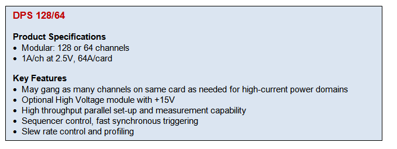

Posted  in [Featured Products](https://www.gosemiandbeyond.com/category/featuredproducts/)

# DPS128

One of three new modules recently launched in support of the V93000 test platform with universal per-pin architecture, the DPS128 (device power supply) is part of a family of power-supply instruments designed to provide a cost-efficient response to the trend toward higher multi-site parallelism. The DPS128 features 128 channels of voltage/current (VI) resources per module to accurately source and measure both current and voltage. Its modular architecture, based on Advantest’s test-processor backbone, can be configured in multiple ways. This built-in flexibility and expandability is key to the power supply’s ability to meet future testing needs.

The DPS128’s per-pin time measurement unit (TMU) enables efficient measurement of high switching frequencies, duty cycles and fast rise/fall times found in today’s advanced power-management devices. With its sophisticated ganging options, this family of instruments can address a broad application space, and also supersedes legacy power instruments within the V93000 portfolio.

This new product family has been instrumental to the growing success of the V93000 in the microcontroller, smartcard, sensor and automotive segments, because it enables very small and attractive system configurations (few cards) with high versatility.

SoC customers have widely accepted the new instruments, and Advantest shipped roughly 1,500 units within the first year. This steep ramp is a first in the history of the V93000 platform. The majority of the units are meeting the high-volume production needs of customers located in Asia.

The products in the DPS family set a new milestone in versatility and cost efficiency, and Advantest looks forward to seeing them contribute further to our growing SoC business.

  end .post_content

