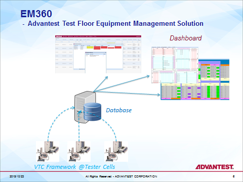

Posted  in [Featured Products](https://www.gosemiandbeyond.com/category/featuredproducts/)

# EM360:  A 360 View of Test Equipment Management

Managing test equipment can be a daunting task when numerous ATE systems have been installed with different configurations, at different sites, and across multiple continents. Requirements range from system maintenance tasks, such as configuration management, repair and calibrations, to production planning and asset management.

Customers of Advantest V93000 systems can take advantage of a software tool created to help them overcome these challenges and enable them to manage their V93000 installation within and across test floors. The Equipment Management 360 (EM360) tool helps improve overall equipment effectiveness (OEE), system utilization and both time to quality and time to market.

Packed with features, EM360 collects data of V93000 system configuration, and calibrations in real time for the whole test floor, and provides an overview of the test floor configuration and calibrations. Customers can check the specific details of the configuration of each system, including hardware slots and pogo pin position as well as the software version of SmarTest, and the FPGA version of the hardware. It shows the hardware change-history to help track system repair and maintenance work. The calibration management features enable monitoring and management of all calibration schedules, including system, NIST, analog and radio-frequency (RF) calibrations, as well as direct-current (DC) updates.

The Configuration Search feature can locate the targeted hardware configuration within the entire test floor while the enhanced Advanced Configuration Search can use the model file from the test program to find a system with the matching pogo position, greatly facilitating production planning. The test floor summary and board trace capabilities can help customers understand the full hardware fleet, and trace each individual board.

**Key EM360 Features**

- EM360-Dashboard

Active Tester Status List –Enhanced
Configurable Column
- Hardware Maintenance

Hardware Configuration
Tester Change History
Board Trace
SMT Version Management
Tester Comparison –NEW
- Calibration

Calibration Overdue Report
Calibration History
Overdue Report–NEW
Diagnostic Log Collector–NEW
- Tester Search (Tester Qualification)

Search
Advanced Search (by model file) –NEW
- Asset –NEW

Floor Summary
- System

Tester Setup
Support Time Zone Setup
Support Hostname Auto-change
User/System Configure

  end .post_content

