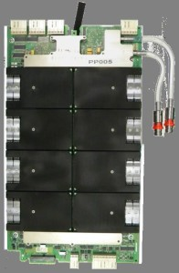
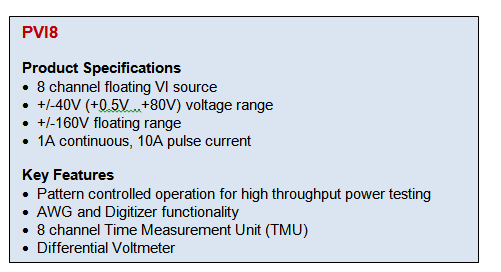

Posted  in [Featured Products](https://www.gosemiandbeyond.com/category/featuredproducts/)

# PVI8

In 2014, Advantest announced its new PVI8 floating power source for the V93000 universal per-pin test platform. The new instrument adds high-voltage and high-current test capabilities to Advantest’s universal V93000 platform, and broadens its market to embedded power devices. Typical target applications in this area are motor controller ICs for automotive and industrial usage and a broad range of power-management devices, including high-power buck and boost converters.

The PVI8 features high channel density and lower test time compared to competitive systems. Designed with eight floating channels and four-quadrant operation, the new instrument can be used to provide up to 80 volts and up to 10 amps per channel. The eight-channel PVI8 can be ganged up to ±80 amps for high-power stress testing of devices. For high-voltage tests, the PVI8 can be stacked up to ±160 volts due to its floating design. The power source supports native pattern controlled operation and therefore leads to extremely fast test times with stable parametric measurements.

Current customers for the PVI8 are leading IDMs in the automotive area. One of these IDM customers is using the power source to test a series of embedded Power MCUs for automotive body electronics. The high channel density, rich feature set and high-throughput of the V93000 power solution provides compelling test cost for embedded power devices.

Efficient test development is essential for these complex applications to meet their short time-to-production requirements. A software package for automatic creation of high-throughput-pattern controlled setups and measurements enables the creation of high-throughput test solutions with reduced engineering effort.

For more information, visit [Advantest.com](https://www.advantest.com/US/products/ictestsystems/WEBDEV004754).

  end .post_content

