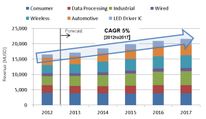
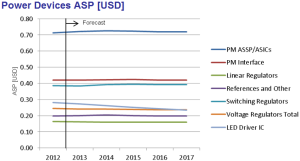
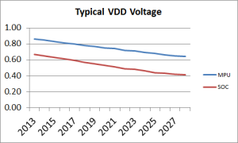
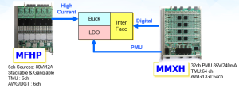
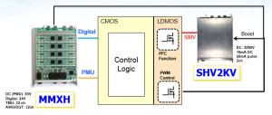

Posted  in [Featured Products](https://www.gosemiandbeyond.com/category/featuredproducts/)

# T2000 IPS Solution for Power Device Testing

*By Amit Monga, Business Development Manager, ASD Product Group, Advantest *

**Introduction**

Integrated circuit devices that fall under the general power device category are getting more mainstream. The devices form an important part of a number of very fast growing industries including but not limited to the wireless, automotive and industrial industries. On the wireless side, PMIC devices are having significant growth as the need for battery management and LED driver integrated circuits grow. The automotive market sees a larger appetite for electrical components with safety (example: ABS, Power steering) and luxury (Example: infotainment systems) primarily driving this area of growth.

Source: Power Management Market Tracker – Q4 2013

**Challenges and Complexity of Power Device Testing**

As power device uses increase, so does the need to test them adequately. The wireless market, driven by smartphone and tablets requires device testing to be done at the lowest cost possible and yet the ever increasing integration of functionality in the devices means the IC has a lot more functionality. The average selling prices for the devices are very low and test budgets are limited. The test solution has to address this as well as ensure test quality is not compromised.

The increasing integration poses a second challenge. The test demands are increasing. A few years back, power devices could be tested on a purely analog tester with a few power supplies. Now, a basic device requires some digital stimulation, high current and voltage requirements, and some are even integrating RF IP. Internet of Things (IoT) type devices are a perfect example of this increasing integration and complexity. Tester selection is therefore not based on a single device type but seen from a solution stand point. The selected platform should be scalable to accommodate the rapidly changing devices.

A general trend that is not particularly related to power devices but more to do with the shrinking process nodes is the decreasing supply voltages. This is especially true for wireless and consumer devices. PMIC devices such as the fuel gauge found in a number of smartphones are an example of devices that are required to monitor these voltage levels. This requires the chips to have very accurate voltage reading capability as well the ability to provide very precise biases. The capability is down to the sub 100uV range and test fixtures are having to redesign their modules to meet this challenge.

 

DC Challenges:

Lower voltages,

More supplies,

Tiny power specs

 

The other challenges facing power device test are common across other family of devices. These range from minimizing test times, reducing time to market, maximizing parallelism and number of devices that can be tested at the same time and ensuring that the load board does not limit the parallelism. This is especially true for automotive power devices because each device requires a large number of on board components. The load boards that for other types of devices can test up to 64 or even 128 devices in one go suddenly seem inadequate for even 16 site testing of automotive parts. The major reason being the real estate available on the boards. Tester companies are aware of this and are continuously coming up with better module and load board design to counteract this.

**The T2000 IPS Solution**

The T2000 test platform is a scalable platform with modules that provide solutions for different device types and industries. The IPS solution refers to a particular set of modules that when populated into the T2000 tester, form a solution for power device testing. The modules provide a broad coverage and cover a whole range of different IC types.

The T2000 IPS modules are designed to target some of the key challenges that power devices face during test.

The modules have special multifunctional architecture (PMU, TMU, DGT, and AWG in one pin). This ensures that each module has a wide capability. This specially targets the increased complexity of devices, and ensures a large number of different tests can be handled by limited number of modules. The overall impact of this for power devices is not only a lower test system cost, but also having so much functionality per pin implies less load board space is wasted on relays. An Example of this would be a pin that for one test requires a PMU resource but for the next test requires a TMU resource. In addition, the MPCM module, a relay module that routes signals internally in the test head also leads to a reduction of load board relays. Overall in some cases this unique architecture has led to almost 40% reduction in the components on board as compared to conventional architectures.

The specifications on the MMXH PMU are also targeted towards PMIC and other devices that require high precision voltage source and measure. The solution has been successfully used with high precision Li-ion battery monitoring circuitry as well as band gap reference IC where stability and accuracy are key. In addition the modules provide high stability current measurement capability.

Some example test connections are shown below:

**Automotive ASSP Device**

 

** **

 

 

 

 

**PMIC Device**

**LED Driver IC Device**

 

 

 

 

 

The other key advantage that the T2000 provides is the multisession architecture. This basically allows the tester to be accessed by more than one user and for more than one user to simultaneously debug tests online. This reduces the overall engineering development time and leads to much shorter time to market. The test modules are specially designed to take advantage of this architecture.

Representation of multisession architecture

**Summary**

Testing of power devices for test solution providers has to be looked at from both a business and a technological point of view. Factors like time to market, cost of test, test time are key to making a business decision on the type of test platform but hand in hand, factors like device trends, accuracy, test coverage and stability weigh in. The T2000 IPS provides a comprehensive solution that targets both these selection criteria.

**About the Author:**

*Amit Monga has a bachelor’s degree in Electrical Engineering from McGill University and an MBA from University of Toronto. He joined Advantest in 2006 as an application engineer and has experience in digital and analog SoC device testing. He is now part of the Business Development team at Advantest* *and focuses on developing strategies to address the power and image sensor test market.*

  end .post_content

