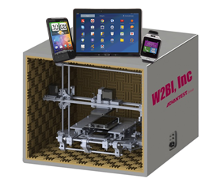
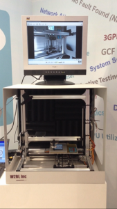

Posted  in [Featured Products](https://www.gosemiandbeyond.com/category/featuredproducts/)

# W2BI Unveils SmartBox – an Innovative System Level Test Solution for Smart Device Testing

*By Artun Kutchuk, **Vice President, Business Development & Strategy, ** and Keith Schaub, **Vice President, Corporate Development**, W2BI, Inc., Advantest Group Company*

**Combining W2BI’s patented QuikStressTM Automated Smart Device Test Software with 3D Robotics**

Smartphones and other smart devices are continuously integrating new functions. Many of these functions are physical movements (i.e. NFC, vibration, gyro, compass, accelerometer, temperature, and health / fitness to name a few). However, most test solutions today still target the non-physical aspects — the software, applications, RF and other specifications. As a backdrop to facilitate our discussion, let’s focus on three key life cycle segments of the smartphone:

- Pre-Launch production testing
- Post-Launch / Reverse production testing
- Point-of-Sale / In store diagnostics and testing

Each of these life cycles are closely related in the types of testing and diagnostics performed. To highlight that, let’s talk about some problems Alex, Tim, and Vicky are having with their smart devices.

Alex recently purchased a new smartphone but is having some audio issues when listening to music on his headphones. Tim has had his smartphone for about 6 months and recently his touchscreen hasn’t been working properly. Sometimes his phone doesn’t register when he swipes or presses the screen. Lastly, Vicky has been missing important phone calls and finally discovered when in silent mode, the phone isn’t vibrating like it is supposed to.

I’m sure many of you have experienced similar problems. Typically, the first thing you would do is to take your phone back to the Point-of-Sale (store where you purchased it) and inform the store assistant of the problem. Now what? Well, the assistant asks if you can show him the problem. Sometimes you can, when it’s a hard failure, but often you can’t. It might be intermittent, or occur only after certain events, or it might be caused by a specific combination of interactions between the hardware, software, applications, etc. Some stores have software diagnostic tools that perform a gross health check, but often the problem or issue is scenario based, therefore the diagnostic tool typically won’t capture or flag the failure, so the phone gets marked as NFF (No Fault Found), or NTF (No Trouble Found). Conservatively, we’ve estimated that NFF/NTF classifications are costing the industry in the 100s of millions of US dollars, perhaps in the billions.

There are two main reasons for that. First, in the store, the assistant typically will swap out your phone, giving you a new phone, so already a few hundred dollars to give the customer a brand new phone. Second, the NTF phone then churns through the reverse production line where numerous tests are run at multiple test stations looking for the problem, when no fault is found, the phone gets wiped and resold as a refurbished unit. Someone has to pay for all that testing and refurbishing. There are entire 2nd and 3rd tier markets existing largely based upon the high quantity of NTF/NFF phones. So, it would be safe to say that it is a big problem when the problem itself subsidizes entire markets.

There is a rule of thumb in industry for an end-user:

- In the first occurrence of the problem –> Change the phone
- In the second occurrence of the problem –> Change the Operator

The first time a customer has a problem with his phone, the customer is annoyed, would most probably change the phone – get a new one or upgrade to a newer model. If the store had to send his phone to the repair center, then he is without his phone for several days.

Then second time he has a problem, now he is extremely frustrated. The operator didn’t fix it the first time, and now he has to go through this again, so there’s a very good chance that he will switch operators.

You might ask. Didn’t any of this get tested at pre-launch? In fact, yes, smart devices with their myriad of integrated functions including: audio, touch screen, video, FM, BT, WiFi, NFC, compass, gyro, accelerometer, etc.), literally require a small army of people manually testing each function. The testing is highly subjective and prone with human errors and each function is generally tested standalone – that is, non-scenario based. Additionally, the emerging Internet of Things (IoT) devices are further complicating testing with high mix and low volume complex test setups.

This has created a need for a new platform that is low cost, easy to use, and automated consisting of robotics, and system level software able to interact and test functions, user scenarios, mission modes, and applications.

At W2BI, we developed an innovative platform, SmartBox, that:

- Functionally tests key components of a smart device at pre-Launch Production, Point of Sale (POS) and Repair Depots completely automated with typical end-user scenarios
- Scales the features and functions appropriately for the three key market segments (i.e. Pre-Launch, Point Of Sale, Post-Launch)

The Key Values & Benefits to customers

- Reduce NTF/NFF
- Isolate quality issues
- Classify true failures
- Eliminate subjectivity
- Verify & validate repairs
- Increase Customer Satisfaction

W2BI’s SmartBox platform combines robotics with system level software designed to be a low-cost scalable profile with a simple and easy to use experience for Production Testing, Point of Sale and Return Depot end users. All major functions as well as integrated applications and user scenarios can be tested automatically.

In addition to testing the software, OS, UI, applications, and user scenarios, SmartBox will be able to test the physical functions, namely:

- Touchscreen
- Audio / Video
- Camera / Lights
- Vibration
- Accelerometer
- Physical Buttons
- Compass
- NFC / Wireless Charging
- Gyro
- Temperature
- Health & Fitness

With SmartBox:

- Point of Sale: A store assistant can potentially place the smartphone inside, chose one or more tests including scenarios and within a few minutes get back a non-subjective actionable assessment.
- Pass/Fail result. Reverse Logistics / Repair Centers: Quickly and easily verify a failure as well as verify a successful repair and eliminate subjective errors caused by manual testing.
- Pre-Launch Production: Automatically test and verify all of the physical functions eliminating manual labor and human error.

**About the Authors:**

*Artun Kutchuk has over 25 years of experience in wireless, aerospace, robotics, business process automation and software development. He holds an M.Eng. Degree from McGill University. Artun also has co-founded a start-up and holds several patents in mobile device testing and diagnostics. Prior to W2BI-Advantest, Artun held multiple positions at Carrier IQ, Ericsson, Interfacing Technologies and CAE.*

* Keith Schaub has worked in RF & Wireless Semiconductors for more than 20 years. Keith is the author of Production Testing of RF and System-On-a-Chip Devices for Wireless Communications. He holds five patents on various wireless devices and test systems, founded two start-ups, and is an avid writer and publisher on wireless topics.*

  end .post_content

