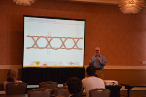

Posted  in [Top Stories](https://www.gosemiandbeyond.com/category/topstories/)

# Advantest Announces Dates & Locations for VOICE 2017; Call for Papers Open through Nov. 18

Advantest has issued an international call for papers on semiconductor test solutions, best practices and innovative technologies for next year’s annual VOICE Developer Conference. The 2017 conference will again be held in two locations — Palm Springs, California, at the Hyatt Regency Indian Wells Resort & Spa on May 16-17, and VOICE will return to the growing China region with an event at the InterContinental Shanghai Pudong on May 26. Both conferences will feature the theme *Measure the Connected World and Everything in It.*

**As VOICE enters its second decade in 2017, the conference will continue to offer attendees comprehensive learning and networking opportunities including technical presentations focused on eight technology tracks, partners’ expositions and social gatherings. In addition, the VOICE Technology Kiosk Showcase will expand to include more interactive discussion sessions for users of Advantest’s V93000 and T2000 system-on-a-chip (SoC) test platforms, memory test systems, handlers, test cell solutions, product engineering and test technology.

For VOICE 2017, Advantest’s call for papers focuses on eight technology tracks:

**Hot Topics
**Concerns new market drivers and future trends including V93000 Wave Scale RF and MX, automotive power analog, Internet of Things (IoT), emerging wireless standards, and test challenges at next-generation technology nodes.

**Device-Specific Testing
**Covers techniques for testing MCUs, ASICs, PMICs, automotive radar, sensors, memory, baseband, cellular, multi-chip packages and more.

**Hardware Design and Integration
**Includes tester/handler integration, probe and package loadboard design, challenges of new package technologies and fine-pitch devices, and more.

**Improving Throughput
**Addresses test-time reduction, increased multi-site, multi-site efficiency, concurrent test, and more.

**Reducing Time-to-Market
**Encompasses DFT, pattern simulations/cyclization, automatic test program generation, system-level test, and more.

**New Hardware / Software Test Solutions
**Focuses on solutions utilizing the latest hardware or software features.

**Test Methodologies
**Involves techniques for testing DC, RF, mixed-signal or high-speed digital devices.

**Product Engineering**

Includes software and tools for data analysis, test program documentation/versioning and production test elimination techniques.

Sponsorship opportunities are also available.  Please visit the VOICE 2017 website to find out more.

[Visit VOICE 2017](https://voice.advantest.com/)

  end .post_content

