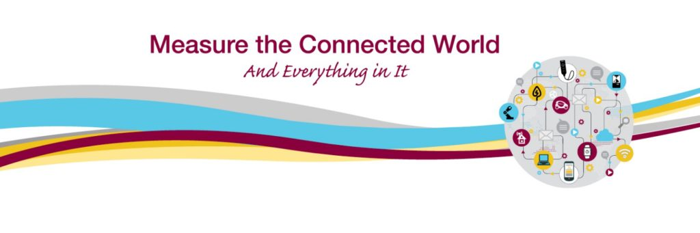

Posted  in [Upcoming Events](https://www.gosemiandbeyond.com/category/upcomingevents/)

# Advantest Explores the Internet of Things at SEMICON Japan

At the upcoming SEMICON Japan trade show in Tokyo on December 14-16, Advantest will bring the concept of Internet of Things (IoT) directly into our exhibit.  The value of our products and what we enable will be the platform for how the products will be shown in the booth.  Our products and services will be sorted into these four IoT segments: Industrial, Connected Home, Wireless/Wearables, and Connected Automobile.  In addition to over 18 products and services featured in the booth, we plan to have more hardware and live demonstrations for each of these products than in previous shows.

Further, we are utilizing more cutting-edge technology to demonstrate our products including an interactive wall that catches the visitor’s motion, transparent glass LED monitors to display product messages, and the use of augmented reality on Apple iPads to creatively display product information.

In addition, as a Gold sponsor of the show we are sponsoring the Autonomous & Connected Car Forum, where Shin Kimura, vice president of the ASD Test and Measurement Business Group, will present Thursday afternoon.

** Learn more about SEMI Japan.**

  end .post_content

