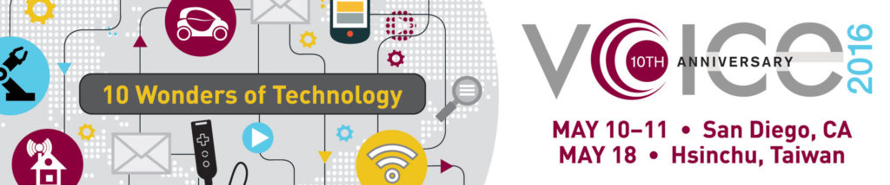

Posted  in [Top Stories](https://www.gosemiandbeyond.com/category/topstories/)

# Advantest Hosts 10th Anniversary VOICE 2016 Developer Conference

Advantest marked the 10th anniversary of its VOICE 2016 Developer Conference this year with 129 technical breakout sessions, two Partners’ Expos, 17 technology kiosks and multiple networking opportunities for members of the semiconductor test industry at dual events in San Diego, Calif., on May 10-11, and at Taiwan’s first VOICE conference in Hsinchu on May 18. Altogether, a record high of nearly 600 people attended the events, including 300 industry professionals in Taiwan – the most ever for a VOICE location outside of the United States.

At the U.S. session, there were 99 technical presentations – 20 more than last year – while the Taiwan conference featured 30 papers – six more than 2015’s VOICE event in Shanghai.  Advantest customers accounted for the majority of this year’s paper authors. Sixty percent of the papers in San Diego and 53 percent in Taiwan were either customer authored or co-authored.  In total, VOICE 2016 featured technical papers from 35 companies representing 12 countries, including the first participation from Ireland.  The event’s international appeal and the diversity of its seven technical tracks covering the newest semiconductor test methodologies continue to attract new participants, with 44 first-time attendees.

VOICE is managed by a steering committee of volunteer representatives from Advantest and its customers, and is the leading conference for the growing international community of users and strategic partners involved with Advantest’s T2000 and V93000 SoC test platforms as well as Advantest memory testers, handlers and test cell solutions.  Attendees gain and share valuable insights, build long-lasting relationships and learn what’s new about Advantest test equipment, handlers and applications, as well as technology trends that are not related to specific equipment.

[Learn more.](https://voice.advantest.com/)

  end .post_content

