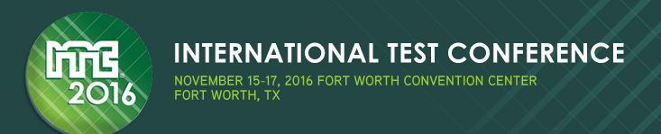

Posted  in [Upcoming Events](https://www.gosemiandbeyond.com/category/upcomingevents/)

# Advantest Plays Key Role in ITC with Extensive Program Participation and Exhibition

At the November 15-17 International Test Conference in Fort Worth, Texas, Advantest will demonstrate both hardware and online test solutions as well as serve on panels and present several papers in ITC’s renowned technical program.

In addition to being a Platinum-level corporate supporter of ITC, Advantest also is a Gold-level sponsor of the IEEE Automotive Reliability and Test Workshop, in conjunction with ITC TestWeek™.**On The Exhibit Floor**

Advantest will feature demonstrations of its on-demand [CloudTesting™ Service](http://www.cts-advantest.com/en/) and its new [EVA100 analog/mixed- signal](https://www.advantest.com/products/ic-test-systems/eva100) IC test solution.

The first-of-its-kind CloudTesting Service allows users to access various IP selections whenever needed from Advantest’s web site.  Using this on-demand online service, designers can verify their new silicon at very low cost with no capital investment, set up their own test environment within a few hours and be ready to test when the device arrives from the fab.  At ITC, visitors to the booth can see the desktop test station with a live demonstration of how fast a device can be verified with STIL-generated DFT patterns.  With free tester leasing and moderate repair costs, Advantest’s CloudTesting Service allows customers to avoid and unplanned expenses.

Advantest’s new EVA100 analog/mixed-signal test solution combines a modular architecture with high-voltage and high-precision analog parametric measurement units, providing the flexibility to conduct various measurements over a broad range of analog and mixed-signal devices.  The latest model in the EVA100 product family includes an integrated servo-loop function that delivers the industry’s fastest test time and high precision.  Its 18-bit AD-converter characterization has 20bit linearity DC performance and ultra-low drift/noise source and VREF.  Coupled with a GUI that is highly intuitive, users are able to minimize the time to market for their newest ICs.

**Technical Program Participation**

In addition to product exhibits, Advantest’s technologists will present several papers within ITC’s revered technical program throughout the three-day conference.  Following is a look at where Advantest’s experts will be heard:

- Dave Armstrong will host a discussion of Advantest’s new HA1000 die-level handler, a cost-efficient test solution for determining known good die (KGD) prior to IC packaging.
- Bob Bartlett will chair Session 5, a special session on “mmWave ATE HVM Technology,” where Roger McAleenan will present on mmWaveATE challenges.
- Dave Armstrong will chair Session 6, a special session on “Heterogeneous Integration Pushing the Test Roadmap,” as well as present a paper in that session titled “Moore’s Law is Done and Heterogeneous Integration is Taking Off.”
- A.T. Sivaram will present a poster co-authored with Xilinx Corporation on “CloudTesting™ Service in Silicon Diagnostics,” which describes an innovative service-oriented test solution for debugging high-end FPGA devices.
- Neils Poulsen along with Alfred Crouch and Jim Johnson of SiliconAid will present a poster titled “Silicon Debug on ATE Using Protocol-Aware JTAG-IJTAG EDA Software Tools.”
- Dave Armstrong along with Gary Maier of IBM will deliver a paper on “Known-Good-Die Test Methods for Large, Thin, High-Power Digital Devices.”
- M. Ishida and T. Kusaka of Advantest along with T. Nakura, N. Terao, R. Ikeno, T. Iizuka and K. Asada of the University of Tokyo will present a paper titled, “Power Supply Impedance Emulation to Eliminate Overkills and Underkills Due to the Impedance Difference Between ATE and Customer Board.”
- T. Nakamura and K. Asami’s paper “Novel Crosstalk Evaluation Method for High-Density Signal Traces Using Clock Waveform Conversion Technique” will also be given.

The four panels held during ITC TestWeek™ will each feature panelists from Advantest.  Dave Armstrong will serve on Panel 1, “The Unknown Unknowns of Test,” while Roger McAleenan will participate on Panel 2, “Phased Array 5G:  Is Test Connected or Disconnected?”  Bob Bartlett will bring his expertise to Panel 3, on test cost reduction, and Holger Engelhard will participate in Panel 4, which looks at ATE today, and where we should be heading.

[More information about ITC.](http://www.itctestweek.org)

  end .post_content

