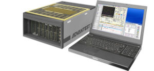

Posted  in [Upcoming Events](https://www.gosemiandbeyond.com/category/upcomingevents/)

# Advantest Promotes Newest Test Solutions at Technical Kiosks During Semicon Taiwan

 

Advantest marked the occasion of Semicon Taiwan to host a two-day hospitality event at which customers were invited to learn about the company’s new products and solutions while networking and enjoying refreshments in a relaxed setting.   With solid attendance on both days, this year’s event recorded the highest level of participation of the event’s five-year history.

Product kiosks within the suite included those focused on:

**-Smart Testing of Smart Devices **

*V93000 AVI64 Universal Analog Pin*

**-Delivering Revolutionary Test Capabilities for the Next Wave**

**NEW ***V93000 Wave Scale Solution *

**-Testing Memory Devices and SSD UFS **

*T5800, T5830 and T5851 Testers*

**-Fully-Integrated Digital IC Test Solution **

*EVA100 Tester*

**-Test Floor Intelligence Solutions **

*Field Service Capabilities*

**-High Resolution TDR for Failure Analysis **

*TS9000 TDR option utilizing terahertz technology*

 

  end .post_content

