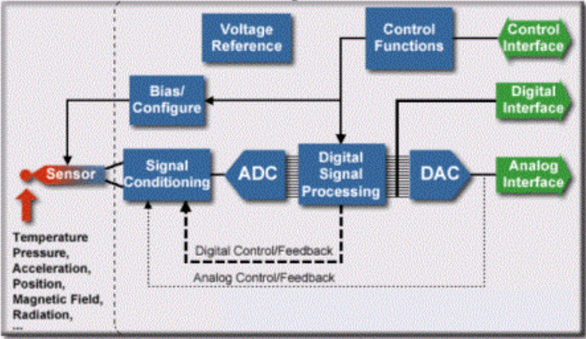
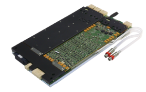

Posted  in [Top Stories](https://www.gosemiandbeyond.com/category/topstories/)

# Analog and Power Integration: The Next Level of IoT Test Demands

**Analog and Power Integration: The Next Level of IoT Test Demands**

By Martin Fischer, Solution Product Manager, Advantest Europe

Next-generation system-on-chip (SoC) designs – many of which are needed for IoT applications – are driving development of a wide range of smart devices with increasingly integrated functionality such as analog sensing, mobile computing, wireless communications and high-efficiency power management. These smart devices contain more analog and power functions than ever before, enabling advances such as longer battery life for handheld mobile electronics and emerging automotive applications for smart and connected cars. At the same time, these devices present new challenges for test equipment.

Analog technology is found in every step of package integration – from single-function ICs to SoCs, completely integrated solutions are enabling further miniaturization, as well as new and higher accuracy and voltage levels (see Figure 1). The semiconductor industry is looking for solutions to achieve faster time to market and lower unit test costs. However, many ATE systems lack the capability to efficiently test all the multiple analog and power functionalities integrated into a single SoC.

Parallel test is key for more complex devices, and this requirement was a driving factor behind the creation of Advantest’s V93000 single scalable platform, with its test-processor-per-pin architecture and modular approach to channel module design. When equipped with the DC Scale AVI64 universal analog pin module, the V93000 can test both analog and digital circuits.  It can handle all smart devices – from low-pin-count ICs to complex, high-density SoCs – by combining power/analog test functions with full test coverage.

The general-purpose AVI64 (see Figure 2) features analog and high-voltage digital capabilities and is optimized for providing a true universal analog pin, covering a wide range of test application needs. An arbitrary waveform generator (AWG), digitizer, digital IO capabilities, and a time measurement unit (TMU) are available per channel. One floating high-current unit with a current of up to ±4 A, one high-resolution AWG, and one floating differential voltmeter are available per group of 8 channels.

The ability to fit 64 channels on one board enables a very high level of integration. When you need to test typical IoT devices, e.g., sensors and MEMS chips, having fewer boards in a tester with very high density allows you to test many devices in parallel – this in turn leads to both high multi-site and lower cost of test. The analog and digital signals of the devices under test (DUTs) are synchronized by the Domain Sync feature, enabling testing of any smart device.

The combination of the V93000 with the AVI64 has allowed Advantest’s customers to achieve industry-leading utilization by combining power/analog testing with full SoC test coverage. This future-ready approach will enable semiconductor manufacturers to address the full range of IoT applications – not only today’s smart devices, meters, homes and buildings, but also emerging smart cities… and whatever comes next.

 

Figure 1. Increasingly integrated analog and power functionality are creating unique challenges for ATE.

Figure 2. Advantest’s DC Scale AVI64 universal analog pin module gives the V93000 platform the industry’s broadest capabilities for testing power and analog ICs used in mobile applications.

[Find out more.](https://www.advantest.com/products/ic-test-systems/v93000-soc-smart-scale)

  end .post_content

