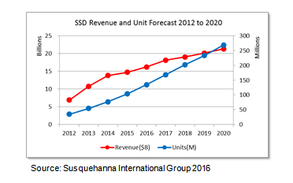
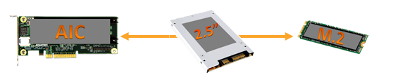

Posted  in [Top Stories](https://www.gosemiandbeyond.com/category/topstories/)

# Applying Flexible ATE Technology to Protocol Test and the SSD Market

*By Scott West, Global Technology, Innovation and Research Group, Advantest America*

The technology applications for which a broad range of connectivity and communication protocols can be employed continue to grow. Manufacturers of end products for these markets increasingly need flexible ATE solutions that they can employ cost-effectively to ensure functionality.

One of the first areas where protocol test has proven successful is the solid-state drive (SSD) market, which is growing rapidly, as shown in Figure 1. In addition to replacing hard disk drives (HDDs) for many applications, SSDs are also expanding into solid-state storage, as they offer advantages with respect to performance, power consumption and form factor, to name a few. While HDDs aren’t expected to disappear entirely – they remain useful for cold storage of data not accessed frequently – SSDs are desirable for fast response time and quick access to frequently used data.

*Figure 1. Unit shipments for the SSD market are expected to approach 300 million by 2020.*

While many SSDs started out using SATA at a speed of 6 Gbits/second (Gbps) as HDDs use, the SSD itself can actually support a much speedier protocol than spinning disks. So addition to SATA, the primary SSD protocols are SAS and PCI Express (PCIe). The latter is typically used with either AHCI¹ or NVMe², a communications interface/protocol developed for SSDs by a group of leading drive vendors. Viewed by many as the future of SSD due to its very high speed, NVMe is also intended to lower data latency.

The most direct way to replace an HDD with an SSD is to stay with the SATA protocol.  When companies are looking to make a further upgrade in performance beyond SATA, the least costly approach is to use SAS – it fits the HDD infrastructure, enabling easy swap-out and low impact on infrastructure cost. With PCs, it’s an easy change to go from SATA to PCIe, while data centers will move either to SAS or NVMe, depending on what makes the most sense for the data quantity and access requirements involved. And legacy systems, of which quite a few remain, will continue to utilize SATA. Manufacturers need to look at what’s involved overall in making a change from one protocol to another.

The bottom line is that the three predominant SSD protocols will be in use for the foreseeable future. Because customer demands vary, SSD makers must be able to incorporate these different protocols into their products, and they need a test solution that can easily and cost-effectively handle them all.

Advantest has developed a flexible, scalable platform for protocol test – the MPT3000 – that can easily accommodate varying requirements in form factor, speed and performance. The MPT3000 platform’s advantages are designed to optimize multi-site system-level-test (SLT) of different protocols:

- Multi-Protocol Flexibility – The MPT3000 uses FPGA-based test electronics, which allows users to download firmware to test SATA and then easily switch over to SAS or NVMe later on. The FPGA’s innate flexibility enables a quick change between solutions, requiring a firmware download that typically takes on the order of just 10 minutes.

- Performance – The FPGA-based electronics provide tester-per-DUT architecture, combined with Advantest expertise is high speed signally in test environments results in full speed testing of the newer NVMe and SAS SSDs. For existing test solutions whose shared architecture was sufficient for 6G SATA testing, the disruptive higher performance of the SAS and NVMe protocols creates performance challenges that the MPT3000 handles without compromise.

- Form factor flexibility – SSDs are replacing HDDs, which have a set form factor determined by the spinning disks. With SSD protocols, several form factors are being used (see Figure 2):

2 – longtime 2.5-in. form factor still found in many PCs and laptops;
Add-in Card (AIC) – formally referred to as a PC Card, now used for enterprise drives in data centers; allows more content to be included and cools easily;
2 – small, gum stick-sized SSD available in different lengths and versions with standard connector; fast and cable-free, M.2 is well suited for space-constrained setups.

*Figure 2. Traditional 2.5-inch U.2 form factors are giving way to both smaller, more versatile approaches such as M.2 and larger, higher performance AIC (add-in-card) SSDs.*

MPT3000 has interchangeable DUT interface boards (DIBs) to allow for quick form-factor changeovers based on customer demand, or other manufacturing flexibility such as the need for fast shipments, or to pursue new business opportunities. This flexibility maintains high utilization of test capacity, and together with the system’s high performance, enables users to slash test times, reducing the cost of test as well as their total test system ownership costs.

- Global structure – The SSD market hasn’t had this requirement previously, but with its rapid growth in past the few years, global support has become a major concern for SSD manufacturers. Advantest has the expertise and resources to support worldwide deployments. Currently, MPT3000 is the only proven, full-ATE SSD tester on the market. Companies using internal systems can no longer support their own test platforms – in particular, when looking to make the shift from internal SATA systems to NVMe. This is a key inflection point for Advantest.

Advantest introduced the first incarnation of its protocol test system in 2014. The MPT3000ENV conducts performance and stress testing of PCIe NVMe, SAS 12G and SATA SSDs of all major form factors in a thermal chamber supporting up to 256 DUTs running at 25W each, or a total of 6.4kW DUT power dissipation. Its focus is on reliability demonstration testing (RDT), testing a small sample of devices over time to prove that they will last over the desired lifetime (based on number of drives tested, length of test time, temperature/environment, and other variables). Typically, a few hundred devices are run for 1,000 hours at high temperatures, which equals about 3 months of constant read/write operations.

Introduced along with the ENV model, the MPT3000ES engineering station uses the same high-performance electronics and software as the MPT3000ENV, but in a smaller footprint. Used to perform test program development, and device analysis and debugging, it can test up to eight SSDs in parallel, providing as many as eight lanes of 12-Gbps signaling.

The newest addition to Advantest’s protocol test offerings is the MPT3000HVM, introduced in August. With the first protocol test systems having been used to prove reliability and handle development and debugging, the next step was to provide high-volume functional test capability. The MPT3000HVM supports the same devices as the MPT3000ENV, but with upgrade electronics for twice the parallelism.  Driven by the throughput and cost considerations of volume manufacturing, the DUT-density per floor space of the HVM system is vastly greater than the chambered system, using new closed-loop ambient-air thermal control. The system can also perform asynchronous test – with its rack architecture rather the tray-based RDT system, devices can be plugged and unplugged one at a time as they needed for more efficient tester. And although current SSD volumes are still generally handled manually by operators, the system is automation ready in anticipation of volumes crossing the threshold where a robotic load/unload system becomes economically advantageous.

Advantest has proved its mettle in protocol test via the high-volume, cost-sensitive SSD market. We look forward to targeting future developments in SSD, as well as in further protocol test applications, with our single-platform, flexible, scalable and highly parallel test technology. And we look forward to updating you as those developments evolve.

[Find out more.](https://www.advantest.com/products/ssd-test-systems)

Notes:

1. AHCI – Advance Host Controller Interface
2. NVMe – Non-Volatile Memory Express

 

  end .post_content

