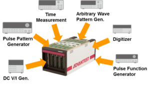

Posted  in [Featured Products](https://www.gosemiandbeyond.com/category/featuredproducts/)

# EVA100 Digital Solution Offers Design-Production Testing

Many IoT-enabled electronic products receive information in analog form, then convert it into signals for transmission. This requires the use of integrated digital ICs. These semiconductors are extremely cost sensitive, and the markets for them are highly competitive.  In addition, digital ICs are used in a wide range of applications, many of which impose stringent safety and reliability standards that put a premium on device performance and accuracy. For these reasons, producers of digital ICs typically employ high-mix, low-volume production methods, which require highly versatile and cost-efficient testing capabilities.

With its flexible architecture, Advantest’s new EVA100 Digital Solution can perform all of the functions needed for testing digital ICs, as well as pattern generation and comparison for evaluating device designs, digital control, power source measurements and 18bit analog measurements. It can conduct all of these measurements at 100Mbps data-transfer rates and up 200MHz clock speeds, resulting in high-efficiency testing.

EVA100 Digital Solution is the latest member in an expanding line of [EVA100](https://www.advantest.com/products/ic-test-systems/eva100) measurement systems for testing a broad variety of digital ICs, including IoT devices, microcontroller units (MCUs), design-for-test (DFT) and built-in self-test (BIST) semiconductors and logic ICs. It is available in both production and engineering models, with capabilities that include design evaluation, front-end and back-end measurements, fault analysis, package verification and acceptance inspection of devices.

 

**EVA100 Digital Solution**

**       **

**Fully Integrated Digital Testing Needs**

The new digital solution enables a customer to establish a common measurement environment throughout a facility, from design evaluation through production – achieving efficiency-boosting standardization that is unmatched by any existing measurement instrument or system. Furthermore, it is 40 percent smaller than the initial EVA100 measurement system, saving time and money by simplifying operation and making periodic maintenance much easier.  Scaling down the architecture also helps the EVA100 Digital Solution to deliver both high reliability and industry-leading productivity.  With each compact unit having a maximum of 256 measurement channels, as many as four EVA100 Digital Solutions can be clustered together to create configurations of up to 1,024 digital channels.  This enables the system to match manufacturing volumes with market needs by readily accommodating changes in production volumes and line retooling for different device types.  It also gives users the flexibility to optimize test environments for logic circuits and IoT devices, many of which utilize DFT.  Additionally, the measurement system can apply the same test programs for design and evaluation as for production, eliminating the need to change program codes and accelerating new devices’ time to market.

[Find out more:](https://www.advantest.com/products/ic-test-systems/eva100?inheritRedirect=true)

  end .post_content

