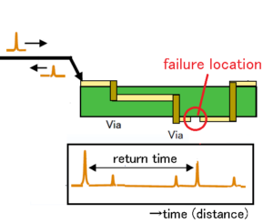
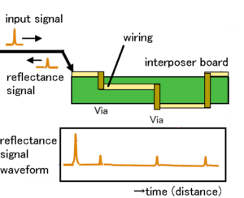

Posted  in [Featured Products](https://www.gosemiandbeyond.com/category/featuredproducts/)

# High Resolution TDR Error Detection for Advanced ICs

#### Short-pulse Signal Technology Enables 5µm Resolution Fault Isolation to Pinpoint and Map Circuit Defects

Electronic device circuit quality analysis is commonly performed using oscilloscope TDR (time domain reflectometry). However, as devices grow smaller and more highly integrated, the ability to locate failures with extreme spatial precision has become increasingly more important. Existing measurement instruments have limited resolution, as the rise time of the short pulse cannot be compressed much further, creating the risk that existing analysis technologies will be inadequate to handle the requirements of the highly integrated devices on the horizon.

Advantest’s terahertz analysis technology addresses these concerns and meets the need for ultra-high-resolution measurement and analysis of complex electrical circuits by utilizing short-pulse signal technology to enable 5µm resolution fault isolation to pinpoint and map circuit defects.

The company’s new TDR Option for the TS9000 series of terahertz analysis systems enables analysis of circuit quality in semiconductors, printed substrates, electronic components, and other applications, utilizing short-pulse terahertz waves.

**TS9000 TDR Option probe station**

The TS9000 TDR Option relies on Advantest’s market-proven TDR/TDT measurement technology to pinpoint and map circuit defects utilizing short-pulse signal processing. The solution delivers circuit analysis with an extremely high spatial precision of less than 5µm, and a maximum measurement range of 300 mm, including for internal circuitry used in through-silicon vias (TSVs) and interposers. Moreover, with the optional TDR/TDT CAD Data Link, errors located can be mapped and displayed on the CAD data of the target device, making it much easier for users to identify the causes of errors. Three types of TDR/TDT probes, each with a different resolution and measurement distance setting, are available for the TS9000 TDR Option, as are customizations for unique contact requirements.

**3D semiconductor wiring failures and TDR measurement examples**

[Find out more:](https://www.advantest.com/products/terahertz-spectroscopic-imaging-systems/tdr-option)

  end .post_content

