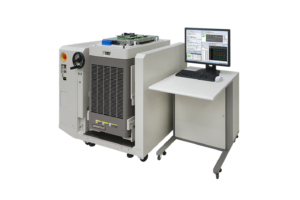
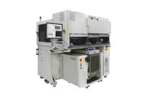

Posted  in [Featured Products](https://www.gosemiandbeyond.com/category/featuredproducts/)

# New T2000 AiR Targets Low-Volume Testing of Highly Integrated Modules and SiP Devices

 

Global market demand continues to grow for smartphones and other mobile electronic devices as well as consumer and enterprise services offered over the internet.  This trend is driving the need for increased production of complex semiconductor devices and modules that integrate MCUs and application processors to perform multiple functions, including telecommunications, power management and sensing.

T2000 AiR

Advantest’s new T2000 AiR system is a compact, air-cooled system optimized for low-cost testing in R&D and high-mix, low-volume production, and offers broad test coverage for these diverse modules and system-in- package (SiP) devices.  With its modular architecture providing maximum flexibility, the tester can be configured with up to six discrete air-cooled measurement modules. This enables single-system test coverage for a wide array of highly integrated, multi-functional devices. Designed to perform digital functions and SCAN testing over as many as 512 channels in parallel, the system can test high-voltage devices up to 2,000 volts, high-precision DC converters, automotive DC devices, mixed-signal ICs with bandwidths up to 100 MHz, RF communication chips and CMOS image sensors.

T2000 AiR with M48XX Handler

The new tester can be integrated with the M48xx series of handlers to create a highly efficient, zero-footprint test cell solution, which Advantest refers to as its Integrated Zero Test Station.  Because the T2000 AiR does not require water cooling, it can be installed anywhere.  Additionally, the system’s software environment is fully compatible with the highly scalable T2000 series, making it capable of conducting massively parallel testing and facilitating smooth production ramps to help customers reduce their newest products’ time to market.  Shipments to customers are expected to begin in the first quarter of calendar year 2017.

[Find out more.](https://www.advantest.com/products/ic-test-systems/t2000)

 

  end .post_content

