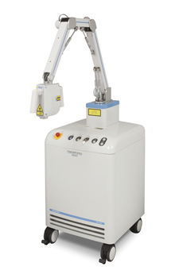

Posted  in [Featured Products](https://www.gosemiandbeyond.com/category/featuredproducts/)

# Photoacoustic Microscope Furthers Research in Dermatology and Regenerative Science

A new photoacoustic microscope introduced by Advantest enables non-invasive imaging of blood vessels in the dermis to a depth of 3mm, affording researchers in regenerative medicine an alternative to conventional biopsies.  Unlike biopsies – which have shortcomings, including limited insight into changes over time – Advantest’s new Hadatomo photoacoustic microscope offers researchers a thoroughly non-invasive process, with an ability to easily reference and compare historical results. This new evaluation method is poised to contribute to further advances in regenerative medicine, dermatology, and plastic surgery.

**Hadatomo™ Photoacoustic Microscope**

### Non-Invasive Imaging of Blood Vessels in the Dermis

One important area of research in regenerative medicine is skin grafts and the restoration of blood supply to the transplanted skin. However, even when treatment has restored blood circulation, non-invasive evaluation of results is difficult. Conventional ultrasound is not suited for imaging of blood vessels in the dermis: although it can produce images of areas deep inside the body, its resolution is poor. Conversely, microscopes and other optical imaging tools offer high resolution, but they cannot produce images of deeper dermis areas, as living tissue scatters the light they require.

Photoacoustic imaging combines the propagation characteristics of ultrasound and the absorption characteristics of light into a new hybrid imaging method. By using ultrasound technology, it can obtain accurate information to a depth of several millimeters: hemoglobin selectively absorbs the energy of light and returns ultrasonic waves to the surface of the skin, where they can be captured by sensors. The information obtained can be displayed numerically and as a high-contrast map of blood vessels in the dermis.

**Principles of Photoacoustic Imaging**

Advantest has been developing photoacoustic technology since 2010. The company’s independently developed sensors and electrical circuits permit high-speed measurement without exceeding the MPE (maximum permissible exposure) guidelines for exposure of skin to a light source. The new Hadatomo offers a measurement area of 4 mm × 4 mm × 3 mm (depth) and a maximum speed of 20 seconds per scan. Proprietary algorithms process the data obtained through dedicated software and construct 2D and 3D images in quasi-real time.

[Find out more:](https://www.advantest.com/products/leading-edge-products/wel5100)

  end .post_content

