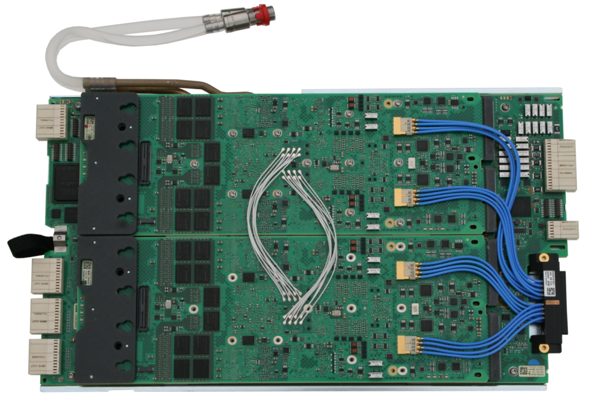

Posted  in [Top Stories](https://www.gosemiandbeyond.com/category/topstories/)

# Testing Ultra-Fast Memories…Ultra Fast

**By Ken Hanh Lai, Director of Memory Marketing, Memory Business Development**

Advanced high-speed test is becoming increasingly important as ultra-fast memory ICs are integrated into a greater number of end products. High-speed memory test systems need to accommodate this trend and offer advanced memory test capabilities for such high-speed ICs. One key category of high-speed memories is GDDR5 (graphics double data rate memory), designed for use in graphics cards, game consoles, and high-performance computational products. These devices include a high-speed parallel data bus that operates at around 8 gigabits per second (Gbps) today and is targeted to go up to 16 Gbps in the future (GDDR5X, GDDR6).

Other fast memory ICs operate using high-speed serial interfaces. Often, a serial bus can be operated at higher overall data rates than a parallel bus because a serial bus inherently has no timing skew or crosstalk. Examples of this include Universal Serial Bus (USB) and PCI Express (PCIe).  The benefits of these implementations include cost-effective, lower-pin-count designs.

These new memory test challenges are being addressed by the new HSM16G, a fully integrated memory test card recently introduced by Advantest (Figure 1). The card extends the high-speed testing capabilities of the company’s V93000 HSM series of testers to native 16 Gbps for at-speed testing of ultra-fast memory ICs. The card provides 32 channels, which are set up as 8 differential receive (RX) and transmit (TX) lines in the 16-Gbps operation mode. Additionally, the card can be switched to two lower-speed operating modes: an HSM8G-compatible operating mode for up to 8-Gbps operation and a 32-channel I/O base mode for up to 1.8-Gbps operation.

 **Figure 1.  Advantest HSM16G card for ultra-fast-memory test.**

The V93000 HSM Series with the HSM16G card provides ultra high-speed memory test capabilities in a cost-effective, small-footprint tester, making it well suited for engineering, design verification, and characterization. Other, less-fast testers have to perform complex multiplexing using lower speed channels  with add-on solutions to reach the speeds needed to test future GDDR5 and other high-speed devices. Because of the subsequent multiplexing, algorithmic pattern generation (APG) is significantly restricted, and only a limited feature set is available for characterization and debugging. The HSM16G card avoids these constraints thanks to its native 16-Gbps speed.

The new card features comprehensive measurement capabilities, including per-pin algorithmic pattern generation to test any kind of fault algorithm and fail bitmap capture. Programmable equalization allows for cable-loss compensation and rise-time control to support the highest signal integrity. A precision per-pin clock with less than 1 picosecond (ps) jitter enables the industry’s most accurate jitter measurements. Further capabilities that set the HSM16G apart are its per-pin-based arbitrary jitter modulation for device characterization and stress test, as well as a set of integrated analysis tools. Key volume-production features include per-pin embedded searches for rapid alignment to the center of the data eye, fast eye measurements to screen for both eye height and eye width, and an integrated time measurement unit (TMU) for accurate jitter measurements.

For memory ICs with serial bus interfaces such as PCIe and Universal Flash Storage (UFS), the HSM16G card offers comprehensive physical layer test (PHY characterization). This enables the card to cover all memory devices with high-speed serial interfaces or high-speed parallel memory buses.

Fully compatible with the V93000 HSM series’ hardware and software, the HSM16G card can be factory installed or retrofit onto a customer’s installed tester base. It enables reuse of existing test programs for HSM testers, with minimal adaptation, letting customers quickly set up the new card and get to work.

[Find out more:](https://www.advantest.com/news?articleId=786044)

  end .post_content

