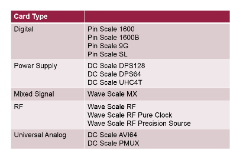
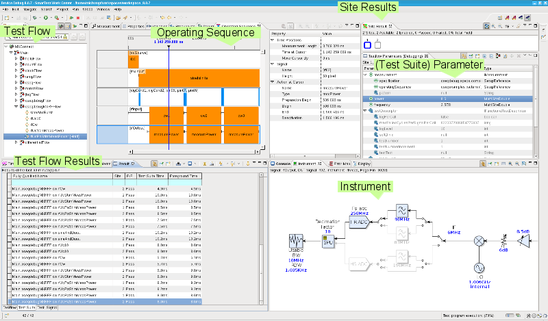
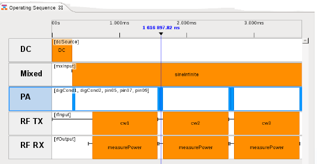
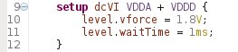

Posted  in [Top Stories](https://www.gosemiandbeyond.com/category/topstories/)

# A Smarter SmarTest: ATE Software for the Next Generation of Electronics

*By Rainer Donners, Product Manager, Advantest Corp.*

The complexity of the ICs being designed into consumer and communications devices continues to increase. The 10-nanometer (nm) node is here, and some chipmakers are already beginning to turn out 7-nm devices. With smaller transistors that pack more and more functionality on a single chip, the complexity of test programs is increasing apace with that of the ICs themselves.

These ICs are used in end products such as smartphones, Internet of Things (IoT) devices, computer and gaming products, and they are ‘multi-domain,’ i.e., they contain digital, DC, analog and radio-frequency (RF) circuitry all on the same chip. Developing efficient test programs for these multi-domain ICs within a shorter time to market (TTM) is becoming a challenge.

To overcome this challenge, Advantest has introduced SmarTest 8, the latest version of its SmarTest software, developed to support the V93000 test platform. It’s important to note that both SmarTest 8 and SmarTest 7 will coexist on the V93000 Series for the next decade, enabling customers to use the version best suited to their test needs and business requirements. SmarTest 8 works with all V93000 Series test cards introduced since 2011; see Figure 1 for cards supported by SmarTest 8.

**Figure 1. V93000 Cards supported with SmarTest 8**

SmarTest 8 features a host of new capabilities that will enable engineers who must deal with highly complex test programs to achieve superior parallelism and throughput. The new software’s many benefits include:

- Faster test program development
- Efficient debug and characterization
- Higher throughput, earlier, due to automated optimization
- Faster time to market
- Ease of test-block reuse
- Efficient collaboration

SmarTest 8 unifies multiple different tools within the SmarTest Work Center (SWC) environment, delivering a state-of-the-art look and feel and an entirely new design to ensure ease of use; see Figure 2.  Let’s take a look at some of the key SmarTest 8 concepts, features and tools that will allow users to reap the new product’s benefits for their test programs.

**Figure 2. SmarTest 8 comprises a suite of tools designed to simplify and optimize test program development and debug**

**Operating Sequence**

Advanced multi-domain devices consist of multiple different functional blocks. Typical block types include an RF block for transmitting/receiving phone signals, a protocol-ware (PA) interface to condition the device, analog blocks for microphone use and playing music, and/or digital blocks for processing.

Testing one functional block, e.g. the RF block, typically requires ‘assembling a test’ out of multiple pieces, e.g., starting an analog stimulus signal, conditioning the device with digital signals, and starting one or multiple RF measurements. Figure 3 provides an example, with three RF tests displayed in the Operating Sequence View.

**Figure 3. Operating Sequence View, displaying an example RF test**

The Operating Sequence is designed to easily assemble the multiple ‘test pieces,’ with precise synchronization where needed. These test pieces are typically patterns, protocol transactions, or ‘actions.’ Actions can be DC stimulus changes (e.g., stepping up a ramp), DC measurements, analog stimulus and measurements, or RF stimulus and measurements – to name some examples.

In addition to easy test setup, the Operating Sequence supports intuitive debugging; the screen view in Figure 3 displays exactly what has been executed.  Interactive changes during debug are well supported – as the second blue block in the figure indicates, inserting an additional transaction into one PA block changes the length of this conditioning block. The SmarTest 8 software automatically ensures that with the next execution of this test, subsequent actions (like cw2 and measurePower in the screen view) are shifted and retain their synchronous start.

Additionally, the Operating Sequence contributes to fast throughput. Multiple measurements can run in parallel, per Figure 3, in which two RF ports are tested concurrently. In addition, the execution of an Operating Sequence is done entirely via the unique test-processor-per-pin hardware of the V93000 system. No software or workstation interaction is required.

Overall, the Operating Sequence, with its new functionality, ease-of-use and optimal throughput, helps enable shorter TTM. This unique tool and concept are unavailable in competitive offerings.

**Modular Test Program Structure
**Test programs are complex, consisting of up to multiple thousands of tests for the different blocks of the device. The structure of the test setup data of SmarTest 8 is designed to easily deal with this complexity: SmarTest 8 incorporates the concept of subflows. Subflows as part of the testflow tool are established in the ATE software already. SmarTest 8 adds the new component that setup data can be structured and stored in separate and independent ‘subflow’ directories.

This capability enables multiple unique advantages:

- Teams can work on their own subflows independent from other teams, so collaboration is easy.
- No manual ‘merge’ effort is needed, as merging of the subflows is automatically performed by SmarTest 8.
- A complete (proven, debugged) subflow can be reused within multiple test programs of a device family. Reuse here refers to one single source of the subflow, not the ‘copy/paste’ approach typically used today. The latter creates test program maintenance challenges that are prevented with SmarTest 8’s re-use/single-source approach.

By making development and debug faster, easier and far less complex, the modular test program structure ultimately contributes to reduced TTM and time to quality (TTQ).

**Test-oriented Use Model via Instruments**

Many test systems’ use model is tester- or hardware-centric – it requires the user to learn how to program the tester in order to achieve the needed tasks. SmarTest 8 moves away from this model, allowing the user to focus on the *test*, not the *tester*.

With SmarTest 8, the user ‘thinks’ in terms of using instruments for his/her test tasks. Figure 4 shows example instruments and their respective implementations of the tester hardware cards.

**Figure 4. Simplified use model via SmarTest 8 Instruments**

These instruments are then programmed via properties and actions; see Figure 5 for an example setup for two VCC signals.

**Figure 5. Level specifications for VDDA and VDDD signals**

This level specification is identical for all DC instruments in SmarTest 8. When setting up the test, the test engineer will use the level specification for all suitable hardware, which could be a DC Scale DPS128, a parametric measurement unit (PMU) of a Pin Scale 1600 or a PMU of a Wave Scale MX card.

This test-orientation and tester, respectively, hardware-abstraction is consequently used in SmarTest 8, for test setup descriptions, application programming interfaces (APIs), access to results, and in debug tools. This makes the software intuitive and easy to learn, and the test programs are easy to develop, understand and debug, further lightening the burden for the test engineer.

In summary, after several years of development, optimization and beta test, SmarTest 8 is now ‘ready for prime time.’ It is installed at numerous customers, both in test program development and in high- volume manufacturing. SmarTest 8 delivers new benefits that, together with the proven V93000 platform, meets the test needs for the next/newest generation of advanced multi-domain, multi-core ICs. As part of the V93000 platform, it will be continuously expanded to enable even more capabilities and to make test engineers more efficient.

  end .post_content

