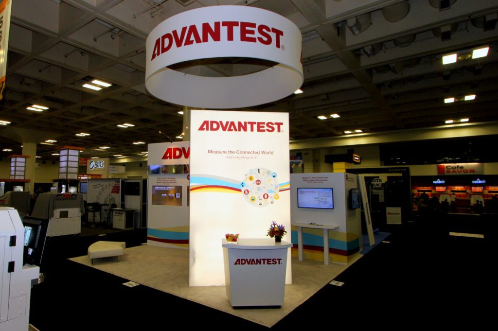

Posted  in [Upcoming Events](https://www.gosemiandbeyond.com/category/upcomingevents/)

# Advantest Shines at Semicon West 2017

The annual SEMICON West show, held July 11-13, 2017, at the Moscone Center in San Francisco, proved once again to be a great venue for interacting with customers, press and analysts, as well as promoting Advantest’s extensive product portfolio.

This year, Advantest showcased its new T5822 memory tester and V93000 Wave Scale™ MX-HR card, as well as its system-level test (SLT) application presentation. The Wave Scale RF and MX-HR modules and T2000 application module on-board (AMO) components were shown in the booth, using organic light-emitting diode (OLED) screens to highlight promotional messages interacting with the products behind the transparent glass. Also featured in the booth were the EVA100 mini shoebox configuration, corporate presentation, and Wave Scale videos.

In addition, Advantest participated in SEMI’s new SMART Journey Pavilion, which allowed visitors to explore the Internet of Things (IoT) and other “smart” innovations that are revolutionizing the manufacturing supply chain, automotive applications and everyday life. In this pavilion, Advantest screened a dynamic video illustrating the numerous devices that we test in autonomous vehicles.

Advantest presented four technical papers during the TestVision 2020 workshop, held July 12-13 in conjunction with SEMICON West. Presenters were: Dave Armstrong, director, business development; Roger McAleenan, director, Millimeter-Wave Test Solutions; Adrian Kwan, manager, business development; and Kotaro Hasegawa, senior director, ADS System Planning Dept.

Our annual SEMICON West customer event was again held at the popular and vibrant 111 Minna Gallery. More than 200 attendees enjoyed an evening of socializing in an informal setting, with entertainment provided by San Francisco’s own celebrated contemporary violinist Gabi Holzwarth.

Next year, Advantest will be located for the first time in the brand new South Hall at Moscone, which is currently under construction. We look forward to sharing with you our latest developments and innovations at SEMICON West 2018!

**Gabi Holzwarth performing at 111 Minna Gallery during Advantest’s Customer Hospitality Event**

  end .post_content

