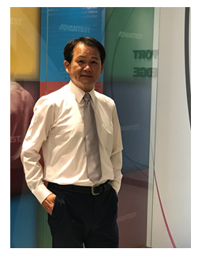

Posted  in [Uncategorized](https://www.gosemiandbeyond.com/category/uncategorized/)

# Advantest Taiwan CEO Guides with Balanced Leadership Approach

**By GO SEMI & Beyond Staff**

*The subject of this issue’s Q&A is C.H. Wu, chairman, president and CEO of Advantest Taiwan. Mr. Wu has served in these roles since 2006, and in 2012, he was named an executive officer with Advantest Corporation. He holds a bachelor’s degree in electrical engineering from Taiwan’s Lunghwa University of Science and Technology and an MBA from Saginaw Valley State University in Michigan.*

**Q: You received your undergraduate degree in Taiwan, and your MBA in the U.S. How did you begin to develop your business acumen?**

A: Growing up, many of my family were farmers, so I helped with farm work, such as rice seeding, weeding and husk drying. It was daunting to face those huge fields, but I soon realized that setting milestones and working steadily to completion is the best way to tackle any big job. This work ethic helped me to finish the farm work efficiently, and when I entered the job market, I continued to apply it to my efforts in the business world. I had trained myself to perform at a high level so that I could achieve excellent results in a timely manner.

**Q: How did you come to join the semiconductor equipment industry?**

A: A statement that has guided me in many of my life choices is “Know who you are and what you want.” After earning my degrees and working at big international firms such as Philips Electric and Motorola, I began to think about what mattered most to me in terms of moving forward in my career. I was familiar with the semiconductor industry, of course, and I chose to join Advantest Taiwan in 1990, just as the semiconductor equipment industry was beginning to boom. That decision opened up an exciting chapter in my life – one that has lasted more than two decades.

**Q: What is your management philosophy?**

A: I believe that task delegation must be balanced with ensuring cooperation and collaboration between company departments. For Advantest to remain successful over the long term, every member of the company must be invested at a personal level in helping sustain overall corporate growth. Our “2020 Project” cultivates in-house talents by inviting employees to propose, plan and implement innovative activities. We believe this program inspires technology advancements that benefit the company while reflecting Advantest’s core values and leadership position in the era of the Internet of Things.

We have implemented a number of projects in the last 25 years to recognize employees’ talents in different areas. Besides collaborating with academic institutions in skills development, we have combined our internal training program and job rotation mechanism to encourage employees to develop their strengths and make the most of their capabilities. A company’s success is not possible without each person’s individual contributions and unique talents. It’s therefore a leader’s responsibility to find ways to leverage the right people working in the right places doing the right things.

I also believe that career accomplishment isn’t the only measure of a person’s success. Good health, close friendships, and strong family relationships are all indispensable to a happy and well-balanced life.

**Q: In what ways does Advantest differentiate itself from competitors?**

A: I believe partnering with customers is absolutely essential. We must understand their challenges as well as they do in order to create a partnership that benefits each side. Just selling products won’t produce long-term relationships, and customers appreciate our efforts to ensure that we’re not just selling to them, but are helping them to achieve their long-term success goals.

  end .post_content

