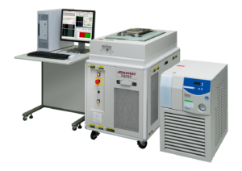

Posted  in [Uncategorized](https://www.gosemiandbeyond.com/category/uncategorized/)

# August Q&A Interview

Jin Yokoyama, Functional Manager of Memory Test, Advantest

** By GO SEMI & Beyond staff**

****

Advantest recently announced the T5822, the latest addition to its highly successful T5800 series of memory testers. In this issue’s Q&A, Jin Yokoyama, Functional Manager of Memory Test, talks about the new tester, which performs wafer-level test of DRAMs, NAND flash devices, and other non-volatile memories (NVMs).

**What market demands prompted the development of the T5822?**

Semiconductor makers need low-cost solutions for high-volume testing of price-sensitive memory ICs. The primary driver is the booming mobile-device market. While the PC market’s share of DRAM bit demand plunged to just 26 percent between 2009 and 2016, mobile DRAM bit share has grown more than 500 percent since 2009. Add in the fast-growing multilayer 3D NAND market, and you have a clear need by manufacturers of multiple memory devices for a cost-effective test system that can handle their requirements with a range of capabilities.

**How does the T5822 fit with other current memory testers in the T5800 family?**

The T5822 is designed for economical wafer-level testing by IDMs/OSATs [integrated device manufacturers/outsourced semiconductor assembly and test providers] producing or testing both DRAMs and NAND flash memories. When it comes to test coverage and functionality in between the T5822 and our existing T5833 in the wafer-level testing segment, some features do overlap. However, they can viably co-exist in the line because each system’s strength is different. For example, in addition to wafer sort, the T5833 is capable of higher-speed interface testing at the package level (i.e., final test) – it’s essentially a superset of capabilities. But at the wafer level, the T5822 will provide a wider voltage swing for some resources, allowing it to cover a wider range of customer needs – it provides greater optimization for memory wafer testing.

**What degree of parallel test does the new system offer?**

It depends upon each device interface specification or test mode. In general, the T5822 will be able to support up to 1,536 devices under test (DUTs) in parallel per device, and at high speed – up to 1.2 Gigabits per second.

**In what geographical region do you expect demand for the T5822 be greatest?**

Judging by recent M&A activity in the memory market, the pool of key memory makers/OSATs is growing more oligopolistic. Thus, we can’t say too much in this regard, as it would likely be obvious what companies we’re referencing. Generally speaking, we are expecting interest from customers that are dealing with both DRAM and NAND memory manufacturing (wafer-level testing), such as combo IDM/mixed-memory-product OSATs in the U.S. and Korea.

**What are the three most important points you’d like readers to know about the new product?**

- The T5822 has been optimized with a wider voltage level swing so that the T5800 series can fully cover all memory wafer-testing segments.
- The system has been enhanced with a compact test head that is more economical compared to our legacy general-purpose solution in our other T5800 series testers. It can be configured with a single or dual satellite test head, the latter being the most common configuration.
- The tester is part of the proven T5800 scalable and flexible platform family, which provide high reliability and enable easy test program porting from other legacy platforms due to high software compatibility. Together with modularity, FutureSuite operating system, and memory redundancy analysis (MRA) software, these are key advantages for our target customers.

  end .post_content

