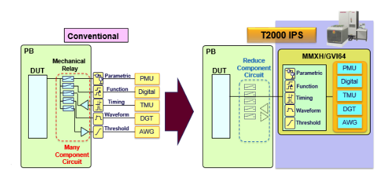
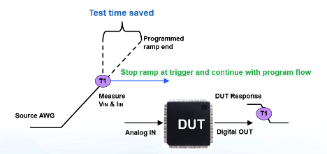
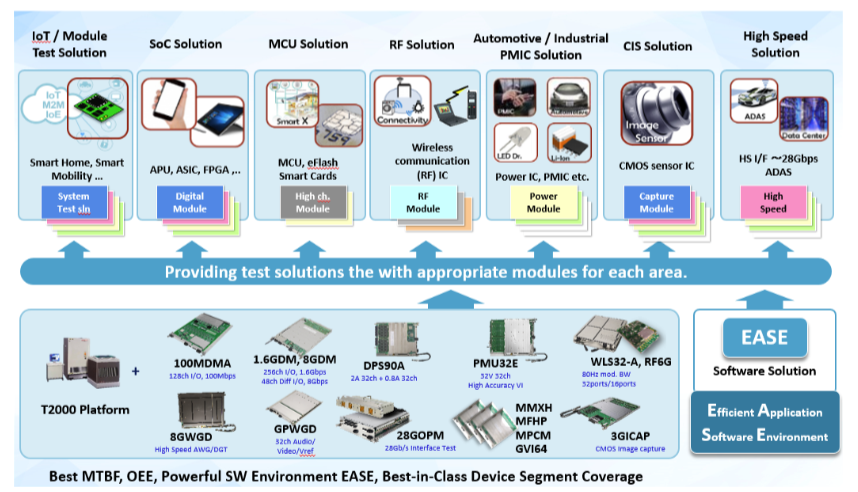

Posted  in [Featured Products](https://www.gosemiandbeyond.com/category/featuredproducts/)

# Five Key Success Factors for Automotive Device Test

*By Kotaro Hasegawa, Senior Director, ADS System Planning Department, Advantest Corp.*

* *

The number of automotive-related semiconductor devices being designed into vehicles has been growing rapidly due to increased requirements associated with safety, in-vehicle entertainment, and advanced driver assistance systems (ADAS; see Figure 1). As ADAS content advances, we move closer to autonomous vehicle driving (Figure 2), which will require even more devices.

**Figure 1. Automotive-related device market trends (Fuji Chimera Research Institute, Inc., 2017)**

In turn, as this demand, goes up, production volumes for application-specific standard products (ASSPs) need to escalate. Thus, more cost-effective testing solutions are required to improve cost of test (COT) while maintaining test quality. Automotive devices must work all the time – this is a critical safety factor, made even more so in the ADAS era. Thus, maintaining high device quality in mass production is essential to developing automotive ASSP device test cells.

Below are five key factors associated with achieving testing success and helping ensure high quality as emerging automotive ASSPs enter into mass production.

**Figure 2. Definition of ADAS levels (copyright SAE International, 2014)**

**1. Optimized Parallelism**

Typically, when testing system-on-chip (SoCs) on automated test equipment, parallelism is mainly defined by resource counts. To increase the amount of parallelism, you simply add further resources onto the tester and align them with the prober or handler. Automotive ASSPs, however, involve a large amount of analog testing using an external control circuit due to the need to simulate an application model for high-quality testing. Performance board (loadboard) space is required to mount all components necessary for testing the device under test (DUT).

In many cases, even with sufficient resources on the test head, loadboard space limitations prevent achieving the desired level of parallelism, which, in turn, limits productivity. One way to address this challenge is to expand the printed circuit board (PCB) area to ensure enough space is available to mount all components, but sometimes even this step is not sufficient.

The Advantest T2000 test platform incorporates two capabilities that address these parallelism limitations, allowing it to achieve greater parallelism than competitive platforms:

- Reduction in application relays on loadboard – up to 40 percent fewer in some cases – provided by the T2000’s multifunctional modules (Figure 3).
- Wider PCB support with RECT550EX fixture (HIFIX) – this feature can enable a 140-pin automotive ASSP device to expand x4 DUT testing to x8 DUT testing, as an example (see Figure 4).

**Figure 3. Example of T2000 relay reduction multifunctional module**

 

**Figure 4. T2000 RECT550EX fixture (HIFIX)**

**2. Reduced Test Time**

Once devices enter high-volume manufacture, test-time reduction becomes even more critical. The T2000 includes some unique features to improve productivity while maintaining test quality, enabling best-in-class performance.

Typically, test systems require the user to power off, change mode, and power on again, but this takes a great deal of time. The T2000 architecture’s switching methodology reduces power spikes by enabling mode switching during test. This reduced switching time is ideal for devices that are extremely COT and time-to-market (TTM) sensitive, such as automotive ASSPs.

Another testing method is to monitor the output behavior of the DUT. With the T2000, the hardware module can automatically detect the device output, and if there is any change in device state, the module can halt the arbitrary waveform generator’s (AWG) input as needed and assess the test result, then immediately move on to the next test item (see Figure 5). This capability speeds the process because waiting to receive the full-scale AWG output isn’t necessary.

**Figure 5. Test time reduction method on AWG**

**3. Wide Coverage**

The T2000 features 52 test head slots, allowing a reach of more than 8,000 digital and 6,400 analog channels. This lets the user obtain the best resourcing fit, choosing from wide variety of T2000 modules available. In addition, the T2000 can deliver both high voltage (up to 2000 V) and current (up to 216 A). With this wider coverage, the platform can be utilized to test automotive ASSPs, power management integrated circuits (PMICs), light-emitting diode (LED) drivers, and other devices with high resource requirements (see Figure 6).

**Figure 6. The T2000’s test segment coverage is among the industry’s widest**

**4. Test quality**

Advantest integrated into the T2000 platform a long lifecycle, as well as testing stability, accuracy and reliability. The platform and modules possess unique hardware/software design rules in order to achieve high-quality hardware. All modules are developed based on these design rules, including selection of the ICs for the module, to help ensure high system quality and reliability. These are key factors for testing quality-sensitive devices such as automotive ASSPs.

**5. Field Proven**

It takes a long time to launch new automotive-related devices into the market, and the test process is highly sensitive to changes in the production environment. Selecting a proven platform that includes all necessary capabilities is key to optimal testing of automotive-related devices. In addition, newer devices targeting this market will be highly integrated to include more functionality, voltage coverage, current, and frequency. In addition to being field-proven, the test system implemented will need to offer the widest coverage so that it is flexible and extendible.

Worldwide, more than 3,900 T2000 modules designed especially for automotive ASSP testing are already installed, and further growth is expected as the market for these devices continues to expand.

Given its combination of high-quality test, high productivity and widest device segment coverage, the T2000 is well suited for testing automotive and other quality-sensitive devices.

 

  end .post_content

