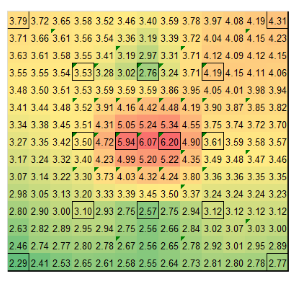
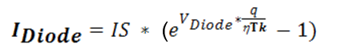
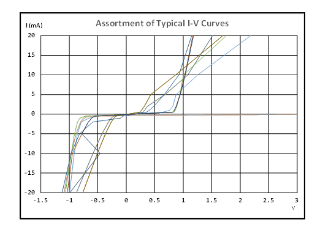
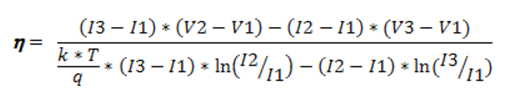
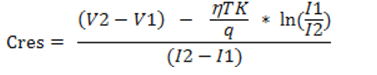
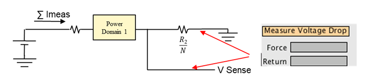
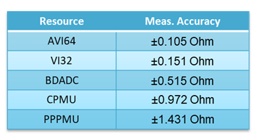

Posted  in [Top Stories](https://www.gosemiandbeyond.com/category/topstories/)

# Inline Contact Resistance Solves Wafer Probing Challenges

**By Dave Armstrong, Director of Business Development, Advantest America, Inc.**

Testing is increasingly being conducted at the wafer level as well as at lower voltage levels, necessitating even greater test accuracy. Achieving this accuracy is often hampered by poor contact resistance (Cres). In this environment, conventional continuity tests – in which current is applied in parallel to all pins and per-pin diode voltage is measured to verify continuity between the tester and the internal die – are not adequate for determining yield limiting contact problem. Moreover, they have no value in determining potential issues with probe card degradation over time.

Probe cards often are subjected to offline electrical contact resistance measurements, but contact resistance grows as the probes become dirty. As wafer probing progresses, if one pin starts to make poor contact, the situation will worsen, resulting in a large quantity of potentially good parts being turned away. To prevent the impact of accumulated residue affecting probe and test quality, inline contact resistance is becoming essential. Similar to the shift toward inline process control that became industry-standard in the early 2000s, measuring contact resistance inline will serve to mitigate the problem of dirty or damaged probes, unlike continuity testing.

**Key industry trends**

Moving to inline contact resistance is critical for a number of reasons. First, systems-on-chip (SoCs) face a daunting roadmap for wafer probing, as Figure 1 indicates.

Figure 1. The International Technology Roadmap for Semiconductors (ITRS) spotlights significant challenges for wafer probing through 2020. 
*International Technology Roadmap for Semiconductors 2015
 **Full Wafer Contact

The data shown in the table for 2016 – 66,000 individual probes making contact with one die – was fairly conservative. Today, the industry is exceeding those numbers, which were published in 2015, by more than 150%. Every probe must be clean and accurate, and therein lies the challenge. Sometimes, the same die is being probed three to four times – perhaps at a different temperature each time – and each probe kicks up oxide “dirt.” In addition, dirt accumulates as the probe moves across the wafer (through the lot) since the same probe is used for each die on the wafer. It’s a problem of numbers, repeatability and trends for a series of wafers and a series of die.

Further complicating this, engineers are now doing more than final test at wafer probe, e.g., at-speed testing and Known-Good-Die (KGD) testing. Getting to KGD is, of course, the ultimate goal – they want to touch down on the die and know that everything works before packaging. This is not easy to achieve. More types of testing, such as high- and low-temperature tests, must be performed – all of which will be challenged by poor contact resistance.

Moving to contact resistance measurements is also critical because of the need to accommodate probe planarity issues. In the environment of the ATE, the probe needs to be held in as planar a manner as possible while, at the same time, a force of 200kg or more is pushing down on the probes. This pressure will cause the probe assembly to bow, making true planarity difficult to maintain. The probe micrograph in Figure 2 provides an example of this problem. The contact resistance in the center of the die was much higher than at the periphery, and much lower at the southern edge. The culprit: bowing up in the center of the die, which created a balloon effect that caused the center and part of the northeast portion to be bad. While a reading of anything less than 8 ohms is considered acceptable, high-power probing requires less than 4 ohms, making Cres requirements much tighter in high-power and extreme-temperature environments.

Figure 2. This example contact resistance (Cres) plot clearly shows bowing in the center of the probe.

**Contact resistance measurement process**

The diagram in Figure 3 represents circuits typically found in a variety of devices, each of which can benefit from inline Cres measurement. While many readers will be familiar with these diagrams, here is a brief summary of each type: 3a is a traditional I/O circuit with two diodes, one connected to a power supply and one to ground; 3b is similar, with a resistor added to each diode in series; 3c consists of one large diode with a resistor in series; 3d contains a single diode going to ground only and not a power supply; 3e is the opposite, with the diode going to the power supply and not to ground; and 3f represents the class of interfaces known as SerDes, used in high-speed communication. These circuits are unknowns in many respects – they are very different from any other type of circuit and by far the most difficult to assess for contact resistance.

Figure 3. Each type of circuit illustrated in this black box diagram can benefit from inline Cres measurement.

Inline contact resistance measurements can be performed in a variety of ways. Using standard digital pin parametric measurement unit (PPMU) resources enables tracking changes to contact resistance – either over time or positionally. To measure the contact resistance of I/O pins, the engineer basically forces currents, measures voltages, and then performs calculations to determine Cres.

Conceptually, Cres is calculated using this equation:

*************

can be calculated by looking at the diode equation:

**************

Which can be reordered to calculate the change in diode voltage:

The challenge with this equation is what value to use for diode ideality *η*. This value is not a constant, it varies with technology, process, and transistor geometry. All the other values are known, e.g., q = transistor charge, k = Boltzmann constant, T = die temperature, etc. Because, as noted above, different device pins have different (or no) diodes, the diode configuration becomes critical when trying to determine the value of *η*. Since diodes may exist to ground, supply, or both, either positive currents/voltage or negative currents/voltage may need to be used in order to obtain valid Cres measurements.

The curves for each pin type also need to be individually analyzed to solve for diode ideality *η*. Once determined, ideality values don’t seem to change for a given process and design. However, ideality values can vary broadly – the pins shown on the graph in Figure 4 have idealities between +60 and -2.6. Many different pins are superimposed on top of each other, all showing very different performance. The key point to note here is that, when the correct value is determined for *η*, Cres doesn’t change with different current levels.

Figure 4. By looking at this plot, the test engineer can determine which type of ESD protection circuit is being employed, and use portions of the plot to calculate η.

 

**Determining values for η**

The process for determining η involves the following steps:

1. Force different currents into and out of all DUT pins and measure the voltage. For the purpose of this article, the currents selected were ±20mA, ±10mA, ±5mA, ±2mA, ±1mA and ±0.5mA.
2. Select three positive or three negative measurements, and calculate ideality using this formula:
3. Try different current values in the equation to check if the ideality stays relatively constant. With the right value for η the result will change very little. Also, all pins with a similar I/O buffer design will have the same η value.
4. Perform a final check of the ideality selected by using the value in the Cres equation. The resistance value should be positive and will not change with different current levels.

At this point, production measurements of Cres can be performed by simply performing two current force and voltage measurements (of the same polarity that was used for calculating Image) and then performing the following calculation for Cres:

Example Cres measurement results are shown in Figure 5. Measurements were taken at two different force levels (140 lbs. and 92 lbs.), and on a pin-by-pin basis, Cres rose by about 2 ohms between them. The orange plot at 69 ohms highlights a failure in the making. Cres should be lower with higher force, so this tells us that the contactor bowed.

Figure 5. This graph provides the distribution of measurement results obtained at two different overdrive levels. Pins with resistors in series with their ESD diode are clearly visible at ~ 33Ω. Those without are at ~9Ω.

**Determining Cres of SerDes pins**

SerDes pins are difficult to analyze. They often have, pre-emphasis and equalization circuits on the inputs and outputs to match the on-die circuitry to their transmission lines. This greatly complicates conducting Cres measurement on these pins.

Figure 6. Changes in termination resistance values can help determine Cres for SerDes pins.

As seen in Figure 6, on part of the I-V curve, the slope of lines is about 100 ohms, as SerDes pins typically have termination resistors of 100 ohms, so the I-V curve will show this resistance, not Cres. The good news is that these termination resistance values do change with Cres changes – so the engineer can measure nominally 100 ohms using traditional Ohm’s law equations without the diode voltage adjustment, and then watch to see if the measurement value increase as the Cres degrades.

The test methods described so far are all two-terminal inline test methods. It’s important to recognize that two-terminal measurements will inherently include additional resistances in addition to the key Cres value to be determined. This is shown in Figure 7.

Figure 7. Two-terminal contact resistance stray values are compensated for over time.

While the test system is designed to compensate for all the resistances in the grey fields, it cannot compensate for the green resistors. As a consequence, the Cres values measured by these techniques will 1) be higher than normally expected, and 2) vary from pin to pin due to fixture design differences. The best way to deal with this situation is to simply save a baseline set of Cres as measured by these two-terminal techniques and then monitor the difference between the baseline and the Cres values measured over time.

**Determining Cres of supply pins**

A supply’s contact resistance can also be measured using a PPMU and a device power supply (DPS) monitor pin. In connecting the DPS in the test system to the DUT pins, it is becoming common practice to connect one of the DUT supply pins to a digital PMU pin. In addition to providing an enhanced ability to monitor the on-die supply voltage, this approach allows direct measurement of Cres from the digital pin to the DPS signal itself, and thus, direct calculation of the contact resistance average value for the DPS interconnection. Using the monitor pin, a simple I-V curve is observed (Figure 8) which allows straightforward calculation of the Cres. Complicating this for high-power designs is the very large number of supply pins in parallel. While this technique will still measure the average contact resistance it is less sensitive to changes in Cres at the per-pin level.

Figure 8. I-V curve for supply-pin Cres measurement. The sensitivity of this measurement to single-pin Cres issues drops as a large number of probes are connected in parallel.

**Determining Cres of ground pins**

This designed-in capability is unique to Advantest. In power-supply modules, a current is forced through a primary path, and then another path is used to sense voltage-out on the device under test (DUT) board. One of the available modules for the V93000 test system is called the UHC4. The UHC4 has a contact resistance monitor circuit built directly into the supply, giving it the unique ability to measure the voltage difference between force and sense right in the instrument (Figure 9).

Measuring a low value of resistance requires a high current (i.e., measurements must be taken during a power-up condition). As a simple example: with the part in an active mode, consuming, say 100 amps, a 1-volt change across the pins tells the user that all resistors are exhibiting 10 milliohms of resistance. A shift in the resistance indicates a ground connection problem. Continually monitoring the module will provide a good level of sensitivity to any big issues that arise.

Figure 9. The V93000 UHC4 module is uniquely able to measure voltage difference between force and sense.

**High-accuracy Cres measurement**

Using the precision DC measurement resources available in the V93000, high-accuracy Cres measurements can be made using thermal measurement diodes with four-terminal techniques. Several resources can be used to make these measurements. The results of a Monte-Carlo analysis of the measurement Imageaccuracy with the available instruments are provided in the table at right, which clearly shows the benefits afforded by Advantest’s DC-scale AVI64 universal analog pin module over the per-pin PMU of the PS1600.

**In summary**

The Advantest V93000 is able to measure both inline (2-terminal) and high-accuracy (4-terminal) contact resistance. These measurements will become more critical as the industry moves to higher pin counts, higher power levels and lower voltages. Expanded testing at the wafer probe will also drive this trend, as will extreme-temperature testing, which makes everything more difficult.

  end .post_content

