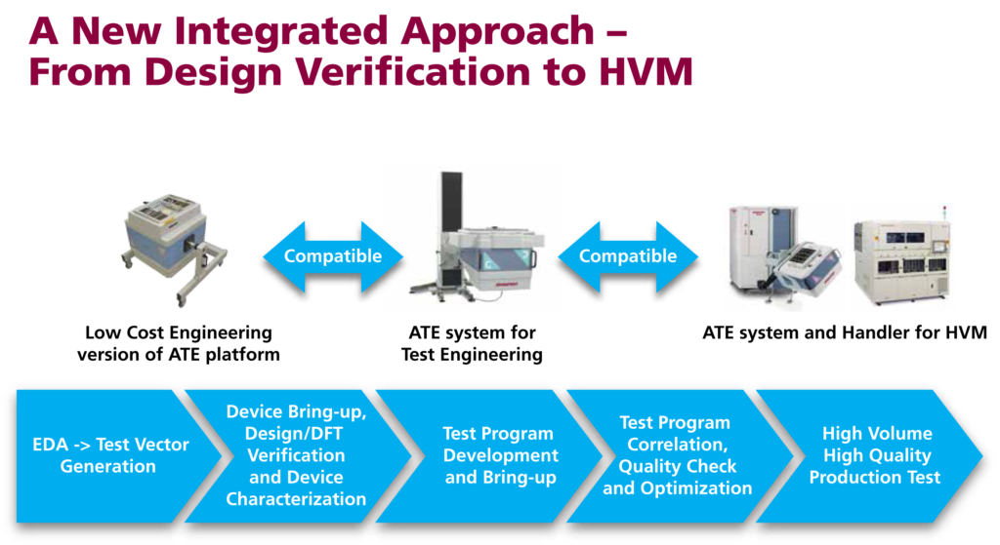

Posted  in [Top Stories](https://www.gosemiandbeyond.com/category/topstories/)

# IoT Devices Require a New DFT Paradigm and Scalable ATE

*By Neils Poulsen, Director of SoC Business Development, Advantest*

Touted as the “next big thing” to drive the next major wave of semiconductor device growth, the emerging market for the Internet of Things (IoT) is widely projected to increase semiconductor device volumes by tens of billions of units over the next several years. These volumes will be fueled by myriad new consumer end-user applications and services, to be provided by hundreds of companies ranging widely in size and resources.

IoT devices comprise several functions: computation (typically a microcontroller); communication (typically a wireless/radio frequency [RF] connection); and multiple sensors and/or actuators, the quantity of which depends on the end-use application. Sensors are used to detect environmental parameters, such as temperature, acceleration, magnetic field, moisture, light intensity or distance. The received signals are processed via integrated microcontroller or DSP cores, and the information is passed on to wireless devices via wireless communication interfaces. The integrated cores’ performance is significant, as data encryption is often required due to security aspects in IoT products. Other key functional components in smart devices are drivers for actuators to convert electrical signals into movements. Typically, these are integrated driver circuits for brushless DC motors or relay drivers.

Because these devices must operate on small batteries for extended periods of time – sometimes years – they must be able to consume very low amounts of power. Bluetooth Low Energy, ZigBee, WiFi and other communications standards are designed for low power requirements and optimized for easy network integration. This combination of requirements presents many challenges to designers and test engineers, as these complex devices are increasingly becoming more like high-end systems-on-chip (SoCs), but necessarily sell at a small fraction of the price.   

Moreover, the dynamic nature of the consumer market, as well as the large number of competing companies, is placing tremendous pressure on semiconductor suppliers to shorten both their time to market (TTM) and time to quality (TTQ). Improving these parameters will allow them to secure customer design wins and achieve the necessary volumes and quality levels their customers require – at the same time, meeting their own cost targets, including acceptable manufacturing yields (see Figure 1).

**Figure 1**

To profitably compete in the IoT market, companies must find ways to significantly increase their overall efficiency and reduce their overall costs. This means they must consider breaking away from their traditional approaches and embrace a new paradigm for the design-to-manufacturing process, including test. 

**Changing the paradigm**

In the traditional process flow (Figure 2), design and DFT (design-for-test) engineers use test instrumentation in benchtop setups during initial device bring-up to debug and verify the chip’s proper operation. This includes building special fixturing to interface the device-under-test (DUT) to various multiple instruments, as well as translating patterns from the design simulation environment into test vectors that can execute in the benchtop instruments to control and stimulate the DUT. To test complex IoT chips’ complete functionality (i.e., digital, analog and RF) as they become more integrated, these engineers typically write time-consuming custom software routines to control and coordinate multiple benchtop instruments.

Figure 2

Similarly, in the next step of the traditional process, the characterization phase, engineers typically use benchtop instrumentation to evaluate the chip’s performance, validate specifications, and determine operating margins across a range of operating conditions, including frequency, voltage and current. This can be a time-consuming, manual process. In addition, the instrumentation, device fixturing and custom software routines usually differ from those used in the design verification phase. This leads to inefficient duplication of engineering resources and can create delays in the overall process.

To garner a statistically valid sample, many devices should be characterized, but collecting and analyzing the large amount of data needed to do this is limited by the slow throughput and difficulty of interfacing bench setups to automated device handlers. As a result, because of TTM pressures, only a few devices usually receive this high level of characterization, and the range of operating conditions is limited, which can negatively impact quality and device yields later during the manufacturing process. This is also typically the phase when customer samples are first provided, based on characterization data, so time-consuming benchtop characterization limits the number of sample devices that can be shipped to customers, which can limit market potential.    

In the next phase of the traditional process, test engineers develop test programs on ATE that will be used to test the devices in high-volume manufacturing (HVM). However, the ATE instrumentation, DUT fixturing and software environment are all very different than the bench set-ups. This means there is very little compatibility between the earlier Design Verification and Characterization phases and the HVM Test Program Development phase. Once again, this results in duplication of engineering effort, including designing new DUT interface fixturing, performing additional ATE characterization to correlate to the benchtop characterization data, and determining test limit guard-bands to ensure HVM test quality. The different environments also mean that correlating the HVM test results to the benchtop data can be difficult and time consuming, requiring multiple iterations and further delaying TTQ. 

**Implementing a new approach**

A new integrated ATE solution being embraced by several leading semiconductor suppliers utilizes engineering ATE that comprises the same hardware instrumentation, software environment and DUT interface fixturing as the ATE used for HVM test (Figure 3).  This compatibility accelerates test program development and bring-up, correlation and release to HVM by leveraging the engineering efforts from the previous phases – resulting in reduced costs and improved TTQ.

**Figure 3**

Design/DFT engineers can utilize low-cost engineering ATE for their initial device debug and verification so that when they translate their simulation patterns to test vectors, these same vectors can be used by test engineers for their HVM test program. This eliminates redundant vector translation, enables test engineers to begin test program development earlier, and minimizes problems and delays due to revision errors.

Similarly, by combining low-cost ATE with a cost-effective engineering handler, an automated “production-like” environment and high-throughput characterization test programs, engineers can realistically characterize thousands of engineering samples in far less time, significantly reducing TTM. And by collecting and analyzing much more data over a far wider spectrum of operating conditions, they can significantly increase quality. 

**Advantest V93000 platform handles multiple requirements**

Advantest is enabling this integrated test approach via its V93000 platform of testers, which includes the scalable A-Class configuration. A cost-effective engineering ATE solution, the A-Class uses the same hardware instrumentation, software and DUT interface fixturing as the other members of the V93000 family (see Figure 4), facilitating transition across the V93000 platform as needed. This includes high-density instruments that utilize the universal pin concept (every pin can generate and receive the digital, analog or RF signals needed to test IoT devices).

Figure 4

Utilizing the V93000 A-Class in engineering for design verification and characterization creates a seamless streamlined process, in which:

- Performing the initial device debug and bring-up on the same DUT fixturing that will be used in HVM enables removing the loadboard from the critical path;
- Reusing common test routines speeds up the entire DV-to-HVM process and can result in having the HVM test program complete with first customer samples; and
- Automated high throughput characterization (in conjunction with an engineering handler) provides faster and higher-volume data collection, on a significantly larger number of devices.

Implementing the Wave Scale RF channel card makes the V93000 A-Class even more effective as an economical engineering option for the IoT market. Wave Scale RF was designed with four independent subsystems per board to eliminate shared pin resources. This enables both in-site and high multi-site parallel testing, helping achieve test time reductions of up to 50 percent or more, compared to traditional RF architectures.

Through the combination of all these capabilities that allow users to conduct their engineering activities on the same platform and instrumentation set that they use for high-volume production, Advantest has developed a scalable solution that improves engineering efficiency, lowers overall costs, reduces TTM and improves TTQ – helping semiconductor suppliers to compete in the emerging IoT market.

[Find out more:](https://www.advantest.com/products/ic-test-systems/v93000-soc-smart-scale)

  end .post_content

