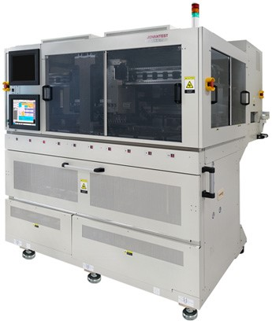

Posted  in [Featured Products](https://www.gosemiandbeyond.com/category/featuredproducts/)

# New Pick-and-Place IC Handler Improves Efficiency in High-Volume Semiconductor Manufacturing and Device Characterization

With an eye on helping customers keep pace with the rapidly evolving system-on-chip (SoC) market, Advantest’s new M4872 pick-and-place handler is designed to rapidly adapt to changes in device technology.  It offers improved productivity in testing SoC devices in high-volume manufacturing (HVM) and device characterization pre-production environments.  

The new handler matches all of the leading-edge performance specifications of its predecessor, the M4871, including throughput of up to 15,000 units per hour, in a footprint that is approximately 10 percent smaller. The portable M4872 handler has advanced vision-alignment capabilities and can accommodate an optional active thermal control system.

The vision alignment-equipped M4872 incorporates a common change kit, which saves time and money and also significantly shortens time to market.  In total, the time it takes to change device types is reduced by more than 45 percent, enabling nearly twice the throughput of handlers that rely on standard change kits.

Advantest’s proprietary on-the-fly vision-alignment technology precisely positions devices under test, making the new handler ideally suited for testing fine-pitch ICs and devices with both top- and bottom-side contacts. The resulting improvements in test yields and cycle times contribute to higher overall productivity.

The M4872 also includes an automatic re-test function that transfers all failed ICs into the loader stocker, helping to avoid time-consuming operator assistance and reducing IoT test times by 20 percent or more.

The scalable M4872 handler is compatible with the V93000 platform for low-cost testing in R&D and high-mix, low-volume production.  Handler operation is made simple by a user-friendly GUI with pre-defined functions.

[Find out more:](https://www.advantest.com/products/ic-test-systems/m4871)

  end .post_content

