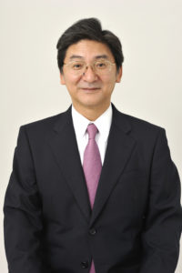

Posted  in [Q&A](https://www.gosemiandbeyond.com/category/qa/), [Uncategorized](https://www.gosemiandbeyond.com/category/uncategorized/)

# Q&A: A Change at the Top

**By ****GO SEMI & Beyond**** Staff**

*Yoshiaki Yoshida became Advantest President and CEO in January 2017, replacing Shinichiro Kuroe, who decided to step down after serving in the role since August 2014. Under Mr. Kuroe’s leadership, Advantest returned to profitability in fiscal 2014 and continued to build on that success over the next two years. Mr. Yoshida was elected his successor, and shares here his vision for taking the company forward.*

**What are your plans for Advantest in your new role? **

My goal is to maintain the profitable corporate structure Mr. Kuroe built, while continuing our pattern of growth. I also aim to build a working atmosphere that will further enable Advantest employees to enjoy and take pride in their work.

**Are there key topics on which you will focus?**

Yes, I plan to focus on three key areas.

First: Our unique value proposition. Everyone values safety and security – both of which our core measurement technologies offer. We have worked hard to ensure that our businesses provide enormous value to people around the world, and it’s essential that we continue to work with confidence to grow our reach.

Second: Our business environment.  Semiconductors are penetrating further and further into everyday life, and semiconductor devices and the equipment and systems that use them will only become more prevalent going forward. With the coming of the Internet of Things, there is no question that semiconductor production and data volumes will grow significantly. This means that test and measurement technologies will play an ever more important role.  

There is still significant room for growth in the application areas for our technologies, from chip test to module and system test, giving us an opportunity to expand our served markets beyond the semiconductor industry, to any and all industries that utilize semiconductors. We must focus on meeting the challenge of applying our core technologies to new and diverse sectors.  

Third: Our position and strengths. Advantest has a strong base of amazing customers, built through our unrelenting focus on providing high-quality products and services. At the same time – and without lessening our focus on satisfying our existing customers – we will shape and evolve our business to embrace new technologies and attract new customers. Another key strength is our financial foundation, built up by our predecessors, which enables us to execute new strategies. But our greatest strength is our employees around the world: our global network and the teamwork of our employees worldwide that support Advantest’s business growth. My mission is to effectively leverage these strengths – customer base, financial foundation and global network – to grow our business and improve corporate and shareholder value.  

To you – our customers, partners and friends – I extend best wishes for a prosperous year. We look forward to playing a role in helping you achieve new levels of success.

  end .post_content

