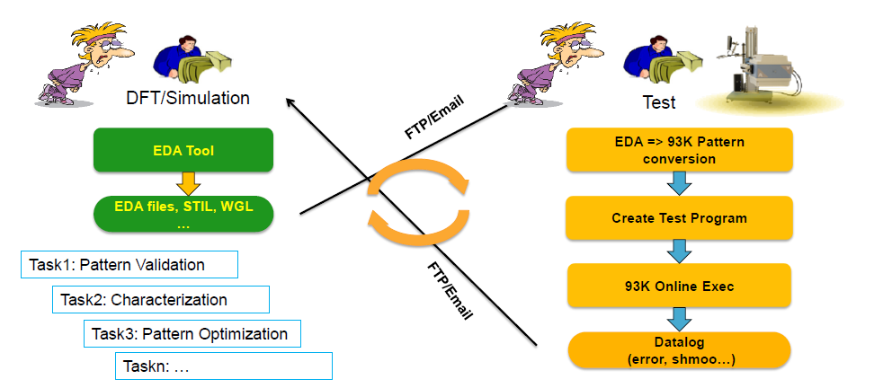
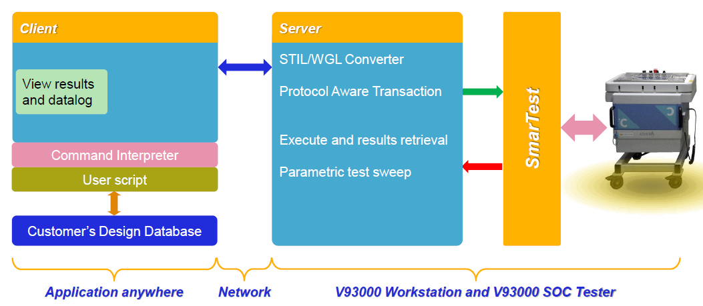
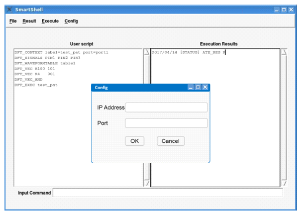

Posted  in [Top Stories](https://www.gosemiandbeyond.com/category/topstories/)

# SmartShell – A Unique Software Interface for Design and Production

*By Shu Li, Business Development Manager, Advantest America and Michael Braun, Product Manager, Advantest Europe*

Before device test can take place on automated test equipment (ATE), device-specific test programs need to be developed for the target device and test system. As part of this process, a large amount of digital test content (patterns) gets translated from EDA (design/simulation) to ATE (test) format and needs to be debugged and characterized on the target tester.

In the mixed-signal (MX) and radio-frequency (RF) domain, scripts in various languages (tcl, Python, LabView, etc.) are often used for device bring-up and characterization on bench instruments, using early device samples on an evaluation board, either before ATE test program development starts or sometimes in parallel.

These often interactive scripts are not natively applicable to the production test system, so ATE users have developed proprietary solutions to bridge the gap between ‘bench type’ engineering test and production test environments. This enables leveraging some of the early device learnings for volume testing, or simply running the same test scripts in the two very different environments.

Both digital pattern validation and MX/RF script execution or conversion to ATE have potential for improvement and standardization, which will benefit both time-to-market (TTM) and time-to-quality (TTQ). This article will provide further details for both areas.

**Digital (DFT) pattern bring-up and validation**

Test patterns for scan, built-in self-test (BIST), functional, or other digital tests are typically created by design or DFT engineers in their design/simulation (EDA) environment and then handed over to the test department, where they are converted to the native ATE pattern format and integrated into the production test program. As part of this process, all patterns need to be validated and characterized on the tester, to make sure that they work as intended and have enough margin to guarantee a stable production test.

This pattern bring-up and validation process can be very time consuming because initial pattern generation and bring-up/validation is typically done in two very different environments: design/DFT/simulation versus test engineering. The design or DFT engineer creates the test patterns, but it is the test engineer’s responsibility to convert and run them against the actual silicon. If they don’t work, the test engineer will produce a log file with failing cycles for the pattern at hand and send it to the designer, whose task is then to identify the root cause of the failures in the simulation environment and to re-generate a corrected test pattern as needed. The corrected pattern needs to be translated and validated on the tester again, going back and forth between design and test. Often, design/DFT and test engineering are isolated from each other, in two different locations, communicating by email or FTP. The test engineer will thus notify the DFT engineer of discovered errors, but the latter may not get around to re-simulating the test patterns immediately. As a result, the test development process will incur some delays. The majority of patterns may pass, but some tricky ones can take months of re-spins, which will not help with getting working products to market quickly. This traditionally manual process – offline pattern generation, conversion and download, then emailing feedback about errors – is painful and time consuming (Figure 1).

If there were a way to execute and validate the generated patterns directly from the DFT/simulation environment without going through the full circle of pattern translation and fail cycle collection for every minor change, it would benefit all parties involved and reduce the pattern bring-up cycle time.

 

Figure 1. The debugging process involves lengthy communication between design and test, requires significant learning, and is prone to errors, leading to lengthy cycle times.

 

**Scripts for mixed-signal/RF ‘bench instrument’ test on ATE**

Mixed-signal and RF testing involves, besides some digital resources to set up and control the device, additional analog and RF instrumentation. In a lab environment, these resources are benchtop instruments such as oscilloscopes, spectrum analyzers, waveform generators and other tools.On the bench, each test requires specific control scripts for both the device and the various lab instruments involved. On the ATE system, fully integrated hardware instruments are used and controlled by standardized software components that are part of a generic test program. Often, bench instruments have a higher precision for specific tasks but are not as universal as ATE resources and cannot reach nearly the same throughput as ATE can deliver. For volume data collection in characterization, significant effort must be made to reach high throughput for data collection from many devices in a reasonable amount of time. Leveraging an ATE to do some tasks that are normally done in the lab/bench environment will speed up this data collection significantly and help to smooth the transition between design/bench and ATE. In this context, it would be very helpful to have a solution that allows moving back and forth seamlessly between the lab/bench environment and the ATE, without the need to convert bench-type scripts into ATE ‘native’ test programs. Running the exact same script(s) on the bench AND on the ATE system would help to improve correlation and TTM, while leveraging knowledge from both environments.

Figure 2. Time to market is a major issue when dealing with scripting for mixed-signal/RF devices. Producing a working customer sample can take 9-12 months, depending on chip size, type, etc.

**Building a unified interface to bridge between design and test**

What’s needed to address these challenges is an easy-to-use client/server environment that simplifies the communication between design and test to enable smart debugging. Advantest has developed a software option for its V93000 system-on-chip (SoC) test system that provides such a solution.

The newly developed SmartShell is a software environment for digital pattern validation and native script execution on ATE. The interface links directly between the DFT/bench environment and the V93000 tester, without the need to convert patterns and scripts to the tester’s ‘native’ data format. This allows fast pattern bring-up and characterization, enabling DFT engineers to validate their patterns faster and designs to be characterized more efficiently before they are released to production on the V93000 system. The block diagram in Figure 3 illustrates the dataflow process.

Figure 3. SmartShell data flow, from pattern/script generation to ATE and back.

With this new tool, porting different test content is made easier and straightforward, giving designers the freedom to incorporate various tasks into their test program without having to think about how to port them to an ATE system. Those that work best for the device being developed will be converted when it comes to manufacturing.

Engineers in both design and test can use the tool. The DFT engineer can run a simple script instructing the tool to check a new pattern or to loop over a number of patterns while varying conditions like voltage or frequency. He or she can access the results directly from their environment, without having to learn the native formats and software environment of the test system. The test engineer can run scripts originally generated for a totally different environment, and then quickly compare ATE results with results from the bench instrumentation. The command interface controls functionality and execution, and allows the results to be viewed in the engineer’s preferred format (see Figure 4).

Figure 4. The software package features an interface that is easy to use for design and test engineers alike.

**SmartShell’s key capabilities include: **

- On-the-fly control of tester resources for digital, mixed-signal, RF and DC measurements
- Fast internal pattern conversion, execution, and back-propagation of results
- Ease of programming using any command-based script language
- Accommodates customized script language using a bridge to its standard set of commands
- Auto-recording/generation of setups for early production to ensure reusability
- Compatible with SmarTest 7 (DFT/pattern validation only) and SmarTest 8 (Scripting)

**Summary**

SmartShell represents a solution to bridge the gap between design and test, delivering capabilities for pattern validation and script execution that are beneficial regardless of company size or device type. Early validation can be done in a well-contained design or bench environment, without the need to ‘learn the tester.’ The highly programmable SmartShell interface for the V93000 allows experts to best utilize their individual skillsets to debug devices effectively and efficiently in a highly integrated manner. The tool significantly shortens the turnaround times for high-quality test patterns and scripts, enabling device makers to achieve both faster TTM and lower overall cost of test.

  end .post_content

