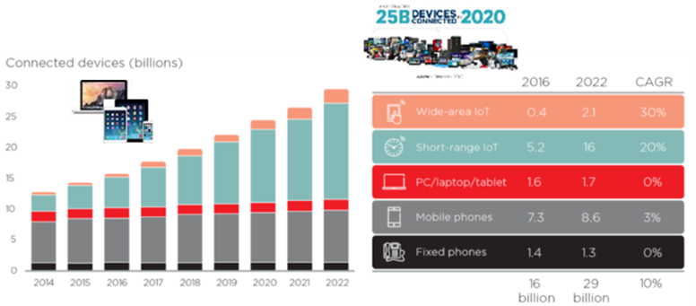
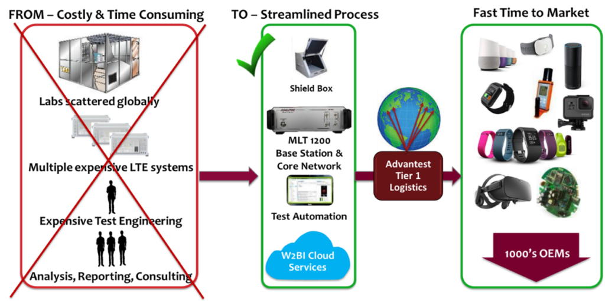

Posted  in [Top Stories](https://www.gosemiandbeyond.com/category/topstories/)

# W2BI in the Spotlight at Mobile World Congress with New Test Automation Products for the Wireless Market

 

Advantest, together with W2BI ‒ an Advantest Group company that provides test automation products to help customers quickly launch high-quality smart devices ‒ showcased their newest test platforms for the wireless electronics market at the 2017 Mobile World Congress (MWC) in Barcelona, Spain.

The world’s most expansive exhibition for wireless technology and mobile devices, MWC serves as an annual springboard for many of the next year’s biggest announcements and rollouts of smartphones, tablets and other connected devices. To give you an idea of scale, MWC this year drew more than 108,000 attendees from 208 different countries and boasted approximately 2,300 exhibiting companies.

Within its booth, Advantest featured a suite of products for the mobile communications and Internet of Things (IoT) markets. This included the EVA100 tester, designed for highly efficient evaluation and measurement of analog/mixed-signal ICs, and W2BI’s portable Micro Line Tester (MLT™). This newly introduced system can leverage cloud technology to support testing of LTE-M devices – while effectively lowering the cost of testing smart devices and IoT-based technologies during their development and production life cycles.

MWC provided a valuable forum for Advantest to connect with customers and potential customers to share our perspective on the future of test in the wireless space, and to obtain their thoughts about where IoT test is headed. By most indicators, the space is only going to continue heating up.

Recent market estimates project a whopping 29 billion connected devices by year 2022, and 18 billion connections targeted at wide-area and short-range IoT devices (Figure 1). If we are to capably accommodate this growth, it is critical that the industry address key issues currently challenging wide-area IoT device implementation, including:

- Lengthy certification process
- Complex cellular tests used to ensure Safe For Network (SFN) operations
- Expensive lab equipment for lab testing
- Non-scalability of test solutions
- Travel to remote sites to perform live network tests is costly and time consuming
- Lack of certification knowledge and experience by IoT device makers new to the market

Figure 1. Connected devices are expected to achieve a combined CAGR of 10% between 2016 and 2022. *Ericsson Mobile Report November 2016*

Some of these challenges can be tackled by simplifying conformance and certification processes, as well as eliminating duplicate tests across the test lifecycle of chips, modules and end products (e.g., wearables, alarm panels, telemetry, and smart homes). Others, however, will require a change in the way the tests are conducted.

W2BI’s new portable all-in-one Micro Line Tester (MLT) platform tackles many of these issues head-on with several key benefits (illustrated in Figure 2):

- A portable and expandable cloud-managed test platform that reduces time to market;
- Automation capabilities that have the domain knowledge built in, thus allowing developers to focus on their specific product requirements;
- Validated industry-standard automated tests downloadable over the cloud directly at the customer site, enabling device pre-certification while reducing travel and lab costs;
- Pre-defined device profiles to efficiently automate tests across multiple device types (modules, smartphones, IoT products, etc.) without having to customize and adapt tests for each;
- Ability to expand within a small footprint to adapt to 5G requirements.

Figure 2. W2BI’s portable MLT platform enables onsite testing of mobile devices, greatly reducing test times and costs.

 

The MLT platform is currently offered in three different modes:

**Standalone** – Used to conduct ad-hoc tests such as basic device operation, network connectivity, network aggression, data throughput, Voice-over-LTE (VoLTE), SMS, LTE to WiFi handover, and others. The target areas are mainly R&D development processes, and isolation and troubleshooting of post-release device issues.

**Developer** – Used to create test automation scripts across the network emulator components (radio, packet core, IMS, application server, etc.) and the devices under test, and to collect test metrics for use in analytics. Target areas are primarily QA processes, stress testing, and returns and repair processes.

**Conformance** – Used to perform automated conformance and certification tests for devices that need to be deployed on wireless networks in accordance with industry standards or operator-specific requirements. The target areas are mainly pre-certification tests, network safe tests, and conformance tests.

W2BI’s MLT platform is currently deployed at a US Tier-1 wireless operator, performing conformance tests on smartphones, and IoT modules and products. The Micro Line Tester is also undergoing multiple trials across test labs, module manufacturers and smartphone OEMs using both the standalone and developer modes. Shipment volume is expected to pick up toward the second half of 2017, when mobile operators begin fully deploying LTE-M and NarrowBand IoT (NB-IoT) on their networks.

As W2BI continues to develop new products that help to enable the growth of the mobile device market, expect to see technologies and products that address new protocols, including LTE-M and NB-IoT, called a game changer for the IoT industry because it extends LTE’s market reach. By allowing LTE to cost-effectively support lower data-rate applications, LTE-M is being touted as a good fit for low-power sensing and monitoring devices such as health and fitness wearables, utility meters, and vending machines, among others.

 

  end .post_content

