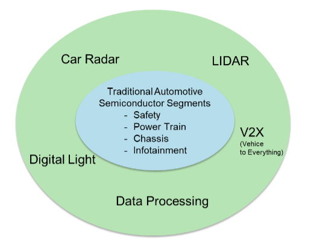
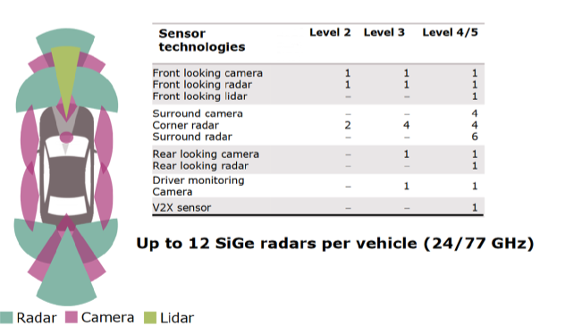
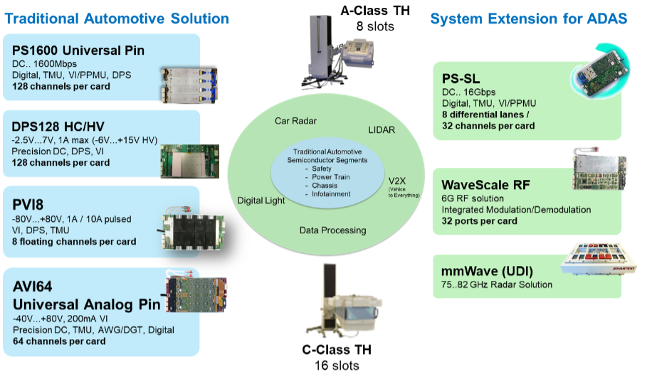

Posted  in [Top Stories](https://www.gosemiandbeyond.com/category/topstories/)

# ADAS Extends Traditional Automotive Technologies for Autonomous Vehicles

**By Toni Dirscherl, Product Manager, Power and Analog Solutions, Advantest Europe**

Autonomous cars are one of the most topical, intensely discussed trends in the world today, and will likely continue to be so for the foreseeable future. The reality is that there are degrees of autonomy; if you drive a car manufactured within the last three to five years, you are already using some of this technology. Typically referred to as “passive” autonomous driving, this includes sensors that issue a warning beep when you’re backing up, changing lanes, or come too close to the vehicle ahead.

While fully driverless cars are still farther out on the horizon, we are into the next phase of integrating automated driver-assistance systems (ADAS) into vehicles – i.e., limited driver substitution. This ongoing effort is overlapping the growing focus on making cars with complete autonomous capability available. This article will look at some of the specifics regarding the different levels of ADAS capability, the semiconductor technologies they entail, and the test capabilities that will be required.

**From driver-only to driverless**

As the illustration in Figure 1 shows, there are several degrees of autonomy that can be designed into vehicle systems. Plenty of cars at driver-only Level 0 are still on the road, and will be for some time, given modern cars’ average age and length of ownership.

Vehicles with Level 1 and 2 features are widely available, and some capabilities that fall under the Level 3 umbrella are becoming available in limited fashion. Levels 4 and 5, of course, are still in the future, but to bring them to fruition will require having regulations in place needed to ensure their safety, which may delay full market penetration of driverless cars. Conventional wisdom at the moment indicates that Level 5 is five to 10 years out.

Figure 1. Today, we are at the midpoint of implementing the levels of advanced driver assistance systems (ADAS) shown here.

Automated driver-assistance systems don’t replace traditional automotive semiconductor segments. Rather, they extend them to enable mechanical and electrical/electronic system capabilities to be smoothly integrated and run as intended. Figure 2 illustrates these two categories – technologies in blue are the traditional segment, those in the outer green circle represent newer ADAS system requirements, which bring with them heightened demand for more flexible, sophisticated test capabilities.

Figure 2. ADAS combines with traditional semiconductor-driven technologies to boost cars’ chip content.

Car radar technology assists in maintaining proper distance between cars in front and to the sides, as well as enabling safe lane changes. The adaptive cruise control technology used in many cars today is also based on 77GHz (millimeter-wave, or mmW) radar assembly. Radar technology requires special testing techniques to accommodate the radio-frequency (RF) devices under test (DUTs).

- LiDAR (light detection and ranging) is always deployed in combination with full radar technology. LiDAR is higher resolution than radar, and its purpose is to maintain a safe distance between the car and other objects. This includes looking for small objects, animals or pedestrians that may suddenly appear in the road – the system looks at how long the laser path takes to reach the object and be reflected back (which is affected by its density) and then tells the car how to respond. Because it does not work in fog or for wide-range tracing, a combination
of LiDAR and radar will result in optimal detection. Testing for these technologies requires an equally integrated approach.
- V2X, or “vehicle to everything,” refers to the connectedness that makes the car part of the Internet of Things (IoT). This is a key technology to advance ADAS. It can be vehicle-to- vehicle, vehicle-to- traffic light, -data center, -network, – pedestrian, etc. – basically anything that involves the car communicating with something outside of it. This can help the car to send a “don’t pass” warning to another car on a blind curve, communicate with emergency vehicles, receive in- vehicle network updates, look for open parking spaces, and myriad other communications-related functions. V2X brings in technologies similar to those found in today’s smartphones, including the trend of moving from 4G to 5G communication. Its three primary aims are to improve active safety, increase situational awareness, and enable better traffic efficiency.
- These new technologies generate a large quantity of data to be processed and acted upon, e.g., the sensors needed for video, radar and LiDAR and technology used in database applications, which is also being integrated into cars. From a safety standpoint, redundancy is critical; if one processing unit is damaged, another one (at least) is essential to ensure backup in case of failure. This is standard in aviation, and we will also begin to see it implemented in the automotive space to address/prevent security concerns such as car hacking. With large amounts of data transfer requiring high-speed interfaces to connect all the individual blocks of an ecosystem, what is the best way test approach?
- Future high-definition headlights will be enabled by digital light arrays. One example being made by a well-known lighting supplier is a matrix that contains 1,024 individual pixels per light-emitting diode (LED) that can be turned on and off individually to make the beam shapes needed. Advanced digital lighting enables advances in safety, such as implementing intelligent high beams, blanking out faces of pedestrians to ensure they’re not blinded, and automatically recognizing pavement warning or traffic lane displays, to name a few. At least one high-end carmaker is already working to design this technology into product lines that will come to market within the next two years.

As mentioned above, sensors play a major role in enabling these new ADAS functions, and the variety of detection methods requires a range of sensor types. These include long-range radar for adaptive cruise control; LiDAR for emergency braking, pedestrian detection and collision avoidance; camera sensors for traffic sign recognition, lane departure warning, parking assistance and 360-degree surround view; short-/medium-range radar for cross traffic alert, blind spot detection and rear collision warning; and ultrasound, also used for parking assistance.

Table 1 shows the escalating sensor content as we move from ADAS Levels 2 and 3 to Levels 4 and 5 in forthcoming cars. This includes as many as 12 silicon germanium (SiGe) radar sensors alone, at both lower (24 GHz) and higher (77 GHz) frequencies. To test all of these device types requires a test system that is both flexible and powerful, and can be adapted to meet current and future needs.

Table 1. External sensors for ADAS applications will increase with each level of autonomy.

 

**V93000: ready for the ADAS wave**

Advantest’s proven V93000 scalable platform is the one-stop solution for testing automotive components. The V93000 is fully equipped to handle traditional automotive technologies, as it has been doing since its inception, as well as the many emerging, complex technologies

Figure 3. The V93000 scalable test system can be configured to accommodate testing of virtually automotive component or system powered by semiconductor content.

As the figure indicates, traditional analog automotive test requirements can generally be addressed using an A-Class (8-slot) or C-Class (16-slot) test head solution with the standard instrumentation shown at left, including the PS1600 pin-scale universal test pin, the DPS128 digital power supply board, the PVI8 floating power source, and the DC Scale AVI64 universal analog pin module, which allows testing of smart devices containing both analog and digital circuits, contributing to the V93000’s flexibility. The PS1600 and AVI64 instrumentation can also be used for testing of digital light and LiDAR sensors.

The system extensions for ADAS shown at right include:

- Pin-scale serial link (PS SL), a super-high- speed serial link with 16 gigabits per second (Gbps) communication, which enables very fast exchange of information
- WaveScale RF, a highly successful channel card that delivers in-site parallelism on a grand scale – as many as 32 ports on each unit, with up 6 units in each system, providing up to 192 ports for parallel testing of multiple RF device types. This solution is essential for testing 4G/5G, V2V communication, and other types of RF devices.
- mmW Universal DUT Interface (UDI) solution, an RF test solution based on the super-high- speed, very small wavelength needed for car radar, requires adding another box on top of the test head interface. It sits outside the system, but very close to the DUTs to avoid any interference, and can be easily docked and undocked as needed.

Processing big data in the ADAS ecosystem currently requires two to three processors – for vision systems, communication and/or decision-making – that must be able to talk to each other via the in-vehicle network. (There may come a point at which a single processor will be able to perform all three functions.) Once data is processed, an actuator makes a decision and takes action automatically, versus traditional driver intervention. The PS1600 provides sufficient memory to address the rise in test content, while the PS-SL interfaces to the high-speed I/O DUT pins.

**Summary**

Advantest’s modular, scalable V93000 tester will allow customers to integrate everything they need for advanced test requirements as system complexity increases. As a power and analog solution with the AVI64 and PVI8, it covers traditional automotive segments, while its extended instrumentation addresses new application fields for ADAS, as described above. The proven all-in- one platform delivers test capabilities for autonomous cars, at every stage of development and market availability, that is unmatched by competitive test solutions.

In the next issue, we’ll be looking at an update to Advantest’s floating power source technology, the FVI16, announced at the beginning of May. It suppliers 250 watts of high-pulse power and up to 40 watts of DC power, to help enable sufficient power test of latest-generation devices while conducting stable and repeatable measurements. Check back with us in August for details on how this new offering will benefit a range of applications, including automotive, industrial and consumer mobile-charging.

  end .post_content

