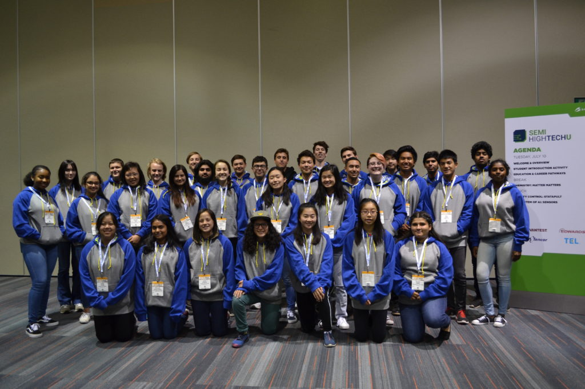

Posted  in [Uncategorized](https://www.gosemiandbeyond.com/category/uncategorized/)

# Advantest Goes “Beyond Smart” at SEMICON West 2018

Advantest returned to SEMICON West as an exhibitor and event sponsor from July 10-12, 2018 at the Moscone Center in San Francisco, California. For the first time, Advantest’s booth was located in the newly renovated South Hall alongside other large semiconductor companies.

In Booth 1105, Advantest displayed several new products, including the [V93000 FVI16](https://www.advantest.com/news?articleId=2034068) floating power source and the [T5503HS2](https://www.advantest.com/products/ic-test-systems/t5503hs2) tester for ultra-high-speed memory ICs, which was named a SEMICON West “Best of the West” 2018 award finalist. Information was also available about the [T2000](https://www.advantest.com/products/ic-test-systems/t2000) Integrated Power Device Test Solution (IPS) with two new modules for testing analog ICs for the hybrid/EV automotive market; the [EVA100](https://www.advantest.com/products/ic-test-systems/eva100) measurement system; [M4171](https://www.advantest.com/products/ic-test-systems/m4171) handler; Wave Scale generation test solutions; and the [MPT3000](https://www.advantest.com/products/ssd-test-systems/mpt3000) test solution for solid state-drives (SSD).

In addition to having a presence on the show floor, Advantest’s Kotaro Hasegawa, Senior Director of System Planning, presented two papers titled “Automotive IC Testing for Autonomous Cars” and “28GHz 5G RF Test Experiences” at Test Vision 2020: *The Next Step to Intelligent Test. *

And, on the evening of Wednesday, July 11, Advantest customers and industry acquaintances gathered for the Advantest hospitality event hosted at the vibrant 111 Minna Gallery located in the famous SoMa district of San Francisco. Over 200 attendees mingled and enjoyed live music by distinguished jazz and cabaret singer Paula West.

Throughout the conference, Advantest sponsored and participated in the first-ever SEMI High Tech U program held in conjunction with SEMICON West. This award-winning education program gives high school students the opportunity to explore the semiconductor industry and develop skills in science, technology, engineering, and mathematics (STEM). Advantest employees led modules, conducted mock interviews, and emceed the third day of the program.

 

  end .post_content

