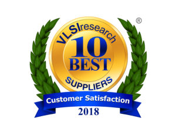

Posted  in [Uncategorized](https://www.gosemiandbeyond.com/category/uncategorized/)

# Advantest Logs 30th Consecutive Ranking as a 10 BEST Company in Annual VLSIresearch Customer Satisfaction Survey

Advantest has once again been named to VLSIresearch’s 10 BEST list, securing the company its 30th consecutive year as a top-rated semiconductor equipment supplier. Global customers also recognized Advantest as one of only three 5-Star companies in the Large Suppliers of Chip Making Equipment category. The survey, which received feedback from more than 94% of the chip market, rates equipment suppliers across 15 categories based on three key factors: supplier performance, customer service, and product performance.

In the 2018 survey, Advantest surpassed its score from 2017, achieving an overall score of above 9.0 for the fifth year in a row, and recording personal-best customer ratings in the areas of **Recommended Supplier** and **Trust in Supplier**.

Remaining a 10 BEST company every year for three decades is an honor and a testament to Advantest’s focus on engineering the world’s finest test solutions and delivering reliable service and innovative technologies.

  end .post_content

