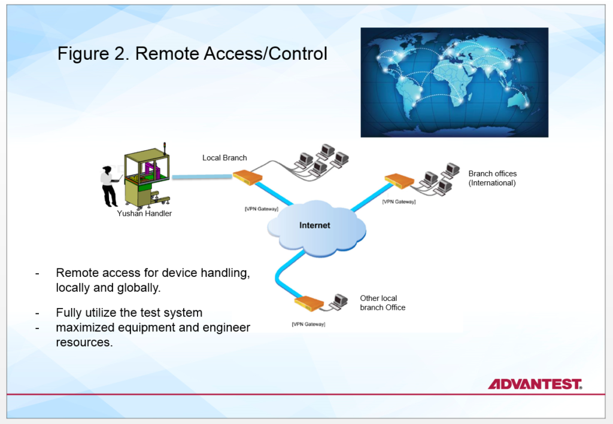
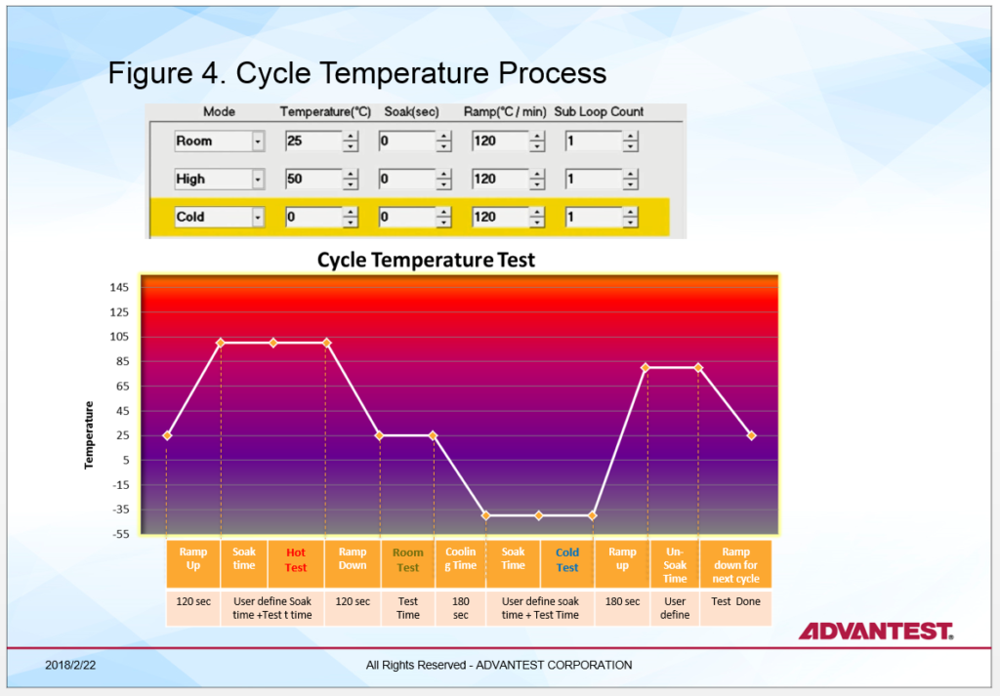
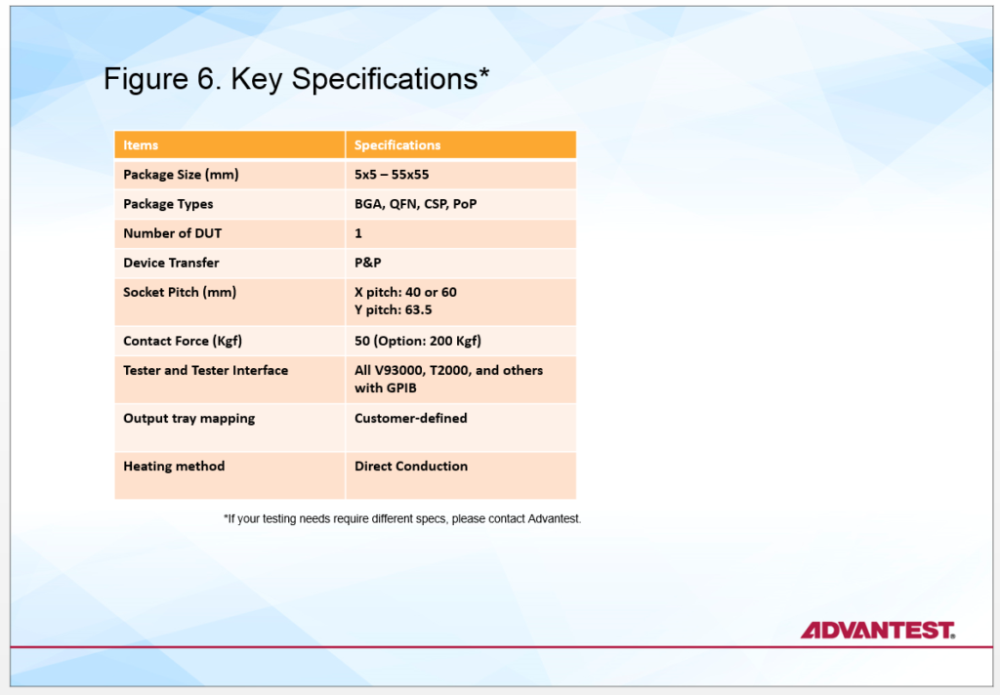
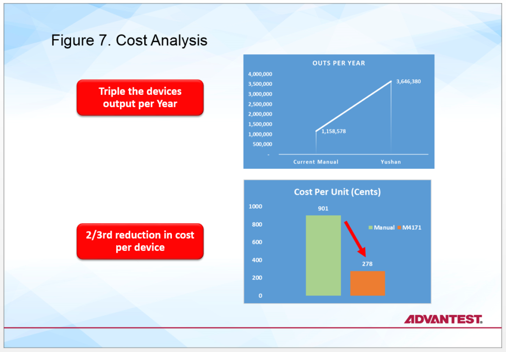

Posted  in [Top Stories](https://www.gosemiandbeyond.com/category/topstories/)

# Automated Pick-and-Place Handler Enables Test Engineering Efficiency in Lab Environment

**By Zain Abadin, Director, Handler Product Engineering and Marketing, Advantest**

In the laboratory environment, the principal goal is to complete development and pre-production testing of integrated circuits (ICs) as quickly and cost-effectively as possible. An associated challenge is to ensure that tester and operator resources are utilized efficiently so that testing can be completed on or ahead of schedule, further improving time to market (TTM).

The typical test approach is to have an operator manually load the devices into the test sockets, and then run the specific test for the defined time per the device maker – this could range from 5 seconds to 30 minutes or more per device. The actual number of devices also varies; in pre-production, there may be as many as 10 trays, containing a few hundred ICs. Testing in this manner is an inefficient use of labor, engineering, and tester resources. For short test times, this means an operator sitting by the tester to load/unload devices under test (DUTs). For long test times, the operator inserts a device and moves to another task on the floor. If an operator isn’t immediately available to change the DUT, the test process can be extended or delayed, causing it to take longer time to complete the lot and increasing the cost of test and TTM.

A scalable handler that can be used for both ATE and bench testing is the ideal solution to these challenges, allowing development and pre-production testing for a variety of device types and batch sizes to be completed faster, and enabling devices to be sent to market in a timelier manner. The result is a significant savings in both labor and cost of test.

Advantest’s M4171 handler delivers an efficient solution to meet the mobile electronics market’s needs for cost-efficient, thermally controlled IC testing. The unit is small – about one-quarter the size of other handlers – making for a small footprint and easy docking. The single-tray handler utilizes one contact arm to pick up a device from the tray and places it into the socket. Once the device has been tested, the same arm moves in to pick up the device and place it into its post-testing position in the tray.

**Flexible operation equals faster results**

The M4171 was created with a range of features intended to enhance lab efficiency (Figure 1). These features are summarized below.

*Remote accessibility/control from any location*

To run tests locally on the handler, the operator is on site to load the trays of DUTs, run the automated test process and remove the trays when testing is complete. However, when the operator’s workday has ended, there will be handler/tester downtime until the next shift or the next day. The M4171 includes cameras that allow a team member at another location, anywhere in the world, to not only monitor activity and view results remotely, but also to actually operate the handler remotely (Figure 2).

This means that the handler can be run at any time of day – a team member located across the country or across the globe can access the handler during his or her workday, moving, docking and undocking the handler, and running the desired tests. In turn, this allows companies to spread out their global resources and schedule operation so that there is less equipment downtime, i.e., a higher utilization rate. Testing can thus be completed faster, speeding TTM.

*Multi-mode testing to expedite the test process*

It can run multi-mode test processes, both pre-defined and user defined, including automated testing, automatic ID testing, output tray re-testing and manual testing (Figure 3).

*High accuracy cycle temperature across wide temperature range *

In addition to its automated device handling and remote operation, the M4171 is unique due to its wide-temperature sensor-based thermal-control capabilities, which range from -45° C to 125° C.  The M4171’s tri-temp technology enables operation of the handler over a broad range of temperatures.  The system uses direct device-surface contact, which enables quick temperature switching for fast ramp up and ramp down. With this capability, ramp-up, soak time, ramp-down and time-at-temperature can be set up all at once, and run one after the other.

The handler collects data continuously throughout the process, enabling significant time and resource savings (Figure 4). In fact, cycle temperature testing time can be reduced by more than 40 percent compared to manual thermal-control solutions.

*Flexible bin assignment for output*

A unique capability of the handler is that it enables pre-programmed binning within the output tray – once the handler and tester are docked, the tester can tell the handler into which bin a device should be placed. This allows the customer to utilize different binning approaches for different devices or batches, to pause in the test process or specify retesting. As Figure 5 shows, the user can define bins within the tray as pass, fail, retest, empty row, etc. – whatever lab functions are desired.

A label or category can also be assigned to a device within the trays, and that label stays with the device throughout the test process. With this capability, the customer can easily tell the devices apart by tray section – which passed, which failed, which need to be retested, etc. This is vital to ensure rapid transition between batches, or from the lab environment into pre-production.

Fully compatible with the V93000 and T2000 platforms as well as other testers, the M4171 also features a 2D code reader, a device rotator and a high-contact force option.  In addition, users can quickly convert the handler to accommodate different setups – with only a few parts to change, conversion takes just 10-15 minutes compared to 30 minutes or more on other handlers. Key specifications for the handler are shown in Figure 6.

A cost analysis using an example test time of 120 seconds and a quantity of 20 testers reveals that using the handler enables a 69-percent reduction in cost. Not only can each operator handle more units per hour and more test cells, but the customer has the flexibility to test triple the number of units using the same number of tester (Figure 7).

The M4171 is available now, providing integrated device manufacturers (IDMs) and outsourced semiconductor assembly and test companies (OSATs) with a compact, cost-efficient engineering test solution that delivers both thermal control and automated device handling.

 

  end .post_content

