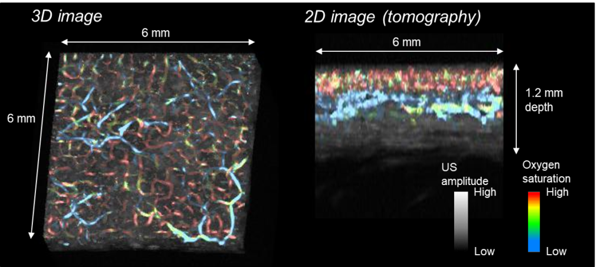

Posted  in [Uncategorized](https://www.gosemiandbeyond.com/category/uncategorized/)

# In Vivo Skin Imaging Technology Developed to Aid in Early Diagnosis

** **Advantest has developed a non-invasive method to achieve real-time 3D imaging of the vascular network and blood condition (oxygen saturation) of the living body, using a photoacoustic method to detect ultrasonic waves generated by laser irradiation. This method may be used for early diagnosis and monitoring of physical functions related to beauty and health.

As part of the “Innovative Visualization Technology to Lead to Creation of a New Growth Industry” project operated by Advantest’s Takayuki Yagi under the auspices of the Impulsing Paradigm Change through Disruptive Technologies Program (ImPACT), a program of Japan’s Council for Science, Technology and Innovation, an R&D group led by Professor Yoshifumi Saijo of Tohoku University and Noriyuki Masuda of Advantest has succeeded in developing in vivo skin imaging technology (1) that can simultaneously generate dual-wavelength photoacoustic images and ultrasound images.

Photoacoustic imaging is a method of imaging the interior of a living body by irradiating light into the body and measuring ultrasonic waves generated from blood or tissues that selectively absorb light energy. It is attracting interest as a new noninvasive imaging method suitable for measuring small blood vessels in the skin, which is difficult with conventional imaging techniques.

However, when using only photoacoustic imaging, even if microvessels in the skin measuring several tens of microns or less in diameter are imaged, it is impossible to ascertain which region of each layer in the skin they are in. In addition, it is possible to photoacoustically measure the oxygen saturation level of blood vessels (3) by using light sources of multiple wavelengths, but the movement of living bodies affects measurement results, so the use of this method has hitherto been limited to research applications such as animal experiments.

The newly developed in vivo imaging technology utilizes a focused ultrasonic sensor that can detect multiple ultrasonic signals. Thus, photoacoustic waves and ultrasonic waves can be measured with the same sensor, while signals are generated on two alternating wavelengths, allowing the detection of ultrasonic waves that image the microvascular network in the dermis as well as blood oxygen saturation (Fig. 1). A 6 mm square area of 2 mm depth can be imaged in about 4 minutes. Also, using the acquired data, mapping of oxygen saturation and the superposition of photoacoustic images and ultrasound images is possible.

Biopsy studies have proved that signs of skin aging such as spots and wrinkles are related to microvessels in the skin. The newly developed photoacoustic imaging method is expected to be used for monitoring of photoaging of the skin as well as other applications.

Figure 1: Example of forearm skin imaging.

Blue indicates lower oxygen saturation of blood vessels, red higher.

[Read more about this novel and promising research technology](https://www.advantest.com/news?articleId=2590495)

  end .post_content

