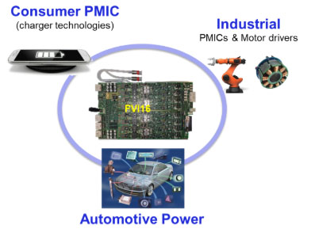

Posted  in [Featured Products](https://www.gosemiandbeyond.com/category/featuredproducts/)

# Meeting Advanced Power and Analog Test Requirements

*By Derek Floyd, Director of Business Development, Advantest America*

The market for power and analog devices is showing strong, consistent growth. Market research firm IC Insights forecasts that revenues for analog products—including both general purpose and application-specific devices—will increase by a compound annual growth rate (CAGR) of 6.6% to $74.8 billion in 2022 from $54.5 billion in 2017. Power-management analog devices help regulate power usage to keep devices running more efficiently and longer, while the automotive application-specific analog market is the third-fastest growing of 33 IC product categories classified by the World Semiconductor Trade Statistics (WSTS).

With the heavy concentration in industrial and automotive applications, focusing the V93000 scalable platform on analog/power-management devices has proven a successful strategy for Advantest. In looking at where to target the next generation of floating power input voltage (VI) sources, a clear need was evident in three key market areas with high-power requirements: consumer power-management ICs (PMICs) for wireless charging of mobile phones and other smart products; industrial applications; and automotive power devices (see Figure 1).

Figure 1. Top high-power target markets

In the automotive market, the demand for high-quality test necessitates greater test accuracy and stability, together with faster test times and more multisite testing – all enabling reduced costs. At the same time, in the consumer space, higher performance and higher-power electronics are needed to support fast wireless charging, i.e., a great deal of current is quickly dumped into the battery. Advantest meets these requirements with its latest floating power VI source, the FVI16.

Introduced in May, the FVI16 source supplies 250 watts of high-pulse power and up to 40 watts of DC power. These parameters allow the source to enable sufficient power testing of latest-generation devices while conducting stable and repeatable measurements.

Figure 2 illustrates the target applications for the FVI16, with 35- to 150-watt applications being the “sweet spot” for its capabilities. Leading the pack in terms of volumes is fast, wireless charging and USB power delivery, followed by key markets in the automotive and industrial arenas. The growth of autonomous and electric vehicles and more electronic systems on board all new cars will drive continued high demand for automotive devices. The automotive space comprises a wide variety of applications requiring power in the 50-100W range – examples include buck/boost devices, window control, braking and other safety-oriented functions.

Figure 2. FVI16 strategic applications

**Key FVI16 Characteristics**

The FVI16 source delivers 40W of continuous DC power, as well as 250W of pulse power, on each channel with no interruption and no dropout. This is crucial for operation in high-power environments/applications, and provides a significant advantage compared to competitive offerings. The industry’s most advanced, accurate and highly integrated card, the FVI16 offers more capability on a per-channel basis and a significantly higher level of integration – not to mention twice as many channels as other available sources. In addition, all 16 channels can operate in pulse mode simultaneously, be ganged and/or stacked, and each channel can run either completely independent or completely parallel, depending the user’s application requirements.

Other key characteristics include:

- 16 fully independent power VI channels (4Q, Kelvin)

-60V … +60V, 3A DC (40W) / 10A Pulse (250W)
18-bit force/measurement accuracy ±200μV / ±10nA
Highly flexible and transparent

Ganging up to ±155A
Stacking up to ±180V

Floating range of ±200V
18-bit 1 Msps AWG and digitizer (voltage and current)
SmartFeatures: Smart Connect/Range/Setting/Mode
Synchronous operation to other channels and digital “domain sync”
Fully pattern-controlled deterministic setup & measurement
- 16 high-voltage VI: -60V … +120V, 30mA
- 16 high-voltage time measurement units (TMU): -60V…+120V / 45MHz

The FVI16 is based on the core digital feedback loop (DFL; see Figure 3) of the existing AVI64 floating source, which has realized significant market success and will continue to compliment customers’ low-power testing requirements. Both systems feature best-in-class accuracy, while the DFL capability enables simultaneous measurement of voltage and current to provide instantaneous power monitoring, and comes with a number of smart features, as noted above, including glitch-free connection, range, and mode settings on the fly in order to prevent damage to devices.

Figure 3. FVI16 digital feedback loop diagram and benefits

Already in use at several customer sites, the FVI16 floating power VI source has generated multiple orders from leading automotive customers. Flexible licensing arrangements are available to allow customers to ensure the solution meets their specific needs.

  end .post_content

