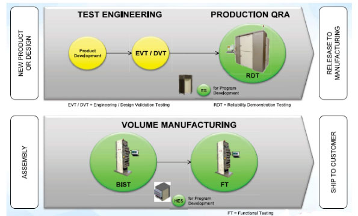

Posted  in [Top Stories](https://www.gosemiandbeyond.com/category/topstories/)

# PCIe Gen 4 Is Coming – the SLT Solution Is Here

*By Colin Ritchie, Vice President, System Level Test Business, Advantest*

The high-tech industry is currently in the midst of what has been widely cited by industry experts and executives as a memory super-cycle. Memory manufacturers, in response to sustained high demand for memory devices – including from the solid-state drive (SSD) market – are adding capacity to ensure their ability to meet this explosive demand.

The test requirements for SSDs comprise a wide range of variables that span many different engineering disciplines, as shown in Figure 1. One of the most challenging is the variety of protocols implemented, which vary widely in functionality and performance. Having noted this, it’s clear that the industry is moving toward newer, faster data-transfer protocols.

Figure 1. SSD test requirements include a wide range of variables.

SSD makers have traditionally utilized Serial ATA (SATA) or Serial Attached SCSI (SAS) – both of which, while still in use, are showing signs of age. However, the more compact and easily implemented PCI Express (PCIe) protocol has become highly popular, both in standalone mode and as a transport mechanism for the Non-Volatile Memory Express (NVMe) protocol (which is optimized for NAND flash next-generation NVM technologies).

While the third generation of PCIe (Gen 3) has met with notable success, the industry has been waiting for Gen 4, as it delivers capabilities previously unattainable with other SSD protocols. The new PCIe Gen 4 standardized data transfer bus will double the per-lane data transfer rate of the prior Gen3 revision from 8.0 gigatransfers per second (GT/s) to 16.0 GT/s. As a result, data transfer rates of up to 2GB/s (gigabytes/second) can be achieved with just one PCIe Gen 4 interconnection, and up to 16GB/s with an 8-slot PCIe Gen 4 interconnection for graphics cards and high-end SSDs.

The greatest beneficiary of this new implementation of PCIe will be the burgeoning Big Data arena. With the advent of the IoT and “smart everything,” a host of applications are churning out data in massive volumes. With its speed and capacity, PCIe Gen 4 will dramatically boost server throughput. At the same time, it will also place even greater demands on system-level testing (SLT), which has evolved rapidly to meet growing industry requirements for protocol testing at the system level. In the highly competitive SSD market, a test system that supports multiple protocols can eliminate the need for retooling and help speed transitions between product generations.

**Another industry first for system-level test**

Advantest’s proven platform strategy is ideally suited to system-level test. Both standard and custom solutions can be economically configured with the implementation of modular components developed for the platform. Its modularity and adaptability also are essential for optimizing manufacturers’ factory-floor configurations to accommodate new product generations – changes can be made quickly and efficiently with a minimum of disruption to the manufacturing process.

The flexible MPT3000 SLT platform was designed to meet customers’ testing needs for both enterprise and client SSDs. Already used by leading manufacturers of PCIe Gen 3, SATA and SAS SSDs, the MPT3000 portfolio has again expanded to accommodate the newest generation of PCIe.

On August 1, Advantest announced its latest industry breakthrough: the first fully integrated test solution for developing, debugging and mass producing PCIe Gen 4 SSDs on the MPT3000. The all-inclusive test solution enables SSD manufacturers to accelerate their newest products’ time to market.

The newly expanded MPT3000 platform is available in three configurations that enable it to cover all test insertions for PCIe Gen 4 devices (Figure 2), without waiting for third-party PCIe Gen 4 infrastructure to be commercially available:

- MPT3000ES for engineering applications and program development
- MPT3000ENV for reliability demonstration testing (RDT) and quality assurance (QA)
- MPT3000HVM for high capacity and throughput in high-volume manufacturing.

Figure 2. The MPT3000 platform can be implemented at every stage of SSD test.

The holistic MPT3000 platform streamlines the transition to PCIe Gen 4 by offering users a test flow that spans design to manufacturing and uses the same tester architecture and software as the proven PCIe Gen 3 offering – giving SSD manufacturers access to the fastest, lowest-risk path to market. Its tester-per-DUT [device under test] architecture and hardware acceleration make the MPT3000 a single-system solution for virtually all engineering, volume production and built-in self-test (BIST) applications.

The newest evolution of PCIe motherboards is expected to begin hitting the market within the next six to 12 months. Developers integrating PCIe into their products need a reliable test solution today to ensure they are able to hit this market window. They need look no further than the MPT3000 PCIe Gen 4 solution from Advantest – available now and already shipping to customers.

  end .post_content

