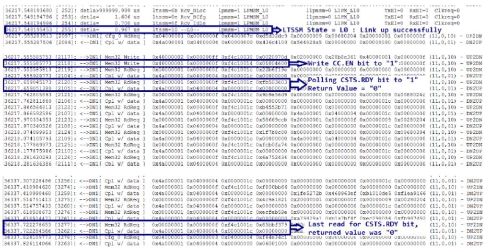

Posted  in [Top Stories](https://www.gosemiandbeyond.com/category/topstories/)

# Preparing Solid-State Drives for Qualification Testing

*By Vishal Devadiya, R&D Applications Engineer, Advantest*

The market for solid-state drives (SSDs) remains strong. International Data Corp. (IDC) recently released figures forecasting a five-year compound annual growth rate (CAGR) of 15.1 percent in worldwide SSD unit shipments with SSD industry revenue expected to reach $33.6 billion in 2021. With SSD usage growing in PCs, consumer electronics and other applications, qualification testing has become increasingly critical as has finding ways to make the process faster and less costly so that SSDs can be brought to market more quickly.

Qualification testing, in essence, is a formally defined series of tests for evaluating a component or system to ensure its functionality, robustness and reliability prior to final approval and acceptance for release to production. Three types of qualification tests must be performed on SSDs before they enter the manufacturing phase:

1. Engineering verification test (EVT) and
2. Design verification test (DVT), both of which are run on a number of samples to check a SSD’s functionality, typically taking one to two weeks; and
3. Reliability demonstration test (RDT), which is run on every device (not just samples) to check each SSD’s reliability and data integrity. RDT is run for a minimum of 1,000 hours and involves thousands of drives.

What is required to prepare an SSD for qualification testing? It is essential to make sure there are no functionality issues with the drive – most importantly, that it powers up correctly, and then that it works as expected in terms of running input/output (I/O) operations. If any issues arise, finding and fixing the root cause must be achieved as quickly as possible to avoid time-to-market (TTM) delays.

Several key issues can arise during the preparation process. Power-up failure, the most serious, typically happens because of a link training issue. This problem generally applies to PCIe drives because the PCIe protocol is quite complex with different layers in the architecture. Another issue is link retrain/drop. In this instance, the system may power up properly, but essentially becomes stuck in a non-ready loop shortly thereafter. A third type of problem is failure during I/O operations, which comprises three types of failures: write, read or data compare (write/read don’t match).

If one of these issues is discovered during preparation, the problem must be debugged. Traditional debugging methods are less than satisfactory. One way is to perform analysis on the available logs from the host and the drive, but the logs provide few details useful for analysis. The more typical approach is to use a protocol analyzer (PA) to capture bus trace and perform analysis to link issues (see Figure 1).

*Figure 1. A PCIe analyzer on an engineering tester*

But using a PA for this purpose has its own challenges:

- The issue may not occur on a fixed slot number on the tester. If the test is run on a DVT trace during DVT and the issue occurs on the first device under test (DUT), the problem can only be captured if it is reproducible and consistent to that DUT slot.
- If this does not work, it may be necessary to connect multiple PAs to avoid having to keep moving the PA from slot to slot. This creates a huge time sink and adds cost.
- The large interposer required to connect the PA to the tester may temporarily change the signal properties, which can mask the issue from the tester and prevent its discovery.
- Ongoing DVT testing on other DUTs cannot be interrupted or stopped in order to debug. EVT takes a week and RDT requires at least 1,000 hours. If an issue occurs within these time periods and a device in a specific slot experiences a failure, testing on all devices must be stopped so that the PA can be connected to that specific slot and then started up again following a period of downtime.
- Thus, it becomes necessary to reproduce the issue. If there are insufficient or no data logs and a protocol trace must be captured, the test must be rerun. If it is not consistent, reproduction can be difficult, if not impossible. If a failure that happened at 120 hours initially does not happen again, the cause cannot be determined.
- Additional considerations arise if the test is running under a thermal environment. Some SSD manufacturers run devices at a high temperature during RDT; if an issue arises, there is no way to connect a PA.

The bottom-line impact of these challenges is that it takes longer to identify the issue, resulting in delayed TTM and loss of revenue. One solution is to use the traffic capture tool created by Advantest and available as an add-on to the proven MPT3000 platform for system-level testing of SSDs.

The traffic capture tool enables transaction layer packet capture and link training/status state machine (LTSSM) capture, both of which are critical for debugging, as the following example illustrates. The tool also captures submission and completion queue information for each command and performs a command log dump to assess the number of commands issued and completed. Essentially, the traffic capture tool captures whatever is going on the bus between the FPGA-based test system and the DUTs.

The following figures illustrate how the traffic capture tool detects a power-up failure. In Figure 2, the link is good, but there is an error on the last line of code, indicating that the block device is not present. This means the device did not get ready within 120 seconds and thus timed out.

Figure 2. The drive linked up successfully, but did not get ready within the specified timeout.

 Figure 3. The highlighted lines of code indicate that the SSD never got ready.

In Figure 3, the transaction layer packets (TLP) capture screens indicate that the device kept repolling and returning a value of 0 until hitting the 120-second mark. This means the device did not get ready (CSTS.RDY) and experienced a power-up failure. Once the failure is correctly identified, the information is relayed to the SSD manufacturer, whose challenge is to determine why the failure occurred.

When selected as an option, Advantest’s traffic capture tool runs continually in the background on the MPT3000 platform – essentially as an in-line process, capturing data that may be needed to rerun a test or reproduce an issue. Using the traffic capture tool on the tester allows the user to:

- Run tests on all slots at the same time and capture the information required to debug issues;
- Capture the traffic log at the time of the failure without having to reproduce the issue; and
- Change the amount of logic in the design to capture more information if required. Because the test system is FPGA-based, it is easy to adjust the amount of logic for data capture.

The bottom-line benefit is earlier identification and resolution of device issues, resulting in the faster TTM that device makers require to keep pace with continuing market growth.

 

  end .post_content

