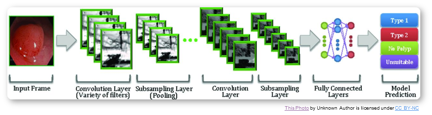

Posted  in [Uncategorized](https://www.gosemiandbeyond.com/category/uncategorized/)

# Q&A Interview with Ira Leventhal

**By GO SEMI & Beyond staff**

*This issue, we delve into a subject of growing interest in the test world and beyond: artificial intelligence. Our Q&A interviewee is Ira Leventhal, Vice President of Advantest America’s New Concept Product Initiative, a position he has held since June 2017. Ira has over 25 years of ATE industry experience, with Hewlett-Packard, Agilent Technologies, Verigy, and Advantest. *

**Q. Why is now the time for AI to be implemented in the semiconductor industry, given that it’s been discussed for many years?**

**A.** Since Alan Turing first postulated in 1950 that the computer equivalent to a child’s brain could be developed and then trained to learn – evolving into an adult-like brain – we’ve been waiting for the technology to catch up to his theory. Today, all the key components essential to enabling AI are in place. First, you need a lot of data, and the Internet of Things facilitates this. Second, you need access to the data; using cloud computing and Big Data technologies, data silos become data lakes with easy access. Third, you need to fast data crunching, which we can achieve thanks to the tremendous advances in computational power and parallel processing. And finally, you need better algorithms for a wide variety of applications – the first three items have enabled rapid advancements in algorithm design.**
**

**Q. ****You state that advancements in deep learning will fuel the next semiconductor industry revolution. How so?**

**A.** For years, the test industry has used adaptive test and other techniques to streamline and focus test efforts for maximum value (and minimum test times). With the advent of AI technologies such as neural networks, new possibilities are coming to light. Merging these approaches will allow the industry to improve device quality, reduce cost of test, and automate the control of functions best suited to the computers supporting us – freeing humans to concentrate on new developments and innovations.**
**

**Q. What is deep learning? Is it synonymous with AI?**

**A.** Many people don’t realize that AI, machine learning and deep learning are not interchangeable terms. AI is actually an umbrella term, and the others are nested subsets of AI. [See Figure 1].

Figure 1. AI vs. machine learning vs. deep learning

**Q. Why should we focus on deep learning?**

**A.** Deep learning is analogous to building a skyscraper. When you don’t have sufficient land to build a very large building, you go vertical. When you lack infinite storage, computing power and training data needed to build a very large single-layer neural network – which we do – you go deep. Deep learning promotes efficient use of available resources, much like a skyscraper, and it enables complex problems to be broken up into a series of steps, similar to an automobile assembly line.

Convolutional neural networks (CNNs) are used heavily in deep learning network architectures. When the network is being fed images during the training process, convolutional filtering layers are used that can recognize specific attributes of the images. As each layer views an image through a convolutional filter, it passes on a reduced set of data to the next layer, enabling the network complexity to be kept in control as you go from one layer to the next. The reduction in complexity of a CNN vs. fully connected networks minimizes processing, memory, and time required for image recognition. [See Figure 2.]

Figure 2. How a convolutional neural network works

**Q. How can deep learning be applied in semiconductor testing?**

**A. **A type of deep learning called transfer learning is well suited to our industry. Transfer learning enables you to start with an existing set of trained data instead of having to train a network from scratch. If you take a network that was trained with millions of images and you keep the initial layers that can understand low-level aspects of the images, you can replace later layers, training them on a new set of data for which you may only have a few hundred images. The result is a trained network that performs with significantly greater accuracy than if you’d started training from scratch. The reality is that a network trained from scratch would never catch up, no matter how long you trained it.

A key application is wafer metrology. Metrology involves monitoring your wafer process to make sure it’s staying within set limits by making measurements on the wafers over time. Trying to measure data on every wafer can be costly and cumbersome.

Virtual metrology (VM) is the prediction of wafer properties based on equipment settings and sensor data.  This data is used with real metrology data from a sample set of wafers to create a deep learning model that maps process data to wafer metrology parameters such as layer thicknesses, photolithography critical dimensions, and others. Instead of measuring every wafer, you can measure a sample set, and then use VM to predict the metrology performance of the rest.

As geometries shrink and capacity is increased, new wafer processing equipment is constantly brought on line, and it is a big challenge to generate enough training data to keep the deep learning models current. Transfer learning enables you to build up a network that’s been trained on many different types of equipment. When a new piece of equipment is added to the line, you can tune a pre-trained network to operate with only a small set of data collected on that new piece.

**Q. This is a fascinating subject. What other kinds of deep learning are there?**

**A.** Reinforcement learning involves training a deep learning network on which actions will achieve the best ultimate reward. In this case, the network is like the brain of a mouse learning the fastest path through a maze to get to the cheese – it learns to navigate complex problems and come up with the optimal solution. An example is using deep reinforcement learning for production scheduling. Let’s say you’re trying to figure out how to minimize the overall time it takes to work through a complex multi-step production process from start to finish – the network will try different types of scenarios and figure out what works best. **
**

Unsupervised deep learning has great potential for semiconductor manufacturing and test applications. Instead of telling the network what kind of data you’re giving it, you feed in unclassified data, and the network identifies things it sees that are similar to each other. It doesn’t know *what* those things are, just that they’re similar. It trains itself to classify things that look alike. This is powerful because you can throw a lot of unlabeled data at the network, and it will be able to identify relationships and act on them. It can find hidden relationships that humans might not have thought of, so unsupervised DL can do things that supervised DL can’t.

Advantest is working with university teams to investigate these techniques in detail, and we’re in discussions with multiple customers about ways to apply AI. We view it as a vital competitive advantage going forward.

  end .post_content

