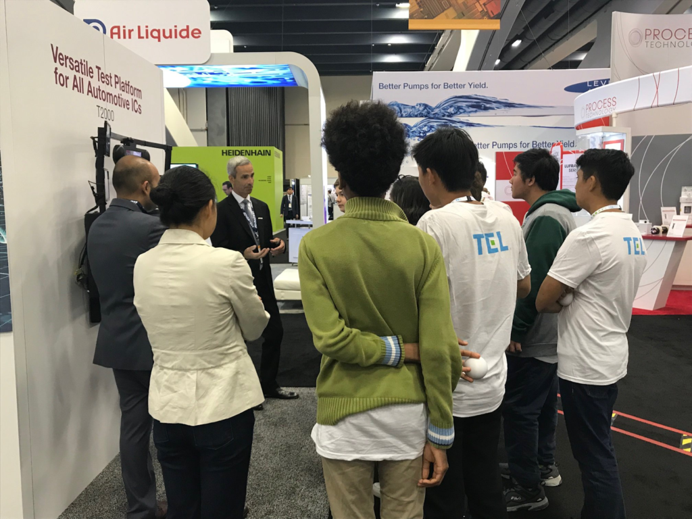

Posted  in [Upcoming Events](https://www.gosemiandbeyond.com/category/upcomingevents/)

# Advantest Showcases 5G Readiness at SEMICON West 2019

Advantest sponsored, exhibited, and presented at SEMICON West from July 9-11, 2019 at the Moscone Center in San Francisco, California. Advantest’s booth was centrally located in the South Hall alongside other large semiconductor companies and featured the new theme, “*5G: Made Real by Our Customers, Made Possible by Advantest*.”

In Booth 939, Advantest showcased several products including the new, and “Best of West” award finalist, [V93000 Wave Scale Millimeter solution](https://www.advantest.com/news?articleId=3895378), the industry’s first integrated and modular multi-site millimeter-wave (mmWave) ATE test solution to cost-effectively test 5G-NR mmWave devices up to 70 GHz. Other displays included information on the new [Advantest Test Solutions](https://www.advantest.com/system-level-test-systems) (ATS) for SoC system-level test; the [MPT3000](https://www.advantest.com/products/ssd-test-systems) platform for solid state-drives (SSD); [T5500-series and T5800-series memory test platforms](https://www.advantest.com/memory-test-systems); and an array of software tools and services to improve overall productivity and test quality. The booth also contained a unique automotive display illustrating how the [T2000 series](https://www.advantest.com/products/ic-test-systems/t2000) of testers is improving the performance and reliability of broader types of automotive devices, from sensors, processors and powertrains to communication systems.

In addition to having a presence on the show floor, Advantest was a sponsor of the Test Vision Symposium and presented during two of the sessions. Kotaro Hasegawa, system planning senior director, presented a paper titled, “New SiP Packaging Trends and Testing Challenges” during the Packaging and Test session and then Adrian Kwan, senior business development manager, took part in an interactive panel discussion about how 5G has changed the way devices are tested titled, “Addressing Challenges of 5G Test Today and in the Future.”

On the evening of Wednesday, July 10, Advantest customers and industry members gathered for the annual Advantest Customer Hospitality Event hosted at first-time venue Local Edition, a subterranean cocktail bar in the depths of the historic Hearst building. Over 200 attendees networked to the backdrop of live music by classically trained violinist Gabi Holzwarth.

Throughout the conference, Advantest sponsored and participated in the award-winning SEMI High Tech U program, which gives high school students the opportunity to explore the semiconductor industry and develop skills in science, technology, engineering, and mathematics (STEM). Advantest employees led modules on engineering design challenges, critical thinking, and social media; conducted mock interviews; and fielded industry questions during booth tours.

Did you enjoy this article? [Subscribe](https://visitor.r20.constantcontact.com/manage/optin?v=001y_Bo5goCBKQ5mpCMPMk9NZ99QMnLrLlllSx9KsYRBGtAwx3BUnAXKOaTpnrPkps9ENqJ2xavSS4iHZoRcF3vbOUMslAszWh5o0QemBpi7ixX88dplnKCbCc1wBocZnWqQunAJgFjTckoqFGgqvpIFXY1CeP37TR15PDr8yiOViQ%3D) to GOSEMI AND BEYOND

  end .post_content

