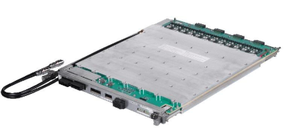
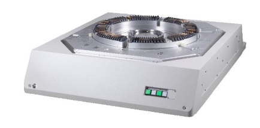

Posted  in [Featured Products](https://www.gosemiandbeyond.com/category/featuredproducts/)

# Advantest’s New Modules and Test Head Extend the T2000 Platform’s Performance in Evaluating Automotive SoC Devices

Advantest Corporation has expanded the range of its [T2000 platform](https://www.advantest.com/products/ic-test-systems/t2000) with the launch of two new modules and a test head designed specifically for high-volume testing of devices used in automotive applications.  The new equipment is designed to enhance test coverage, enable higher parallelism and reduce the cost of test for system-on-chip (SoC) devices used in automobiles, a market segment that is projected to have a 9.6 percent compound annual growth rate from 2019 to 2022.

Semiconductor content in automobiles is increasing rapidly as ICs are becoming integral in everything from powertrains and infotainment systems to ADAS (advanced driver-assistance systems) and on-board safety features.   To reach their market potential, automotive SoCs require high-performance, cost-efficient test solutions.

The new RND520 test head has 52 slots, providing the highest pin count available with Advantest’s direct-dock testing option. As a member of the HIFIX (high-fidelity tester access fixture) product line, the new test head supports massively parallel wafer-sort testing.  It covers an area 40 percent larger than its predecessor while using center-clamp technology to ensure stable contact during wafer sorting. In addition, the test head can operate over an extended temperature range up to 175° C.

The enhanced 2GDME digital module leverages 256 channels to test a wide range of SoC devices used in automotive electronics including MCUs, APUs, ASICs and FPGAs operating at speeds up to two gigabits per second (Gbps). It features a dedicated high-performance parametric measurement unit (HPMU) for every 32 I/O channels, giving the unit an expanded current capacity up to 60 milliamperes (mA) for every I/O channel. The module also supports high-voltage applications by enabling electrical stress testing and arbitrary waveform generator (AWG) and digitizer (DGT) functions valuable for characterization purposes.

The new 96-channel DPS192A device power supply facilitates highly parallel testing of automotive SoCs with high pin counts.  This versatile module has a voltage range of -2.0 volts to +9.0 volts and a current range up to 3 amperes. The unit’s capabilities include enhanced slew-rate control as well as a trace function to evaluate power integrity, an averaging function that improves sampling rates for measuring supply currents and a continuous sampling function that enables a new test methodology for IDD spectrum measurement.

The highly flexible T2000 test platform is ideally suited for evaluating SoC devices and other ICs fabricated with small-lot, high-mix manufacturing methods.  The system enables users to respond rapidly to shifting market needs with minimal capital investment while also helping to reduce development times for new designs.

 

DPS192A

RND520

 

Did you enjoy this article? [Subscribe](https://visitor.r20.constantcontact.com/manage/optin?v=001y_Bo5goCBKQ5mpCMPMk9NZ99QMnLrLlllSx9KsYRBGtAwx3BUnAXKOaTpnrPkps9ENqJ2xavSS4iHZoRcF3vbOUMslAszWh5o0QemBpi7ixX88dplnKCbCc1wBocZnWqQunAJgFjTckoqFGgqvpIFXY1CeP37TR15PDr8yiOViQ%3D) to GOSEMI AND BEYOND

  end .post_content

