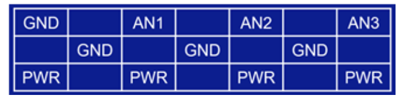
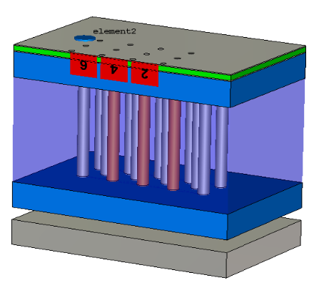
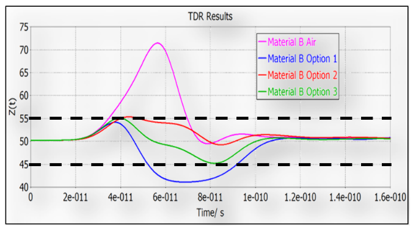

Posted  in [Featured Products](https://www.gosemiandbeyond.com/category/featuredproducts/)

# Evaluating a spring probe card solution for 5G WLCSP

*By Krzysztof Dabrowiecki, Feinmetall GmbH, Thomas Gneiting AdMOS Gmb], Jose Moreira Advantest*

With the deployment of the wireless 5G standard and its support for mmWave frequencies that allow gigabits-per-second data rates on the consumer market, the semiconductor industry needs reliable and low-cost test solutions. The 5G standard allows mmWave range frequencies from 24GHz to 28GHz—to frequencies as high as 44GHz, and possibly even higher.  To achieve these frequencies requires reliable, highly efficient, cost-effective chip packaging technology. 

From that point of view, wafer-level chip-scale packaging (WLCSP) offers one of the most compact package footprints, providing a high level of functionality, and a frequency range with low resistance and inductance path. Despite having a good thermal performance with a finer pitch interconnection to the printed circuit board (PCB), WLCSP is resilient to extreme variations in stress, drop, and vibration. At the wafer test level, WLCSP technology requires a good and consistent contact resistance, a relatively high contact force with short probes, and above all, an effective online cleaning together with easy onsite repair [1]. With respect to those electromechanical wafer test requirements and with added value such as a frequency performance higher than 28GHz, or a high current capability, the spring pin probe card technology is always a favorite on the test floor on account of its cost and versatility and worthwhile to evaluate for high frequency 5G mmWave applications [2-4].

To define the best possible probe card structure, detailed electromagnetic simulations and analyses are required. RF engineers have several modeling approaches available for this type of simulation, such as a lumped element model (SPICE), distributed element model, or 3D electromagnetic (EM) models. For this study, it was decided to utilize CST Studio Suite 3D EM simulation software.  It allows us to build and analyze an exact and detailed 3D-model of the probe card. A probe card acts as an interconnector on the signal transmission path between the wafer chip and automated test equipment (ATE). Therefore, it is vital to keep in mind that, besides the probe card, there are other challenges with respect to ATE and the PCB side.

On the ATE side, mmWave frequencies already present significant implementation challenges, including the measurement instrumentation and interconnect to the ATE device under test (DUT) test fixture PCB. 

*Figure 1*

**Figure 1 **shows a picture of the bottom of an ATE mmWave test fixture, where it is possible to observe the blind mating connectors to the ATE system and the coaxial cables. They are connected to coaxial connectors, very close to the socket. The use of coaxial cables in the test fixture is essential because a coaxial cable is significantly less lossy than any PCB signal trace. The PCB test fixture challenges, however, are not the main subject of this paper.

The system assembly and modeling (SAM) framework was used to investigate and optimize a signal path. It consists of multiple individual components, such as wafer bump, probe head, and PCB. These are described by relevant physical quantities such as field magnitudes or s-parameters.  This paper is trying to find an answer and explore three objectives: 1) the impact of different materials and probe head designs on the mmWave performance, 2) analysis of s-parameters and crosstalk, and 3) the probe head design optimization to improve them. Crosstalk is also an important parameter that is taken into account. The presented analysis results reveal the impact of different structure probe head elements on the s-parameter results.

**Simulation model**

*Figure 2*

**Figure 2 **shows an example of what mmWave RF peripheral ports (AN1, AN2) might look like on a 5G DUT. The diagonal bump pitch is 0.4mm, with a bump height of 100mm. The distance, in a row, between RF bumps is 0.566mm. Initially, a spring pin was chosen with uncompressed length L=3.7mm, at working mode L1=3.5mm.  The PCB thickness was 3.8mm and used a hybrid stack-up of the FR4 and Tachyon 100G for dielectric material. The matched trace lengths were designed at 38.8mm. Because of the symmetrical PCB traces layout, the simulation was performed for the critical traces only and one-quarter of the PCB. The RF 3D model analysis includes the wafer solder bump, probe head, and contact with the PCB, in which the traces are included up to the connector locations.  

*Figure 3*

**Figure 3 **illustrates a quarter of the probe card model and trace topology.

*Figure 4*

**Figure 4 **shows a model of a probe head in contact with the wafer at the bottom and the PCB at the top. The probe head is a 2-layer structure comprising guiding plates and fillers between the plates. The filler layers are the additional materials added between the guiding plates with various dielectric constants and loss tangent. The double plunger spring pins are inserted into drilled holes in the guiding plates and fillers. The pin plunger protrusions at the working mode are formed with a uniform air gap of 0.1mm between the head and the PCB, and 0.25mm between the head and wafer. The created 3D simulation model allows quick verification of results to identify appropriate material properties and geometry before building a test probe card.

**Initial simulation results**

It is well-known that any impedance mismatch in the signal path will have an impact on the return loss and in that way, degrade the measurement path performance. Therefore, impedance is a crucial parameter to be checked and controlled. In the PCB industry, the common impedance specification is in the range of 50 +/-10% Ohm for a single ended signal. But 5% is possible in certain cases, though at a very high cost.

*Figure 5*

**Figure 5 **shows the simulated time domain reflectometry (TDR) plot for the model with various filler materials wit a time rise of 29.2ps (for 30GHz). The dashed lines indicate the maximum and minimum impedance tolerances. In the figure, it can be noticed that the air gap between the guiding plates causes an impedance discontinuity that peaks at

70 Ohms. The material option 1 shows a drop in the impedance discontinuity peak at 41 Ohm. The material B options 2 and 3 significantly reduce the impedance discontinuity to an acceptable range. As a consequence of material B air and option 1, the insertion loss and return loss had a limited frequency bandwidth, as shown in **Figure 6**. In this case, the dashed lines reveal acceptable limits of -1dB for insertion loss, and -10dB for return loss.

**To read full article please visit Chip Scale Review December 2019 issue, page 14:  **[http://fbs.advantageinc.com/chipscale/nov-dec_2019/52/](http://fbs.advantageinc.com/chipscale/nov-dec_2019/52/)

 

Did you enjoy this article? [Subscribe](https://visitor.r20.constantcontact.com/manage/optin?v=001y_Bo5goCBKQ5mpCMPMk9NZ99QMnLrLlllSx9KsYRBGtAwx3BUnAXKOaTpnrPkps9ENqJ2xavSS4iHZoRcF3vbOUMslAszWh5o0QemBpi7ixX88dplnKCbCc1wBocZnWqQunAJgFjTckoqFGgqvpIFXY1CeP37TR15PDr8yiOViQ%3D) to GOSEMI AND BEYOND

  end .post_content

