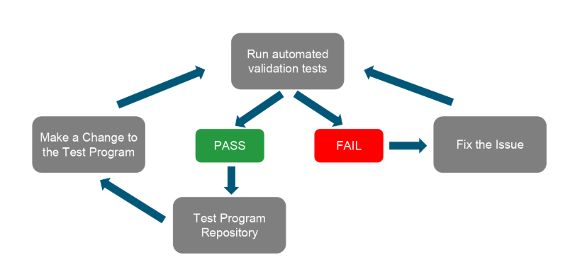

Posted  in [Top Stories](https://www.gosemiandbeyond.com/category/topstories/)

# Flexible Automation Infrastructure Supports Continuous Test-program Integration and Delivery

*By Stefan Zügner, V93000 Product Manager, Jan van Eyck, Product Owner SW R&D, Kheng How, Senior Staff Software Engineer and Daniel Blank, Senior Application Consultant Center of Expertise*

Test engineers today are facing many challenges working within a collaborative test-program-development environment. Fortunately, a concept called continuous integration, or CI, can be implemented within the test-program development process to help meet these challenges.

Today, each engineer is likely to be part of a team of many engineers working on different parts of the same test program concurrently. Furthermore, test engineers developing IP blocks may be spread across widely scattered geographical locations.

The result of the complexity is that developers issue multiple program changes (commits) every day. Each commit changes the test program, and any commit may break the test program. Consequently, at any given time, the overall quality of the test program may be unknown, and problems can require significant time and resources to discover, debug, and fix. In addition, the longer it takes to discover a bug, the more time and expense it takes to fix it.

**Continuous integration addresses today’s test challenges**

Collaborative development typically relies on an existing source-code management system (for example, git or SVN) for tracking changes, but by the time an integrator discovers issues, it is usually too late to fix them in an efficient and timely manner. With continuous integration tooling it is now possible to trigger validation tests in an automated manner whenever changes are committed to the source-code-management repository, allowing for frequent integration and timely checks without additional overhead for the individual developer (as illustrated in Figure 1). Continuous delivery in addition automates the release-to-production process and therefore allows for new test-program releases essentially at any point in time.

*Figure 1: The continuous integration workflow embraces automated validation tests for each change to a test program. *

The difference between traditional and continuous integration processes is illustrated in detail in Figure 2. With the traditional process, different engineers (Alice, Bob, and Charlie in Figure 2) independently develop sections of a test program, and yet another engineer (David) performs integration and test just before the program’s release. If David’s test finds a bug, deadlines could be at significant risk because of the time it may take Alice, Bob, or Charlie to debug and rework their code and resubmit it to David for further integration and test.

*Figure 2:  A traditional development process (top) can put release deadlines at risk. In contrast, a continuous integration process (bottom) reduces time-to-market and time-to-quality.* 

The continuous-integration process, in contrast, delivers continuous and systematic validation throughout the entire development cycle, providing immediate feedback to engineers such as Alice, Bob, and Charlie on the quality of their commits. The immediate feedback made possible through continuous integration reduces both time-to-market and time-to-quality. In addition, the automated test-program validation process includes programmatic checks, which allow engineering teams to establish quality processes in a repeatable manner.

**Tools for continuous integration**

Several software tools can serve in a continuous-integration system.1 One of them is Jenkins ([https://jenkins.io/](https://jenkins.io/)), an open-source and widely used automation tool with support from an active community that makes information widely available on the web. 

Jenkins is extensible and contains comprehensive plugins for functions such as source-code management (for example, git and SVN) and email notification.

In an implementation in which Jenkins is employed in a continuous-integration system (Figure 3), every commit can trigger the automatic running of validation jobs offline or online according to the job setup. The system stores and manages execution logs and test results while sending out notifications and reports on each execution. With the continuous-automation system automating test-program validation, test-program developers can focus on development.

*Figure 3:  A traditional development process (top) can put release deadlines at risk. In contrast, a continuous integration process (bottom) reduces time-to-market and time-to-quality. *

**Adding Smart CI to SmarTest 8**

For semiconductor test-program development, Advantest offers its SmarTest 8 software for the V93000 platform.2 SmarTest 8 builds on previous versions to offer fast test-program development, efficient debug and characterization, high throughput due to automated optimization, faster time to market, ease of test-block reuse, and efficient collaboration.

To support continuous integration and delivery for test-program development in the SmarTest 8 environment, Advantest offers the Smart CI solution. The Smart CI solution includes the Smart CI custom Jenkins server plugin, which is tailored for SmarTest 8. The plugin offers simple validation job setup through “fill-in-the-blanks” forms, and it supports freestyle (GUI-based, one client) and pipeline (script-based, distributed single validation job on multiple clients) setups.

Tightly integrated with the plugin is the Smart CI Client for SmarTest 8, which provides a command line interface (CLI) to enable continuous integration and delivery for SmarTest 8 test programs. Smart CI Client can also be used for other CI solutions not incorporating Jenkins.

Also included in the Advantest Smart CI solution are Docker images for each individual SmarTest 8 release, allowing for a simplified Smart CI application. The Docker images offer preconfigured setup and enable virtual-machine (VM) and cloud installations. Multiple SmarTest 8 versions and offline jobs can also be run on the same workstation concurrently.

**Smart CI works out-of-the-box**

Smart CI works out of the box. Just enter a test-program name, and the program compiles, loads, and executes, comparing results against datalog and throughput references.

In addition to working out of the box, Smart CI offers Advantest templates that can be adapted with low to medium effort by a lead test engineer to validate a test program with customer-specific checker scripts. Customized results are available via offline execution.

Beyond continuous integration as enabled by Smart CI today, Advantest’s roadmap calls for the future implementation of continuous delivery, in which a test program (optionally encrypted) can be exported for production, and test-program validation can take place in a production environment, including a test cell. As such Smart CI will also offer an integration with built-in or custom release checkers of TP360.3 TP360 is a software package that helps V93000 customers increase test-program development efficiency, optimize test-program quality and throughput, reduce cost of test, and increase test-program release and correlation efficiency. TP360 is based on an open framework that enables users to add new applications easily and flexibly.

As does continuous integration, continuous delivery will work out of the box—an engineer need only enter a test-program name.

**Conclusion**

In summary, Smart CI enables automated continuous integration and delivery for SmarTest 8, saving test-program development time and effort and boosting engineering capacity by 10% to 15%. Smart CI ensures test-program quality through fully automated and systematic test-program quality checks throughout the entire development cycle, and it enables the release of runtime-ready test programs at any time. Furthermore, it fosters discipline in engineering teams, enabling team members to consistently deliver high quality, and it provides clear project status reports anytime, thereby increasing manageability and predictability. Smart CI Docker images simplify installation and maintenance, the Advantest Jenkins server plugin supports easy validation job setup, and Advantest provides comprehensive support and continuous enhancements.

**References**

1. “Comparison of continuous integration software,” Wikipedia. [https://en.wikipedia.org/wiki/Comparison_of_continuous_integration_software](https://en.wikipedia.org/wiki/Comparison_of_continuous_integration_software)

2. Donners, Rainer, “A Smarter SmarTest: ATE Software for the Next Generation of Electronics,” GO SEMI & BEYOND, August 3, 2017. [https://www.gosemiandbeyond.com/a-smarter-smartest-ate-software-for-the-next-generation-of-electronics/](https://www.gosemiandbeyond.com/a-smarter-smartest-ate-software-for-the-next-generation-of-electronics/)

3. Zhang, Zu-Liang, “TP360—Test Program 360,” Video, VOICE 2013. [https://vimeo.com/80319228](https://vimeo.com/80319228)

Did you enjoy this article? [Subscribe](https://visitor.r20.constantcontact.com/manage/optin?v=001y_Bo5goCBKQ5mpCMPMk9NZ99QMnLrLlllSx9KsYRBGtAwx3BUnAXKOaTpnrPkps9ENqJ2xavSS4iHZoRcF3vbOUMslAszWh5o0QemBpi7ixX88dplnKCbCc1wBocZnWqQunAJgFjTckoqFGgqvpIFXY1CeP37TR15PDr8yiOViQ%3D) to GOSEMI AND BEYOND

  end .post_content

