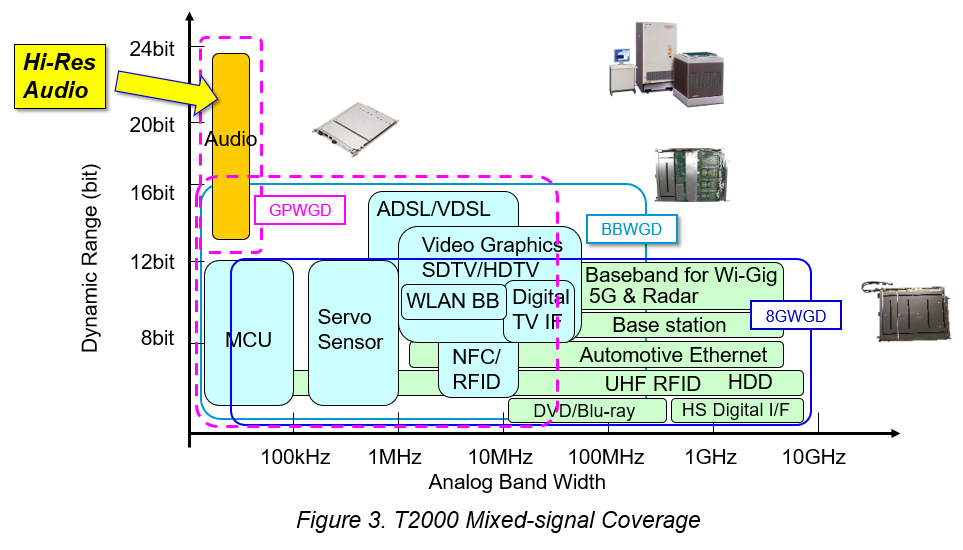
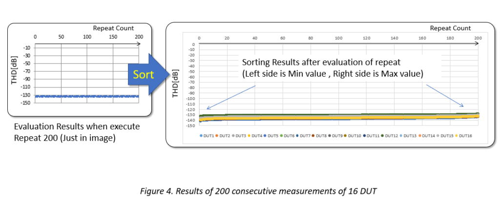

Posted  in [Featured Products](https://www.gosemiandbeyond.com/category/featuredproducts/), [Uncategorized](https://www.gosemiandbeyond.com/category/uncategorized/)

# High-Resolution Audio Requires Advanced Measurement Capabilities

*By Takahiro Nakajima, Senior Expert, Analog/Mixed-signal, Advantest Corp. *

Smartphones supporting High-Resolution (Hi-Res) Audio are growing more widely available, enabling consumers to experience high sound quality when streaming music, movies or other content. To accommodate High-Res Audio, these devices integrate an increased number of power management ICs (PMICs) equipped with digital-to-analog converters (DAC), which require high dynamic range testing with 24-bit resolution.

This has, in turn, led to manufacturers’ increased demand for automated test equipment (ATE) with analog performance exceeding a total harmonic distortion (THD) of -130 dBc*, as well as the ability to perform 16 multi-site tests. This article details a solution for achieving both ultrahigh dynamic range performance and 16 multi-site testing.

Figure 1 shows a block diagram of a smartphone. Smartphones incorporate numerous semiconductors to drive power management, connectivity, sensors, displays, audio, cameras, and memory. In recent years, there has been a trend toward integrating the PMIC and audio coder/decoder (CODEC) into a single chip, as the figure illustrates. There has also been an increase in 24-bit resolution DAC, needed for support of Hi-Res Audio.

**What is ****Hi-Res Audio****?**

The Hi-Res Audio specification – defined by the Japan Electronics and Information Technology Industries Association (JEITA) – allows a much wider dynamic range than that provided by CDs. A Hi-Res sound source, such as 24 bit / 96 kHz or 24 bit / 192 kHz, is converted to data at a finer resolution than a CD sound source (Figure 2), so it has much more sound information compared to a CD sound source. This means that Hi-Res Audio is as close as possible to the original sound, enabling the listener to experience sound quality comparable to being in a studio or concert hall.

**Audio testing**

The four test methods required for audio devices are the tests for total harmonic distortion (THD); total harmonic distortion + noise (THD+N); dynamic range (DR); and signal noise ratio (SNR). Each of these tests determines various requirements associated with Hi-Res Audio, and together they create a set of parameters that must be met in order to assure the highest quality audio performance.

** **Once these tests are completed, frequency weighting is used to obtain measurement values matching the sensitivity of the human ear. The frequencies people hear the best are in the range from 2 to 4 kilohertz (kHz), and sensitivity declines at frequencies that are higher or lowe**r.**

A-weighting is commonly used for the weighting network. SNR/DR tests often show analog performance when A-weighting is applied.

Measurement error occurs when measured noise can be calculated from the difference between device performance and measurement instrument performance. For example, if the difference between device performance and measurement instrument performance is 0 dB, the measurement error is 3 dB. If the difference is -5 dB, measurement error is 1.19 dB. This clearly indicates that the better the performance of the measurement instrument, the lower the measurement error.

**Advantest solution**

The T2000 supports three Mixed-signal modules (GPWGD, BBWGD,8GWGD) as shown in Figure 3.

Advantest has developed a measurement technique with ultrahigh dynamic range to achieve industry-leading levels of analog performance for 24bit DAC solution, by adding high-precision analog circuits such as a band elimination filter (BEF) at the front-end of its T2000 general purpose waveform generator digitizer module (GPWGD).

** **The target performance for the T2000 solution was set to be 5dB better than target device performance in order to enable analog measurement with higher precision from characterization to mass production (Table 1). The test results performed indicated that the T2000 Integrated Power System (IPS) + GPWGD solution can address multiple challenges associated with Hi-Res audio testing, including high dynamic range measurement, power supply/GND design and isolation, high multi-site testing.

Mobile PMICs require digital, high-precision mixed-signal/analog, and power testing. As a product for automotive/industrial devices and PMICs, the T2000 IPS system can have a number of modules installed, as shown in Table 2. A high-precision analog function can also be added to the front-end of the GPWGD as a 24-bit DAC solution for Hi-Res Audio. For semiconductor manufacturing pre-processing, a wafer prober, probe card, and pogo tower can be combined together. The analog circuits can be equipped with 16 channels by mounting additional analog circuits in the user area on the wafer prober.

**Measurement results**

On the T2000 platform, analog performance was demonstrated with an ultra-high dynamic range, showing that the platform can achieve results beyond the target performance – as occurred when all of the audio tests listed earlier were conducted. Moreover, the results are consistent and repeatable, as indicated in Figure 4. When measurements were performed 200 times continuously with 16 multi-site tests, a typical THD result of -134 dBc was consistently obtained.

The results detailed in this article indicated that twice the number of multi-site tests can be achieved compared to conventional systems when the T2000 is combined with an IPS and GPWGD module. This makes it possible for the solution to support everything from characterization to mass production for PMICs associated with Hi-Res Audio. Future test efforts will take on the challenge of solutions for 32-bit DACs that require a higher dynamic range.

* dBc = decibels relative to the fundamental carrier power level; standard measurement for total harmonic distortion (THD)

  end .post_content

