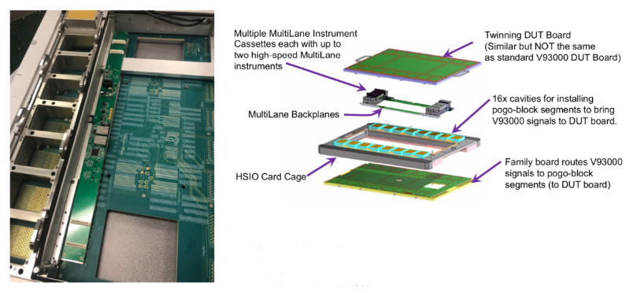
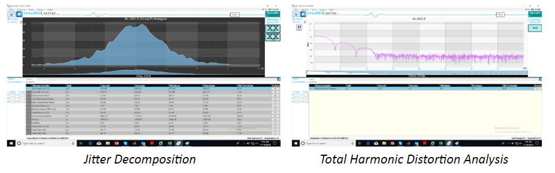

Posted  in [Top Stories](https://www.gosemiandbeyond.com/category/topstories/)

# High-Speed I/O Testing with the Power of Two

*By Dave Armstrong, Director of Business Development, Advantest America, Inc.*

As the internet backbone speed continues to spiral upwards, the interface speeds to the devices making up the cloud also continue to scale up. As many of these interface, server and artificial intelligence (AI) devices move both to 112Gbps data rates and multi-chip heterogeneous integrations, the industry is facing an increased need for at-speed testing in order to confirm truly known-good devices (KGDs).  Until now, an elegant, efficient ATE-based solution for conducting these tests hasn’t been available.

In 2018, Advantest and MultiLane, Inc., a leading supplier of high-speed I/O (HSIO) test instruments, began to explore partnering together to provide a single-platform solution leveraging the best capabilities and qualities of both companies. A fast-growing company founded in 2007, MultiLane is based in Lebanon, where CEO and industry veteran Fadi Daou is committed to expanding the tech industry. With more 200 products and over 500 customers, MultiLane’s product and technology portfolio, as well its corporate culture, are highly complementary to Advantest’s.

The concept of the joint solution is straightforward: existing MultiLane instruments are ported to a form factor compatible with Advantest’s V93000 test head extension frame, as illustrated in Figure 1. As the figure shows, the combined solution consists of an Advantest V93000 tester and twinning test head extension from Advantest, to which MultiLane adds power, cooling and a backplane to create the HSIO card cage. MultiLane then takes existing off-the-shelf instruments and re-lays them out for inclusion in the card cage, which sits on top of the V93000 test head. The use of existing instruments is a key aspect because it contributes to lower cost of test while delivering an already proven capability – just in an ATE environment.

*Figure 1. The basic components of the Advantest-MultiLane solution combine to create a unique test offering.*

Delving down further into the specifics, Figure 2 illustrates the build-up of the solution. On the bottom is a family board – one of two DUT boards in the build-up – which the customer can typically purchase once and reuse for a variety of testing needs. This bottom board routes the V93000 signals being used to the pogo-block segments located in the HSIO card cage just above, which are then routed to the twinning DUT board at the top of the stack. Multiple MultiLane backplane cassettes sit just underneath the DUT board and device socket, enabling the shortest possible interconnect lead length via high-performance coaxial cabling. The number of cassettes is expandable to include as many as 32 digital storage oscilloscope (DSOs) or 32 bit-error-rate tester (BERT) channels.

*Figure 2. The photo at left shows the view from the top of the HSIO card cage with the twinning DUT board and MultiLane instruments removed. *

The setup is designed to be highly configurable. High-speed signals are routed from blind-mate wide-bandwidth connectors to the twinning DUT board mounted connectors adjacent to the DUT. These connectors may be either on the top or on the bottom of the twinning DUT board to provide an optimal signal-integrity solution. Putting the connections on the top of the DUT board allows for direct connection to device signals without the need for routing through vias. For probing, the probe is typically installed on top of the DUT board, with the wide-band connections made on the bottom.  Moving the connectors to the bottom allows the probe to be the only thing extending from the top of the DUT board, as required in a wafer-probe environment.

Another configurable aspect of this solution-set is how bias-tees and splitters are utilized. While very wideband components, these circuits always cause some signal attenuation and distortion. Some users prefer to maximize the signal swing and integrity by not including these circuits in the path. Other users have plenty of amplitude and want the added testability afforded by these components to perform DC tests and/or feed low-frequency scan signal through their HSIO. The flexibility of this approach supports both solutions and allows users to change between them on a part-by-part basis.

**Multiple instruments broaden capabilities**

MultiLane presently has three pluggable instruments available to coordinate with the V93000 and HSIO card cage. The first can accommodate 58Gbps four-level pulse amplitude modulation (PAM4), while the second is twice the frequency at 112Gbps – the “new normal” data rate. The third is a full, four-channel 50GHz bandwidth sampling oscilloscope, integrated into the solution at a cost far lower than that of a standalone scope, with the same capabilities.  

*Figure 3. MultiLane instruments are packaged in cassettes for insertion into the HSIO card cage.   *

To ensure the platform solution meets customers’ needs and complementary roadmaps, the MultiLane software and tools are tightly integrated with the V93000. MultiLane eye diagrams and scope plots can be brought up in standard V93000 SmarTest tools (see samples in Figure 4). The scope can also analyze results in the frequency domain to provide a distortion analysis, as is typically done on a vector network analyzer (VNA).   

*
Figure 4a. MultiLane BERT output waveforms shown on the V93000.*

*
Figure 4b. MultiLane DSO measurements shown on the V93000.*

**Conserving tester resources**

A noteworthy capability of the solution is that the entire HSIO card cage and MultiLane instrument assembly can be used on the bench together with the V93000 DUT boards – i.e., they can run independent of the tester. In some cases, it may be possible to add a simple bench power supply and a PC interface to allow some long-running measurements to be made without the V93000. 

Returning the HSIO card cage on the tester, a local PC can also be used to talk to the MultiLane instruments via the internet. For example, the tester’s SmarTest program can be sequenced to an area of interest and pause, at which point a PC can interact with the MultiLane hardware to interactively explore and analyze the results – much like a scope would be used in the old days, only without the need for probing the fine-geometry wide-bandwidth interfaces. This unique capability both improves the utilization of the HSIO Instruments and allows the user’s offline experience, with the device and instruments to be leveraged into the ATE environment thereby improving efficiencies in both locations.   

**Bringing it all together**

Developing leading-edge test solutions in the 112Gbps area requires close collaboration and involvement with experienced high-speed I/O experts. Working together with our mutual customers, Advantest and MultiLane can leverage the strengths of both companies to help ensure success and provide the full benefits of this truly unique ATE-meets-HSIO test-platform solution.

 

Did you enjoy this article? [Subscribe](https://visitor.r20.constantcontact.com/manage/optin?v=001y_Bo5goCBKQ5mpCMPMk9NZ99QMnLrLlllSx9KsYRBGtAwx3BUnAXKOaTpnrPkps9ENqJ2xavSS4iHZoRcF3vbOUMslAszWh5o0QemBpi7ixX88dplnKCbCc1wBocZnWqQunAJgFjTckoqFGgqvpIFXY1CeP37TR15PDr8yiOViQ%3D) to GOSEMI AND BEYOND

  end .post_content

