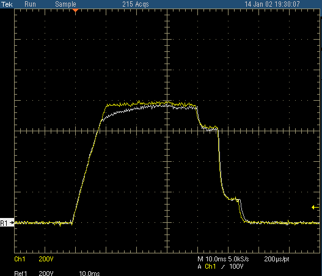
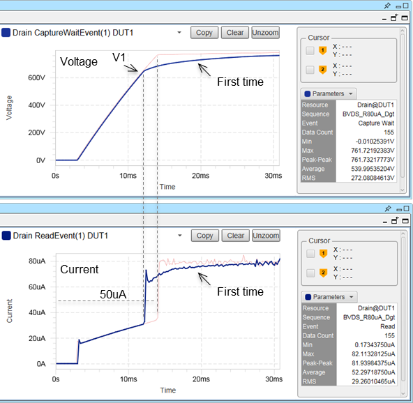

Posted  in [Featured Products](https://www.gosemiandbeyond.com/category/featuredproducts/)

# High-Volume Consumer Devices Need High-Voltage Test Solution

*by Anthony Lum, Business Development Manager, Advantest Corp.*

If you’ve been increasingly feeling that your home doesn’t have enough electrical outlets for all of the consumer products you’re amassing, you’re not alone. As our hunger for consumer devices grows, so does our need for more AC-power wall outlets. The common denominator between large entertainment hubs, wearable and portable devices, and smart-home hubs/accessories is the need for AC power – either as a constant source or for on-demand recharging. Hand-in-hand with this requirement comes the need for reliable testing to protect these devices by ensuring their power supplies can handle the associated high voltage.

Most devices that plug into AC outlets need a power testing solution that can accommodate voltage as high as 2,000 volts (or 2 kilovolts). This is vital worldwide: both in industrialized countries, where the power supply is stable and reliable; and in developing nations, where little to no regulation exists on the power-supply side. In these regions, power surges and glitches that can damage or destroy an end product are not uncommon. As these devices are manufactured in high volumes, the more you have, the more important it is to preclude surging and overheating.

**Enabling high-voltage testing**

Previously, there have been two options for those seeking a high-voltage semiconductor test solution. Testing at-voltage, while the most accurate approach, incurred a premium cost for the device on the part of the chip manufacturer because it required building special, costly test equipment or using antiquated test systems as the high voltage source, but traded off quality of other functions and tests. Less costly: guaranteed-by-design ICs that weren’t tested in production because the chip provider deemed the added test costs not worth the investment internally. This requires trusting that the design will work in all circumstances without real-world testing to back it up. Monolithic ICs may contain multiple discrete power devices in a single package, further increasing the need for accurate, preventive testing.

Advantest has developed a cost-effective solution that achieves real-time testing in situations where testing wasn’t previously performed. A new module for its EVA100 measurement system allows testing of these high-power ICs deployed for large-volume consumer applications. This includes the power FET at the heart of all AC/DC and DC/DC converters.

The HVI (high-voltage VI [voltage-current] source and measurement module) ensures the reliability of power devices used in applications such as AC/DC or DC/DC converters (behind which are power field-effect transistors, or FETs) and LED drivers, as well as motor controllers, gate drivers and intelligent power modules (IPMs). It does this by accurately measuring their current leakage and breakdown voltages, utilizing unique capabilities designed into the module.

The HVI possesses a digital loopback architecture, which allows glitch-free changing of current or voltage mode, or range switching, on the fly. This is important because the test range isn’t a straight path from 0 to 1,000 (or 2,000) volts; there is an intermediate range that must be accommodated. The HVI module handles measurement across the entire voltage range with no spikes, yielding faster test times and more accurate results.

The HVI module excels at testing the breakdown voltage of power devices that go into AC/DC converters, i.e., the amount of voltage the device can sustain before it short circuits. Since manufacturers typically guarantee their products up to 800 volts, the module allows immediate ramp-up to 800-850 volts in order to ensure the device can sustain the breakdown voltage without failing (see Figure 1). Monitoring over time is key, as this allows the module to recognize variations in time and current as voltage increases, thus achieving more accurate test results.

*Figure 1: This plot, in which two 800V ramps are overlaid on top of each other, provides an example of glitch-free voltage source measurement performed by the EVA 100 HVI module.*

When using a single channel, the HVI module expands the EVA100 voltage coverage up to 1,000 volts with a current range of +8 milliamps or +20 milliamps of pulsed power.  By stacking the voltage source, the module enables tester coverage as high as 2,000 volts.  This ganging also enables the EVA100 to handle devices with a current range of +16 milliamps up to +40 milliamps of pulsed power.

In addition, the HVI module features digitizers on both the voltage and current source lines. This construct allows the EVA 100 to sample and monitor both current and voltage simultaneously, in real time, to provide profiling and device response under stressed high-voltage tests (see Figure 2). Prior competitive solutions using a rack-and-stack architecture without a digitizer were unable to obtain real-time results. 

*Figure 2: This chart illustrates two distinct behaviors of devices under test (DUTs) while under high-voltage stress. The top instance shows a small current glitch when ramping past 600V (blue line), while the bottom instance shows a more typical current response above 600V (red line).*

The HVI module’s four-quadrant/four-wire solution allows the user to source/sink current and source/sink voltage all in one unit. Each channel has four wires: force, force sense, ground, and ground sense. To accommodate voltage dropout, the sense lines need to test voltage as close to the source as possible. Figure 3 shows a typical test setup in which the HVI module is able to test four DUTs simultaneously, alerting the user if absolute maximum ratings are reached, i.e., parameter values or ranges that can cause permanent damage if exceeded.

*Figure 3: The typical HVI test scenario shown here is a small-pin-count AC/DC converter with four DUTs.*

Advantest’s proven EVA100 tester marries the company’s ATE and benchtop expertise to deliver a monolithic, scalable benchtop measurement system in a compact footprint. The HVI module, which integrates quickly and seamlessly with the EVA100, expands the tester’s market reach into these fast-growing high-voltage analog/power applications

  end .post_content

