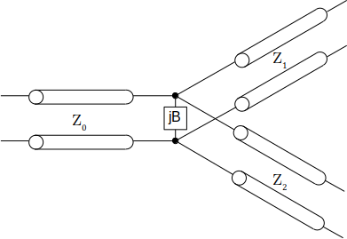
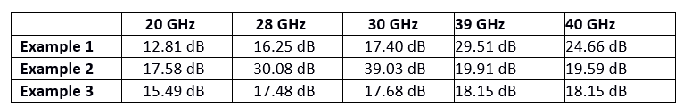
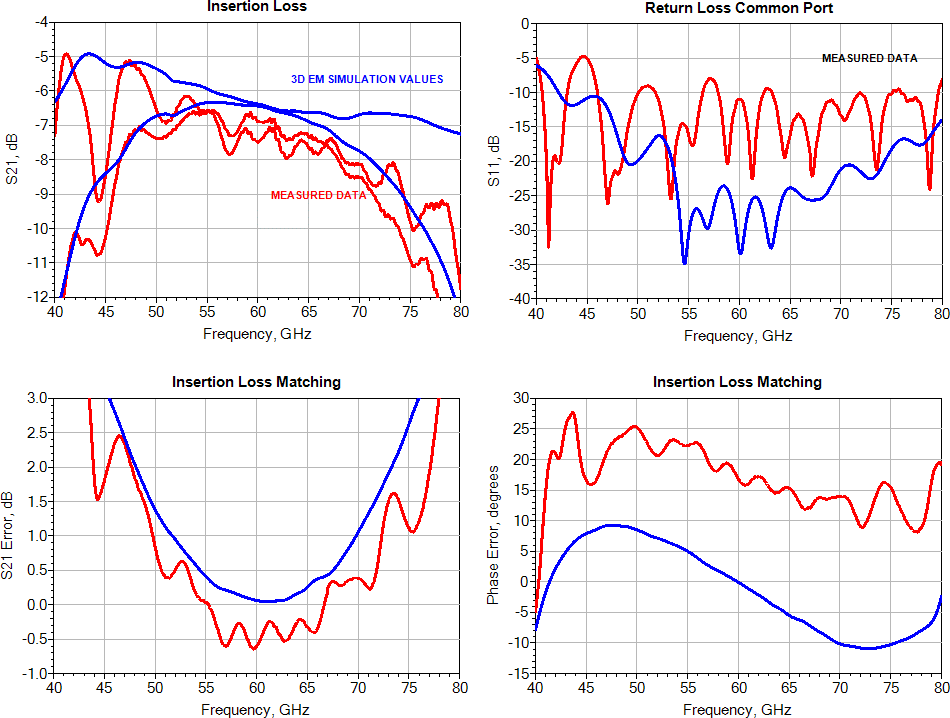

Posted  in [Top Stories](https://www.gosemiandbeyond.com/category/topstories/)

# PCB Design Topologies for 5G and WiGig ATE Applications

**The following article is
an adapted excerpt of a ****DesignCon 2019 Best Paper
Award**** winner. The full paper is included in the conference
proceedings, which can be purchased ****here****.**

*By Giovani Bianchi, Senior Staff Engineer, and
José Moreira, R&D Engineer, Advantest Corp.; and Alexander Quint, Student, K**alrsruhe Institute
für Technologie, Germany*

The opening of the millimeter-wave (mmWave) spectrum to the next
generation of mobile communications introduces mmWave-based communications to
the consumer arena. This new generation includes 5G and WiGig [Wi-Fi-certified
60MHz communications]. From a test engineering point of view, mmWave communications
require a significant jump in testing frequencies from the maximum of 6 gigahertz
(GHz) used for LTE applications
to frequencies as high as 44GHz for 5G and 72 GHz for WiGig.

In addition, these new applications use
phased array antennas, which means there are many
more radio-frequency (RF) ports that need to be tested compared to LTE
applications. At the same time, the same cost-of-test pressure for consumer
applications applies to testing these new mmWave integrated circuits (ICs).

While mmWave applications
pose a variety of new challenges for the automated test equipment (ATE) test
engineering community, this article concentrates on a specific topic: the
design of printed circuit board (PCB) combiners/dividers that can aggregate
multiple RF ports into a single measurement/stimulus port. This can be vital
for reducing cost of test. Deciding to use a combiner/divider will be highly
dependent on the target application, testing phase (e.g., initial
characterization or high-volume production), available ATE resources and test
strategy.

**What is a combiner/divider?**

In general, power combiners/dividers are passive N-port networks (N ≥ 3). They can be used as power dividers to split the power of an input signal into two or more output signals, or they can be used to combine multiple input signals to one output signal of higher power [1]. In this case, the power divider is called a power combiner. The input of a power divider is the output of a power combiner and vice versa.

The easiest way to build a three-port power divider is shown in Figure 1. It consists of a T-junction and a susceptance, which represents discontinuities in the junction. A reciprocal three-port network (which a power divider is) can never be lossless and matched at all ports [1]. 

Therefore, to be matched at all ports, resistive elements must be added to the power **divider**.

*Figure 1: General schematic of a power divider.*

**Wilkinson combiner/divider**

Another disadvantage of the simple power divider shown in Figure 1 is that the two output ports are not isolated against each other. To obtain isolation between the output ports, Wilkinson power dividers [1,2] are used. A two-way Wilkinson power divider schematic is shown in Figure 2.

*Figure 2: Schematic of Wilkinson power divider.*

The two quarter-wave transformers provide good input matching,
whereas the resistor between the two outputs provides good isolation between
the output ports. If the output ports are both matched, the Wilkinson power
divider even appears lossless because there is no current flowing through the resistor.
Wilkinson power dividers can be designed for multiple outputs; can have unequal
power ratios; and can be extended using multiple sections to achieve higher bandwidth.

Wilkinson power dividers well suited for frequencies in the
range of 20-40GHz. However, power dividers with resistors are difficult to use
in frequency ranges above 50GHz. For these scenarios, the better choice is a
hybrid ring. 

**Hybrid ring or rat-race combiner/divider**

While it is not possible to build lossless three-port networks
that are matched at all ports, it is possible to do so with four-port networks.
One easy way to realize a four-port power divider is with a hybrid 180° coupler,
such as the hybrid ring or rat-race example shown in Figure 3 [1].

If port 1 or 3 is used as an input port, the output ports (2,3
or 1,4 respectively) are in phase and port 4 or 2, respectively, is isolated.
If port 2 or 4 is used as an input port, the output ports (1,4 or 2,3
respectively) are shifted by 180°, respectively isolating port 3 or 1. A hybrid
ring can also be used as a power combiner with two inputs and one sum and one
difference output. For example, if ports 2 and 3 are used as input ports, port
1 is the sum output and port 4 is the difference output.

*Figure 3: Hybrid ring structure*

 **ATE test fixture challenges **

**ATE PCB test fixtures used in mmWave applications face some key challenges, as described below.**

- PCB size and thickness. Figure 4 shows a typical multi-site ATE PCB test fixture for high-volume production testing of an LTE-related RF device (below 6GHz). These PCBs are very large (e.g., 516.8mm x 600mm) and thick—a minimum thickness of 3.5mm is required for some ATE platforms, with stack-up thickness reaching 5mm or higher. In addition, while multi-site setups are necessary for parallel testing (essential for reducing cost of test), handler requirements can cause the pitch between the devices under test (DUTs) to be very tight.

*Figure 4: Example of ATE test fixture with eight
sites for high-volume testing
of an RF integrated circuit (<6GHz). Courtesy of Spreadtrum.***

- Small manufacturing
volumes. Compared with higher-volume
PCB applications, the manufacturing volume for an ATE PCB test fixture can be
as small as only one or two boards at the start of a project. In addition to
their size and complexity, this means these boards will be relatively
expensive.

- DUT pitch. Currently, ball grid
array (BGA) pitches for mmWave applications can be less than 0.4mm. This small
pitch, coupled with the large, thick PCB test fixture, further complicates
manufacturing. It will also create mechanical restrictions on any
combiner/divider designs one needs to implement to connect to the DUT BGA pads.

- Dielectric material. High-performance dielectric materials have been the default choice in mmWave applications, but cannot be used for the large, high-layer-count PCBs typical of ATE applications. Ideally, traditional high-performance materials that are already in use for ATE test fixture applications can be deployed. Hybrid stack-ups can also be used, with a high-performance RF material in the outer layers and standard FR4 in the inner layers, but this should be discussed in detail with the PCB test fixture fab house.   The type of fiber weave used is also a critical determinant of dielectric material. Typical high-performance RF materials for ATE PCB test fixture manufacturing use a glass weave. This glass weave will have an impact on dielectric loss, dielectric constant, and, ultimately, signal delay. This is now important because mmWave application usually use phase array antennas, so the phase of each element is critical. On the PCB test fixture, it is important that the phase delay of all interconnects to the antenna ports is the same. To minimize differences in dielectric constant, either a spread glass fiber weave type can be used, or the PCB test fixture can be rotated 10 degrees on the manufactured panel.

- Microstrip copper profile and plating. For traditional RF applications (<
6GHz), only the skin effect and dielectric loss
were important, but for mmWave applications the surface roughness loss becomes
important [4,5]. This means that when selecting the dielectric material, one
also needs to consider the type of copper profile to be used, taking into
account the manufacturing and reliability requirements of the PCB test fixture.
Choosing a very low-profile copper, for example, may make sense for loss
mitigation, but if the PCB fab house cannot
guarantee its reliability for the specific requirements of the ATE PCB test
fixture, it may generate other problems and should not be used.

**Implementing a Wilkinson combiner ***[for complete analysis and all figures, please see full paper]*

As mentioned, ATE PCB
test fixtures present significant challenges due to their size and
requirements. Although there are off-the-shelf combiners/dividers with
excellent performance, especially for the 5G frequency range, they use
materials and implementation techniques that are not viable for an ATE PCB test
fixture. PCB size and the need for a multilayer implementation limit the types
of possible approaches. Also, the large number of ports required for mmWave
applications, coupled with the need to test multiple DUTs in parallel, requires
that the combiner/divider structures be small and omit processes incompatible
with standard ATE PCB test fixture assembly.

Figure 5 shows three examples of a two-way Wilkinson
combiner/divider element targeted for 5G applications (target design was 20-40
GHz), chosen for their implementation simplicity and small size. Example 1 is
the easiest layout for a Wilkinson power divider. The quarter-wave transformers
are curved to reduce coupling between them. In Example 2, there is only a small
modification where a short line with a different width in front of the
quarter-wave transformers is used to further improve the input matching.
Example 3 is the most complex since it consists of two
power divider stages. In general, this type has a higher bandwidth than a single-stage
Wilkinson divider. 

*Figure 5: Implementation examples of single two-way Wilkinson
combiners/dividers.*

The key metrics when
evaluating a combiner/divider are its phase matching (which, with a Wilkinson
simulation model, is always perfect), the return loss at each port and the loss
matching across the frequency of interest. Tables 1 and 2 show the insertion
loss and the return loss of the common port for the three examples at five
different frequencies.

*Table 1: Comparison of the simulated insertion loss for each Wilkinson example.*

*Table 2: Comparison of the simulated return
loss for each Wilkinson example.***

The results show that Example
2 has an overall improved return loss
on the common port compared with Example 1. Example 3 shows slightly less
variation on the insertion loss compared with the other examples. These differences may seem small when comparing single
elements but they do amplify once one begins to aggregate the elements in a
more complex Wilkinson combiner (e.g., a 1-to-8 Wilkinson combiner/divider).

**Implementing a hybrid ring [for complete analysis and all figures, please see full paper]**

As mentioned in the previous section, hybrid ring combiners are able to work at higher frequencies than traditional Wilkinson combiners, but with a smaller bandwidth. This type of design should be targeted for WiGig applications in a frequency band of 56 to 72GHz. Unfortunately, in this frequency range, off-the-shelf combiners in coaxial packages are not easy to come by, although some vendors can create them by special request.

Figure 6 provides two examples of implementing a single two-way hybrid ring combiner/divider element targeted for the WiGig frequency range. The shape of the ring in both examples is not exactly circular due to the rectilinear T-junctions. The layout of Example 2 looks more regular due to the smaller T-junctions, to which trapezoidal tapers have been added, to make the T-junction shorter and to geometrically match the width of the 50-ohm lines.

*Figure 6: Implementation examples of single 2-way Hybrid
ring combiners/dividers.*

Figure 7 shows simulated and measured results for this
structure. The connectors were not de-embedded from the measured data, so a
full 3D EM simulation was done, including the connector model from signal
microwave. The used PCB parameters on the simulation (dielectric constant and
loss tangent) were based on tuned values from a previous test coupon using the
procedure described in [5]. This is critical to obtain more accurate simulation
results.****

*Figure
7: Results of the hybrid ring test coupon simulation and measurement.***

The results show a
reasonable correlation to simulation, even when assuming the structure etching
was perfect. The target bandwidth of the hybrid ring (56 to 72GHz) was achieved
with less than 1 dB measured amplitude imbalance and less than 25 degrees
measured phase imbalance in that frequency range.

**Conclusion**

In looking at combiner/divider design approaches for mmWave applications on ATE systems, special attention is given to the Wilkinson and hybrid ring (rat-race) combiner approaches because they’re more easily implemented on ATE PCB test fixtures. These fixtures present specific challenges that need to be considered in advance when designing a combiner/divider for 5G/WiGig applications. In this context, some of the challenges are new to the ATE test fixture design community. The importance of the 5G/WiGig applications will certainly generate design improvements and new ideas, both for combiner/divider topologies and for PCB manufacturing.

**References**

[1]  D.
Pozar, *Microwave Engineering, *4th
Edition, Wiley 2011.

[2]  E.
J. Wilkinson, “An N-Way Hybrid Power Divider,” *IRE Transactions on Microwave Theory and Techniques, *Vols. MTT-8,
pp. 116-118, 1960.

[3]  Jose Moreira and Hubert Werkmann, *An Engineer’s Guide to Automated Testing of High-Speed Interfaces, *2nd
Edition, Artech House 2016.

[4]  Rogers Corporation, “Copper Foil Surface Roughness and
its Effect on High Frequency Performance,” PCB West, 2016.

[5]  Heidi Barnes, Jose Moreira and Manuel Walz,
“Non-Destructive Analysis and EM Model Tuning of PCB Signal Traces Using the
Beatty Standard,” DesignCon, 2017.

  end .post_content

