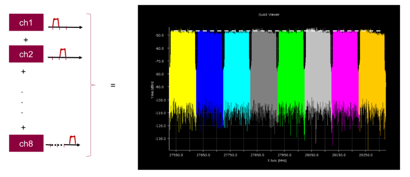

Posted  in [Q&A](https://www.gosemiandbeyond.com/category/qa/)

# Q&A Interview with Dieter Ohnesorge – 5G mmWave Challenges and Solutions

**By GO SEMI & Beyond staff**

*mmWave is the key topic when it comes to frequency ranges that allow to allocate more bandwidth. millimeter-wave (mmWave) is the band of spectrum between 24 GHz and 100 GHz. As it enables allocation of more bandwidth for high-speed wireless communications, mmWave is increasingly viewed as one key to making 5G connectivity a reality. In this issue, Dieter Ohnesorge, product manager, RF solutions for Advantest, discusses the market opportunity and test challenges associated with 5G mmWave, as well as Advantest’s solution for addressing them.*

**Q. We’ve been hearing about the promise of 5G for a long time. What demand drivers are edging it closer to fruition?**

A. If you look at the global ecosystem [Figure 1], there is massive potential for 5G in many vertical markets. For example, 5G will be an essential aspect of smart manufacturing (SM). SM processes provide greater access to real-time data across entire supply chains, allowing manufacturers and suppliers to manage both physical and human resources more efficiently. This will result in less waste and system downtime and will make more technology-based manufacturing jobs available.

Remote access to health services is another key benefit of 5G. First, it would mean less driving, which is much better for the environment as well patients and doctors and staff. Second, if you’ve already had a screening and the doctor has access to it, why not communicate remotely, saving time on both sides? With 5G, you have the benefit of high bandwidth and low latency, which is important for many applications. Autonomous driving, consumer multimedia applications, and remote banking are just a few more of the many areas that will benefit from highly reliable connections, as well as high bandwidth and/or low latency.

*Figure 1. A global ecosystem of vertical deployments stand ready to benefit from 5G.*

**Q. What has prevented 5G from becoming fully implemented?**

A. Primarily, the infrastructure requirements. A specification of this scale cannot be implemented on a local basis alone – it takes a concerted, global effort. The worldwide effort to achieve 5G standardization is a huge step forward. In the U.S., discussions about mmWave technology are currently under way, and at the end of the year or early next year, the discussion will expand towards 5G in the <6GHz band.

In 2015, Verizon took it upon themselves to define a proprietary version of 5G as the next step forward from the current 4G LTE standard. At the end of 2018, the 5G NR (New Radio) industry standard developed from the Verizon effort was released, and all new deployments will follow this spec. In the U.S., initially the frequency band is 28 GHz, with carrier bandwidth of two 425-MHz channels and 24 GHz with seven 100 MHz channels. Additional frequency bands will be auctioned by the FCC for 37, 39 and 47 GHz from December 2019 onward. Other mmWave activities can be seen all over the world, although at different pace.

**Q. Where does mmWave come into play?**

A. Because the portion of the spectrum that mmWave covers is largely unused, mmWave technology can greatly increase the amount of bandwidth available, making it easier to implement 5G networks. Lower frequencies are currently taken up with the current 4G LTE networks, which typically occupy between 800 and 3,000 MHz. Another advantage is that mmWave can transfer data faster due to the wider bandwidth per channel, although over a shorter transfer distance – up to around 250 meters, or just over 800 feet. This means that it could conceivably work as a replacement for fiber or copper wire into homes and businesses, and this “last mile” capability would broaden the reach of 5G to cover both small and very large areas.

**Q. What are the challenges around mmWave test that spurred Advantest to develop a solution? Which does it address?**

A. Advantest’s Wave Scale RF card for the V93000 tester platform has seen great success. Its operational range is 10 Mhz to 6 GHz, so we needed a solution that can address the frequency and power requirements associated with higher-bandwidth devices.

Frequency is one of the key parameters associated with mmWave, and with that comes power-level measurement, EVM [error vector magnitude], ACLR [adjacent-channel leakage ratio], and other aspects that all need to be addressed in the testing process to ensure they meet specifications at the wider bandwidths required by 5G-NR.

Another requirement is the number of ports – with 5G mmWave’s beamforming capability, testing could easily be in the range of as many as 32 to 64 ports. At the same time, due to the frequency nature of mmWave, with 5x to 7x frequency, the cost goes up as well. That’s also been one of the challenges: holding down the cost of test with a wide number of sites being tested in parallel.

The V93000 Wave Scale Millimeter test solution, which we introduced in May 2019, extends the capabilities of Wave Scale RF. It is designed for multi-band mmWave frequencies, offering high multi-site parallelism and versatility. It has two operational ranges: 24 GHz to 44 GHz for 5G mmWave, and 57 GHz to 70 GHz, which extends the product’s capabilities for the wireless Gigabit, or WiGig, era. Figure 2 shows the range of frequencies that Wave Scale was developed to cover.

*Figure 2. Wave Scale RF provides a scalable platform for connectivity device test, from standard RF to millimeter-wave.*

In addition, new modules can be added as new frequency bands are rolled out worldwide. The card cage has up to eight mmWave instruments, making it versatile, cost-effective, and able to perform as well as high-end bench instruments. Because it has wideband testing functionality, Wave Scale can handle full-rate modulation and de-modulation for ultra-wideband (UWB), 5G-NR mmWave up to 1 GHz, and WiGig up to 2 GHz, supporting probes as well as antenna-in-package (AiP) devices connectorized, and over-the-air testing.

Figure 3 illustrates 5G device measurements that can be achieved using Wave Scale Millimeter: power out/flatness test results. The solution’s massive parallelism allows these tests to be performed quickly and at significant cost savings.

*Figure 3. This graph overlays a customer’s 8-channel transceiver power-out test results, performed over 800 MHz at 28 GHz. Wave Scale allows channel flatness to be executed in a single operating sequence, one channel after the other.*

**Q. When will this solution be widely needed?**

A. The Industry is still learning how to test these devices. We can help customers get started now, thanks to the modularity of the solution. They can start below 6GHz and when they need the higher frequency, we can add the mmWave capability.

The bottom line is that Advantest’s platform approach is ideal for this scenario – because it is scalable and modular, we can continue to add to the product’s functionality to make it even more comprehensive. By being ahead of curve, we will have the right solution ready when our customers need to adapt to new requirements.

Did you enjoy this article? [Subscribe](https://visitor.r20.constantcontact.com/manage/optin?v=001y_Bo5goCBKQ5mpCMPMk9NZ99QMnLrLlllSx9KsYRBGtAwx3BUnAXKOaTpnrPkps9ENqJ2xavSS4iHZoRcF3vbOUMslAszWh5o0QemBpi7ixX88dplnKCbCc1wBocZnWqQunAJgFjTckoqFGgqvpIFXY1CeP37TR15PDr8yiOViQ%3D) to GOSEMI AND BEYOND

  end .post_content

