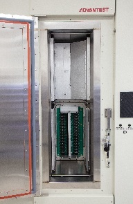

Posted  in [Q&A](https://www.gosemiandbeyond.com/category/qa/)

# Q&A Interview with Scott West – Expanding SSD Test Capabilities for Extreme Temperatures

*Advantest has found great success with its test solutions aimed at the solid-state drive (SSD) market. In this issue of *GO SEMI & Beyond*, Scott West, Product Marketing Manager for System-Level Test, provides some background on how the company began to address this market, and shares details on its latest SSD offering, the MPT3000ARC, for validation testing to accommodate extreme thermal standards. *

**Q: What was the catalyst for developing this latest addition to the MPT3000 family?**

A: Let me briefly recap the MPT3000’s evolution. After spending several years on product research and development, we launched the SSD platform in 2014, signaling a branching out for Advantest from chip test to system-level test. While chips are a single unit, manufactured all at once, with everything controlled by the chipmaker, SSD drives are themselves systems. They’re modules that contain a great deal of flash memory, a controller, controller circuitry, protection capacitors, and other components, which adds further complexities from a test standpoint.

Our focus from the start has been to test SSDs through a protocol interface, including the three primary SSD protocols: SATA [Serial ATA], SAS [Serial Attached SCSI] and PCIe [PCI Express]. All products in the platform test all of these protocols, including PCIe Gen 4, the latest version of PCIe, which is about twice the speed of Gen 3. However, with the ARC system (see Figure 1), we’re expanding in a different direction – we’re looking not just at all SSD protocols, but at all test insertions.

**Q: How does this differ from the other MPT3000 products?**

A: Each product in the platform has a slightly different, and specific, purpose. The MPT3000EV2 (the second generation of the 3000ENV) is a large-chamber system for reliability demonstration testing (RDT), which is focused on the test design. This involves constant hot and cold temperature cycling of several hundred drives over many months. For example, there is one project we are working on that requires more than six months of constant temperature cycling and testing.

The MPT3000HVM is a rack system designed for production test. It tests each individual drive during high-volume manufacturing to make sure it’s good. It requires not months but several hours, under hot conditions only, with a large amount of power pushed through, to validate that each drive works as expected. It can test quickly because of the rack design – you can put in one drive and immediately begin testing while you’re loading more.

The ARC system addresses a couple of key parameters that the other systems in the family don’t with respect test insertions. The first is *extreme temperature range*. The standard is referred to as automotive range (-40°C to +105°C), which is where the product name is derived from – ARC stands for Automotive Range Chamber. But automotive is only one application; the standard is also used in aerospace, defense and other ruggedized applications that require extreme temperature range.

The second parameter is *high-volume production cold-temperature test*. The new chamber was designed to be able to accommodate this type of testing in the production environment, for which the EV2 is not as well suited as it is optimized for very test times. In the enterprise, cold temperature – down to as low as -40°C – is often required for production test. The MPT3000ARC can test up to 128 PCIe Gen 4 DUTs in parallel. Because you have to load the entire chamber at once at ambient temperature, it doesn’t make sense to make it too big, as the ergonomic range needs to be production friendly.

**Q: Do all the MPT3000 products have the same pin electronics?**

A: Yes, all the systems are compatible with respect to the software and firmware, and all electronics that go to the DUT come from the same test electronics boards. The systems feature up to 22.5G electronics with tester-per-DUT architecture.

However, the ARC system interface boards, which are designed for the system’s thermal interface, are different from those for the HVM. In the ARC chamber, the chamber is turned on its side, with up to four primitives inserted vertically instead of horizontally (see Figures 2 and 3). This creates a totally closed system that allows air to circulate from right to left inside the chamber, whereas the HVM rack-based system pulls air from the room and then blows it to the back of the system and out into the room. The ARC chamber also features a pocket door designed to accommodate the ergonomic requirements of manual loading and to be automation friendly as well

**Q: What are some other key features of the MPT3000ARC?**

A: As I mentioned earlier, the system has the ability to test up to 128 DUTs of 50W each. The primary compressor stage has a water-cooled condenser that transfers the energy generated by the chamber load to the test floor’s water-cooling system. This construction helps regulate chamber temperature to ensure consistency. The system has two programmable power supplies for PCIe DUT, targeting high-power enterprise SSDs, and performs current and voltage measurement with high accuracy.

We introduced the MPT3000ARC at the Flash Memory Summit in August 2019, where it was very well received, and the system has shipped to the first customer. We look forward to sharing further successes and advancements in the future.

**FIGURES**

*Figure 1. The MPT2000ARC is the latest addition to the MPT3000 family of SSD testers, and tests devices to extreme temperatures.*

*Figure 2. The chamber for the MPT3000ARC is oriented vertically to allow a fully closed system with right-to-left air flow. The primitives are stacked 2×2, back to front. *

*Figure 3. This view inside the ARC chamber shows the positioning of one of the lower primitives in a 64-DUT system.*

 

Did you enjoy this article? [Subscribe](https://visitor.r20.constantcontact.com/manage/optin?v=001y_Bo5goCBKQ5mpCMPMk9NZ99QMnLrLlllSx9KsYRBGtAwx3BUnAXKOaTpnrPkps9ENqJ2xavSS4iHZoRcF3vbOUMslAszWh5o0QemBpi7ixX88dplnKCbCc1wBocZnWqQunAJgFjTckoqFGgqvpIFXY1CeP37TR15PDr8yiOViQ%3D) to GOSEMI AND BEYOND

  end .post_content

