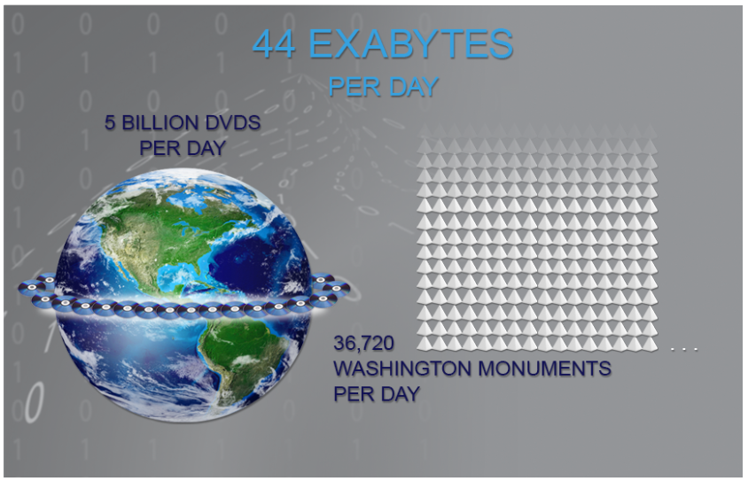
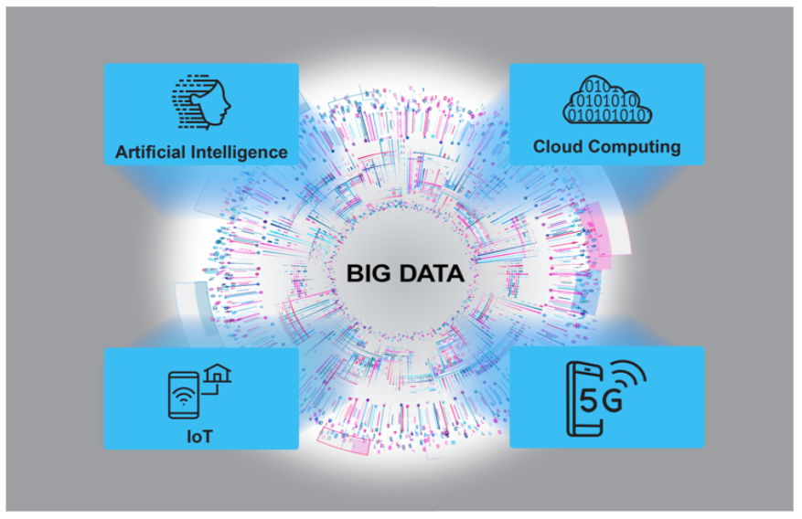
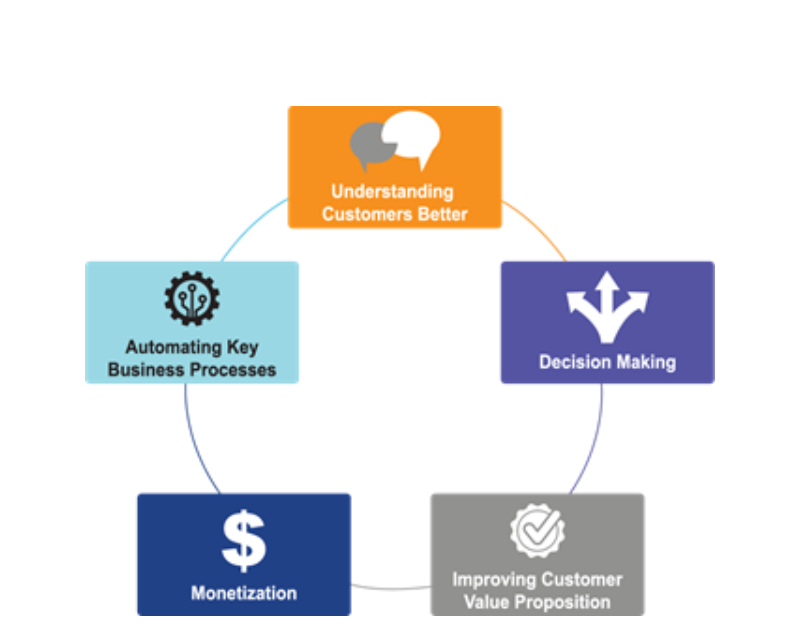

Posted  in [Top Stories](https://www.gosemiandbeyond.com/category/topstories/)

# Semiconductor Test – Toward a Data-Driven Future

*By Keith Schaub, Vice President, Marketing and Business Development, Applied Research and Technology Group, Advantest America*

Integrating new and emerging technologies into Advantest’s offerings is vital to ensuring we are on top of future requirements so that we are continually expanding the value we provide to our customers. Industry 4.0 is changing the way we live and work, as well as how we interact with each other and our environment.

This article will look at some key trends driving this new Industry 4.0 era – how they evolved and where they’re headed. Then, we’ll highlight some use cases that could become part of semiconductor test as it drives towards a data-driven future. 

**The past**

To understand where we’re headed, we need to understand where we’ve been. In the past, we tested to collect data (and we still do today). We’ve accomplished tremendous things – optimized test-cell automation, gathered and analyzed yield learnings, process drift and statistical information, to name a few. But we ran into limitations.

For instance, we lacked tools necessary to make full use of the data. Data is often siloed, or disconnected. Moreover, it’s not in a useful format, so you can’t take data from one insertion and use it in another insertion. Not having a way to utilize data for multiple insertions reduces its value. Sometimes, we were simply missing high-value data, or collecting and testing the wrong type of data.

**The future**

Moving forward, we think what we are going to see is, the data that we collect will drive the way that we test. Siloed data systems will start to be connected, so that we can move data quickly and seamlessly from one insertion to another – feeding the data both forward and backward – as we move further forward into Industry 4.0. This will allow us to tie all of the different datasets from the test-chain together, from wafer, from package, from system-level test. All of this data will be very large (terabytes and petabytes), and when we apply artificial intelligence (AI) techniques to the data, we’ll gain new insights and new intelligence that will help guide us as to what and where we should be testing.

We’ll ask new questions we hadn’t thought to ask before, as well as explore long-standing questions. For example, one dilemma we’ve faced for years is how best to optimize the entire test flow, from inception to the end of the test cycle. Should the test be performed earlier? Later? Is the test valuable, or should it come out? Do we need more tests? How much testing do we need to do to achieve the quality metric that we’re shooting for? In the Industry 4.0 era, we’ll start seeing the answers to these questions that resonate throughout the test world.

**Data…and more data**

Today, thanks to the convergence of data lakes and streams, we have more data available to us than ever before. In the last two years alone, we’ve generated more data than in all human history, and this trend will only increase. According to some estimates, in the next few years, we will be generating 44 exabytes per day. In other words, this would be about 5 billion DVDs worth of data *per day*. Stacked up, those DVDs would be higher than 36,700 Washington Monuments, and the data they contain would circle the globe in about a week (see Figure 1).

*Figure 1. The volume of data we generate will soon reach 44 exabytes, or 5 billion DVDs, per day. Since this amount of data could circle the earth in about seven days, an “earth byte” could equate to a week’s worth of data.*

These kinds of numbers are so massive that the term “Big Data” doesn’t really suffice. We need a global image to help visualize just how much data we will be generating on a daily basis. Based on these numbers, we could begin using the term “earth byte” to describe how much data is generated per week. Regardless of what we call it, it’s an unprecedented amount of data, and it is the fuel behind Industry 4.0.

**Industry 4.0 pillars**

Five key pillars are driving and sustaining the Industry 4.0 era (Figure 2):

- Big Data – as noted above, we are generating an unprecedented and near-infinite amount of data, half comes from our cell phones and much of the rest from the IoT
- IoT – sensor-rich and fully connected, the IoT is generating a wealth of data related to monitoring our environment – temperature, humidity, location, etc.
- 5G – the 5G global wireless infrastructure will enable near-zero-latency access to all of the data being generated
- Cloud computing – allows us to easily and efficiently store and access all our earth bytes of data
- AI – we need AI techniques (machine learning, data learning) to analyze in real time these large datasets being sent to the cloud in order to produce high-value, actionable insights

*Figure 2. The five key pillars of Industry 4.0 are all interconnected and interdependent.*

Because they are all reinforcing and accelerating each other, these Industry 4.0 trends are driving entire industries and new business models, creating an environment and level of activity that’s unprecedented.

**Hypothetical use cases**

Now that we’ve looked at where the test industry has been and what is driving where we’re headed, let’s examine some theoretical use cases (grounded in reality) that provide a visionary snapshot of ways we may be able to leverage the Industry 4.0 era to heighten and improve the test function and customers’ results. Figure 3 provides a snapshot of these five use cases.

 

*Figure 3. Industry 4.0 will enable advancements in many areas of the test business.*

**1) Understanding customers better – across the supply chain**

This use case encompasses various customer-related aspects that Industry 4.0 will enable us to understand and tie together to create new solutions. These include:

- Customers’ march toward and beyond 5nm and how wafer, package, and system-level testing will work together for them
The entire supply chain’s cost challenges, which will help us optimize products and services across the value chain
How automotive quality requirements are driving into other business segments – as autonomous vehicles will be connected to everything across 5G, the quality of the connected network and its components will be forced to improve
5G’s advanced technologies, including phased arrays, over-the-air, and millimeter-wave, all of which are already mature in the aerospace and military sectors – we will need to be able to leverage those technologies, cost them down appropriately, and support them for high-volume testing

**2) Decision making – yield prediction**

The ability to predict yields will change everything. If you know, based on historical process data, that you’ll experience a yield drop within the next one to two months, you can start additional wafers to offset the drop. This easy fix would enable very little disruption to the supply chain.

If you can solve this problem, however, the next obvious question is, what’s causing it? Why don’t I just fix it *before* it happens? This involves prescriptive analytics, which will follow predictive analytics. Say you have developed a new generation of a product. You’ve collected yield data at all test insertions for previous generations of the product, which share DNA with the new incarnation. Combining past data with present data creates a model that enables highly accurate predictions about how the wafer will perform as it moves through the supply chain.

**3) Creating new customer value – predictive maintenance**

This use case is the most likely to come to fruition in the near term. Maintenance contracts require carrying inventory, spare parts and myriad logistics – they represent a huge cost. Soon, by combining tester fleet data with customer data and implementing machine learning, we’ll be able to dramatically improve tester availability, reduce planned maintenance, and decrease losses due to service interruptions. This will allow us to replace modules before they fail.

Predictive maintenance is a proven parameter that’s already being used in other industries such as oil and gas manufacturing. IoT sensor arrays are applied to the huge pipes and pumps controlling flow of chemicals, measuring stress, flow rates, and other parameters. The data from these sensors predict when a pump is going to wear out or a pipe needs to be replaced before it fails. We can leverage, redefine and redeploy this implementation for our use case. Soon, a field service engineer could show up with a replacement module before you even know that you need it.

**4) Monetization – using data in new ways to drive our business**

Data is an asset, and we’ll start to derive new business on sharing access, or leasing use of our data assets. One example might be a tester digital twin that resides in the cloud. Imagine that customers’ chip model data could be fed into this digital twin as a kind of virtual insertion, and the outputs would be parameters such as performance and yield. Customer benefits would include optimized programs, recommended tests, and predicted test coverage at each virtual insertion. This would enable them to optimize the entire flow depending on the product life cycle – perhaps test order could be changed, or a test added in order to improve quality. Because Advantest owns all the data that comes from our testers, we could lease or sell chipmakers access to the data, creating a significant business opportunity.

**5) Automating and improving business operations – driving efficiencies**

The test engineering community struggles with finding ways to improve process efficiencies. One way to do this is with the use of intelligent assistants. Still in their infancy, this category of AI can best be described as a trained assistant that could guide you in a helpful way when trying to perform a task.

For example, say we are validating a new 5G RF product on our Wave Scale RF card on the V93000 tester. All the pieces are being brought together – load board, tester, socket, chip, test program – and if there are any problems, the whole thing won’t work, or you’ll get partial functionality. An intelligent assistant or ‘bot’ trained in the necessary skillset can dynamically monitor the inputs and outputs and engineers’ interactions and provide real-time suggestions or recommendations on how to resolve the issues. At first it won’t be smart, but will learn quickly from the volume of data and will improve its recommendations over time.

As you can see, AI’s potential is vast. It will touch all aspects of our lives, but at its core, AI is really just another tool. Just as the computer age revolutionized our lives in the ’80s and ’90s, AI and Big Data will disrupt every industry we can think of – and some we haven’t yet imagined. Those slow to adopt AI as a tool risk being left behind, while those that embrace AI and learn to fully utilize it for their industries will be the future leaders and visionaries of Industry 5.0, whatever that may be.

Did you enjoy this article? [Subscribe](https://visitor.r20.constantcontact.com/manage/optin?v=001y_Bo5goCBKQ5mpCMPMk9NZ99QMnLrLlllSx9KsYRBGtAwx3BUnAXKOaTpnrPkps9ENqJ2xavSS4iHZoRcF3vbOUMslAszWh5o0QemBpi7ixX88dplnKCbCc1wBocZnWqQunAJgFjTckoqFGgqvpIFXY1CeP37TR15PDr8yiOViQ%3D) to GOSEMI AND BEYOND

  end .post_content

