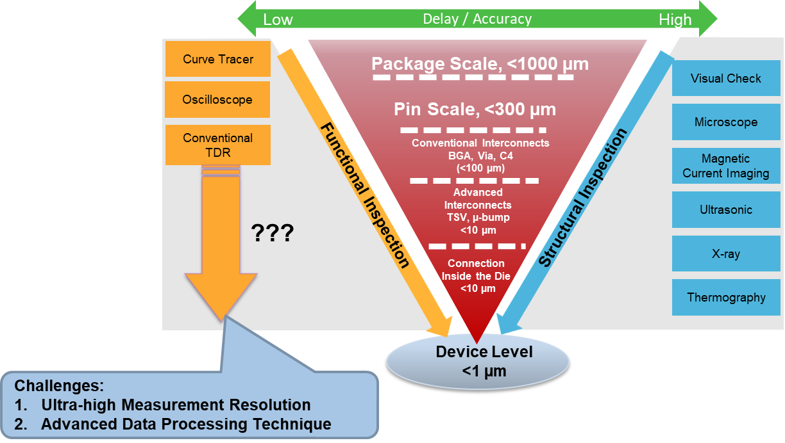
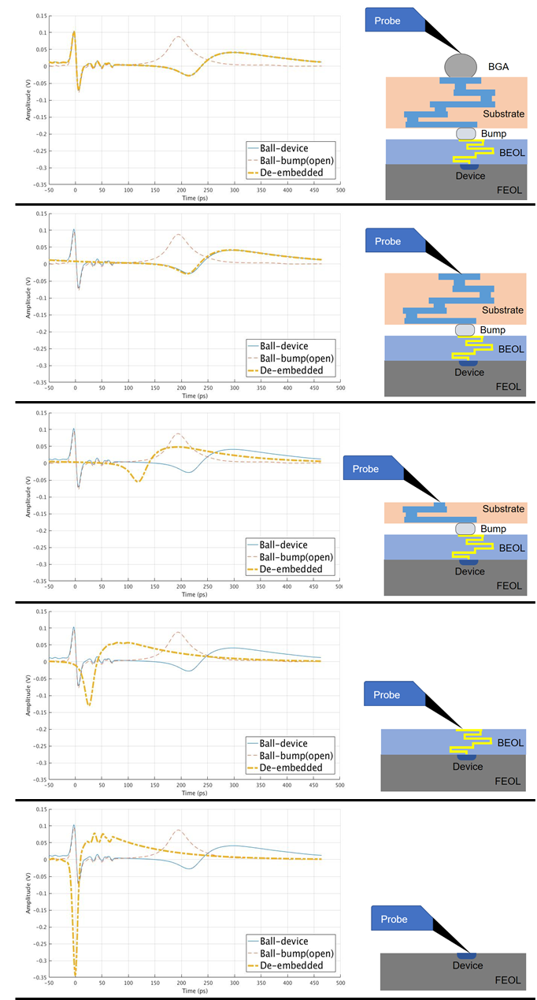

Posted  in [Top Stories](https://www.gosemiandbeyond.com/category/topstories/)

# TDR with Recursive Modeling Optimizes Advanced-Package FA

*by Shang Yang, Ph.D., Senior R&D and Application Engineer, Advantest Corp.*

As the range and volume of chips developed for a host of Internet of Things (IoT) applications continues to escalate, conventional failure analysis (FA) techniques are increasingly challenged by the higher input/output (I/O) density and data throughput associated with complex 2.5D and 3D IC packages. These structures are not flat and one-dimensional; they more closely resemble skyscrapers, with many “floors” or layers, as Figure 1 illustrates. In this example, these layers are sitting on a complex foundation of microbumps, interposers and through-silicon vias (TSVs), on top of a laminate material that is attached to the printed circuit board (PCB) using ball grid array (BGA) bumps. This type of complexity makes it increasingly difficult, when conducting FA on the chip structure, to pinpoint the location of a failure from the package level to the die level.

*Figure 1: Multidimensional chips, such as the 3D IC package shown here, face significant challenges with respect to performing failure analysis.*

Techniques such as x-ray scanning can perform FA on these devices, but these processes are lengthy, which is problematic given the fast time-to-market windows that IoT devices and applications require. For example, if a 5-micron solder bump is determined to be the source of a failure, it is highly challenging to determine whether the crack is on the top or the bottom surface of the bump. Conducting FA by performing x-ray scanning through the entire chip can take up to a few days depending on the chip complexity.

Time-domain reflectometry (TDR) is increasingly being deployed in order to determine the location of the problem more quickly. However, applying TDR analysis for defect characterization inside the die creates its own set of challenges, as this method becomes less accurate if the failure point is between the package-die interface and the transistors. This combination of challenges points to the need for a new approach to TDR.

**Effective defect searching**

To further aid in understanding why a revised TDR technique is necessary, let’s take a look at a general chip FA process (Figure 2) leverage two kinds of inspection – structural and functional – both of which are needed to debug the defect down to the device level. The first step is conducting a visual inspection by using the human eye or a microscope. Obvious cracks in the chip may be detected and the failure location narrowed down to the *package level* with approximately 1000-micron resolution.

*Figure 2: Structural and functional inspection techniques are both necessary for failure analysis, but a gap exists on the functional side that conventional TDR cannot fill.*

Step 2, electrical evaluation, uses an oscilloscope or curve tracer to verify the functionality of each pin. At this point, the failure location may be further narrowed down to the *pin level* with resolution of about 300 microns. Next, using TDR, x-ray or ultrasonic imaging, the failure point is further investigated at the *interconnect level*, down to a resolution of around 100 microns.

While there are a number of powerful tools that can conduct further structural inspection and analysis at the *die level*, a large gap exists between functional inspection steps 3 and 4, as the figure illustrates. If the density of devices inside the 100-micron scale is very high, conducting step 4 efficiently and getting down to the submicron *device level* for FA becomes highly difficult. Further complicating the matter is that functional solutions are faster with lower accuracy whereas structural methods are more accurate, but take much longer. A high-resolution TDR system that can deliver accurate results quickly is needed to fill this gap.

**TS9000 TDR enables high-res die-level accuracy**

Advantest has addressed these challenges by developing a TDR option for its TS9000 terahertz analysis system to achieve real-time analysis with ultra-high measurement resolution. The TS9000 TDR Option relies on Advantest’s TDR measurement technology to pinpoint and map circuit defects utilizing short-pulse signal processing. Figure 3 shows the difference between conventional TDR and the Advantest approach.

*Figure 3. Conventional TDR is intrinsically a high-noise, high-jitter process. High-res TDR with the TS9000 option replaces the sampler and step source with photoconductive receptors, enabling low noise and very low jitter.*

Using laser-based pulse generation and detection, the Advantest solution delivers impulse-based TDR analysis with ultra-low jitter, high spatial precision of less than 5 microns, and a maximum measurement range of 300mm, including internal circuitry used in TSVs and interposers. 

Having a high-resolution TDR solution alone does not guarantee the ability to detect the defect all the way down to the design level. Another problem is signal loss – if it is very high, it will have two effects on the front-end-of-line reflected pulse: the pulse will have reduced amplitude and large spread. This makes it difficult to pinpoint the specific defect location.

Recursive modeling (see Figure 4) simulates “removing” all the layers to enable virtual probing at the desired level without destroying the device or being hampered by the hurdles that conventional FA techniques present. This overcomes the challenge of the probe point not always being available due to probes’ minimum pad size requirement and limited accessibility to points far inside the die. The probe can move down layer by layer, de-embedding each trace and recursively measuring the signal pulse, until the defect point can be clearly observed and characterized in the TDR waveform until the interface before FEOL.

This impulse-based TDR approach has proven to be a highly effective method for quickly localizing failure points in 2.5D/3D chip packages, with ultra-high resolution. The recursive modeling technique described, when implemented with the Advantest TS9000 TDR, can greatly increase the strength of the reflected signal and reduce the spread effect to ensure high-accuracy defect detection.

*Figure 4. In recursive modeling, the layers of the device can be virtually peeled away like an onion and probing conducted far inside the die to determine a defect’s nature and location.*

  end .post_content

