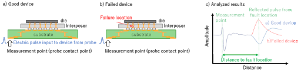

Posted  in [Featured Products](https://www.gosemiandbeyond.com/category/featuredproducts/)

# Advantest’s New TS9001 Time Domain Reflectometry (TDR) System Employs Terahertz Technology to Provide High Resolution Analysis of Circuit Faults

Advantest Corporation announced that it has initiated sales of its new TS9001 TDR System. The new system fully utilizes the company’s unique terahertz technology to enable non-destructive and high-resolution analysis on circuit faults in advanced semiconductor packages, such as flip chip BGAs, wafer level packages, and 2.5D/3D ICs. 

The TS9001 TDR System provides semiconductor manufacturers with flexible solutions for addressing a variety of failure analysis requirements. By establishing a low-cost failure analysis environment and enabling connections to high-frequency probing systems already in use by customers. TS9001 offers customers one of the shortest measurement times on the market. 

Advantest’s leading-edge semiconductor test technology and terahertz failure analysis technology supports the development of innovative semiconductor supply chains, while enhancing the customers’ quality control. 

**Background**

As semiconductor packages (hereafter, devices) grow smaller and more highly integrated, the ability to locate failures with non-destructive, high-resolution technology is increasing in importance. Providing access to the industry’s most advanced failure analysis environment is critical to being able to address the wide variety of failure analysis issues that are present in these complex devices. To meet these requirements, Advantest developed the TS9001 TDR System, which enables customers to direct-connect their high-frequency probing systems, to obtain high-speed, high-resolution measurement. 

**Key Features**

- High-speed and high-resolution measurement

The TS9001 TDR system, which utilizes an ultra-short pulse signal processing technology,  achieves higher distance-to-fault resolution of 5 μm and precise fault location identification with the industry’s fastest class measurement time of 30 sec (Number of integration: 1024, 1/10 shorter than our conventional products). This is the same proven technology used in our ground-breaking terahertz analysis systems.

- Versatile connectivity for high-frequency probing systems

TS9001 can be configured with a high-frequency probing system owned or selected by the customer. It offers flexible solutions according to the device forms or fault analysis environments. 

**(1) Failure analysis of devices with micro bump**

By connecting the TS9001 to a high-frequency probing system along with a high-resolution microscope, failure analysis of devices with micro bump of minimum diameter 50 μm is possible. 

**(2) Temperature control function**

Failure analysis of devices kept in low/high temperatures is also possible, if the system is connected to a high-frequency probing system with a thermal-system function.  

(*) TDR (Time Domain Reflectometry) is widely used to locate circuit failures. Input pulsed signals are reflected at circuit faults inside the device. Time domain analysis of the reflected waveform　allows users to determine the fault location and failure mode (open or short) by waveform comparison between good device and failed device. The peaks appearing only in the failed device are analyzed to identify them. 

For more information on this system, visit our Website. 

URL: [https://www.advantest.com/products/terahertz-spectroscopic-imaging-systems/tdr-option](https://www.advantest.com/products/terahertz-spectroscopic-imaging-systems/tdr-option)

  end .post_content

